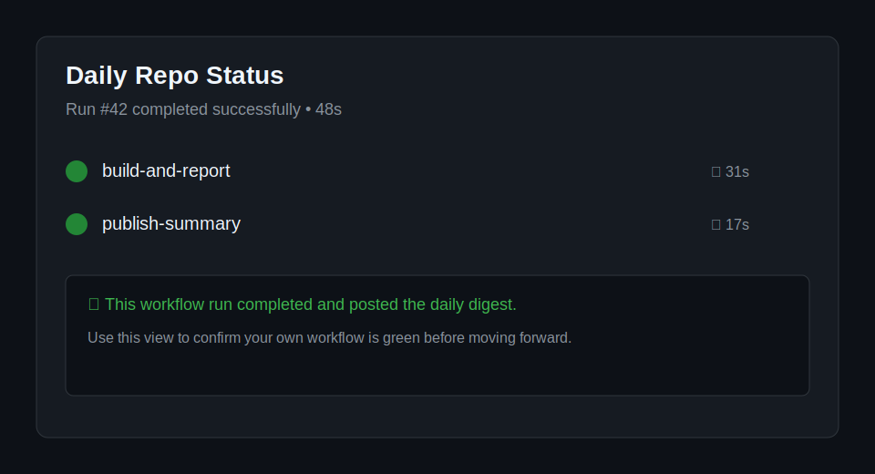
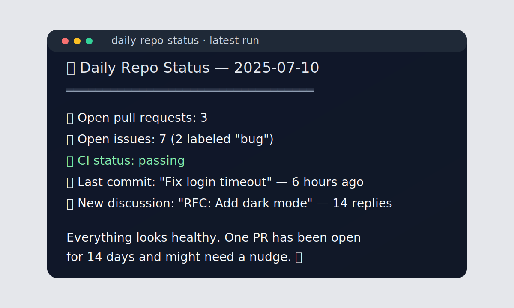

# Step 0: Welcome — What We'll Build

**In about 2 hours, you'll have an AI-powered daily repo health report running automatically in GitHub** — the kind of workflow a teammate or evaluator can judge in under a minute.

## Why Agentic Workflows?

Before: you open your repo every morning, click through issues and pull requests, and manually summarize what changed. After: a scheduled workflow does that scan for you and posts a digest automatically before your first meeting. That's the practical value of agentic workflows in this workshop: less status-chasing, more decision-making.

> [!TIP]
> **Already know GitHub Actions? Fast path:** Jump to [Step 5: What Are Agentic Workflows?](05-agentic-workflows-intro.md) — Steps 1–4 focus on setup and Actions fundamentals.



## 🎯 What You'll Do

You'll build an **agentic workflow**: a GitHub Action that uses AI to inspect your repository, decide what matters, and publish a useful status report on a schedule. Instead of wiring together a toy demo, you'll finish with a practical workflow you can adapt for real teams.

## Why This Is Different from Regular Actions

- **It reasons about live repository state** instead of only following a fixed script.
- **It turns signals into decisions** — for example, spotting stale pull requests or flagging CI trouble without you hard-coding every branch.
- **It produces stakeholder-ready output automatically**, so the result is a daily report people can actually use.

## A Peek at the Finish Line

By the end, your workflow can post a report like this every morning:



```
📊 Daily Repo Status — 2025-07-10
══════════════════════════════════
🔀 Open pull requests:  3
🐛 Open issues:         7  (2 labeled "bug")
✅ CI status:           passing
📝 Last commit:         "Fix login timeout" — 6 hours ago
💬 New discussion:      "RFC: Add dark mode" — 14 replies

Everything looks healthy. One PR has been open for 14 days
and might need a nudge. 👀
```

That report can land in a GitHub issue comment, Slack message, or anywhere else you configure. It runs on a schedule — no clicks required.

## What You'll Learn

| Step | Skill |
|------|-------|
| Set up your environment | Codespace or local terminal |
| GitHub Actions basics | Triggers, jobs, and steps |
| Agentic workflows | How AI agents fit into CI/CD |
| `gh-aw` CLI | Write and run agentic workflows |
| A real-world workflow | Design → build → schedule |

## Who This Is For

You should be comfortable with:
- Creating a GitHub repository
- Making commits and pushing code
- Reading a little YAML (we'll explain everything line by line)

You do **not** need experience with GitHub Actions or AI tools. This workshop assumes none.

## How the Workshop Is Structured

Each step is short — most take **5–10 minutes**. Steps build on each other, but checkboxes at the end of each step tell you exactly what to verify before moving on.

At **Step 1**, the path splits into two options:
- **Adventure A** — set up a cloud environment with GitHub Codespaces (no local install needed)
- **Adventure B** — use your local terminal

Both paths converge at **Step 3** and stay together for the rest of the workshop.

> [!TIP]
> If you get stuck, every step links back to the previous one. You can always rewind.

## ✅ Checkpoint

- [ ] You know the concrete outcome you'll build in about 2 hours
- [ ] You know how this differs from a regular GitHub Action
- [ ] You know which setup path you'll take (Codespace or local)
- [ ] You're excited — let's go! 🚀

**Next:** [Step 1: What You Need Before We Start](01-prerequisites.md)
