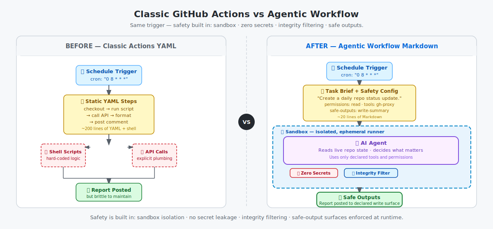

# Step 0: Welcome — What We'll Build

By the end of this workshop, a real AI agent will post a comment on one of your GitHub issues — automatically, every day, without you writing shell-script workflow code.

## 📋 Before You Start

- A GitHub account (free or Enterprise)
- A web browser — no local tools required for Step 0

## 👀 What you'll see in 30 seconds

This is the finished workflow run you'll build toward in the GitHub Actions UI.


## Choose your path

| If you're a... | Recommended setup adventure | Why this path fits |
|---|---|---|
| **UI learner** (GitHub web UI, little or no terminal experience) | ➡️ [Step 3b: Create Your Repository in the GitHub UI](03b-create-your-repo-ui.md) | Stay in the browser without terminal setup |
| **CLI user** (comfortable in a terminal) | ➡️ [Adventure B (Step 2b): Set Up Local Environment](02b-setup-local.md) | Use your existing local workflow and tools |
| **[VS Code](side-quest-01-02-environment-reference.md#visual-studio-code-vs-code) user** | ➡️ [Adventure B (Step 2b): Set Up Local Environment](02b-setup-local.md) | Keep working in VS Code with your local repository |
| **[GitHub Copilot app](side-quest-01-02-environment-reference.md#github-copilot-app) user** | ➡️ [Adventure D (Step 11d): Build with GitHub Copilot](11d-build-copilot-agents.md) | Open your repository in the desktop app, steer an agent, and land its pull request |
| **GitHub Copilot user with the Agents tab enabled** | ➡️ [Adventure D (Step 11d): Build with GitHub Copilot](11d-build-copilot-agents.md) | No installation needed — start a browser session, paste a prompt, and merge a PR |

> [!NOTE]
> <details>
> <summary>If you're using the **GitHub Copilot Cloud Agent (CCA)**, you'll open a Codespace terminal in [Step 6](06-install-gh-aw.md) to install `gh-aw` — no extra setup needed now.</summary>
>
> **Experienced developer or Enterprise Cloud user?** See [Step 1: What You Need Before We Start](01-prerequisites.md) for the skip-ahead checklist and platform compatibility notes.
>
> </details>

## Quick check: where are you starting from?

Complete this 3-minute warm-up. Open your [GitHub billing summary](https://github.com/settings/billing/summary). Then work through the checklist to determine your next steps.

URL reference:

```
https://github.com/settings/billing/summary
```

- [ ] I opened my GitHub account settings and confirmed I can sign in with the account I'll use
- [ ] I noted the plan name shown on that billing page (for example, Free, Pro, or Enterprise Cloud) so I know whether Step 1's enterprise notes apply to me
- [ ] I picked the row in the table above that best matches how I want to work today
- [ ] I confirmed I have a GitHub account ready for the workshop
- [ ] I opened the **Actions** tab in any public repository, such as [githubnext/gh-aw-workshop](https://github.com/githubnext/gh-aw-workshop/actions), so I could decide whether I want the GitHub Actions background in [Step 4](04-github-actions-intro.md)
- [ ] I decided whether "I've used GitHub Actions before" is true for me
- [ ] I identified whether I've used AI-assisted developer tools before
- [ ] I checked whether my work happens on GitHub Enterprise Cloud (GHEC)
- [ ] I opened [Step 1](01-prerequisites.md) in a new tab so I know where I'll continue next
- [ ] I found the skip-ahead checklist in [Step 1](01-prerequisites.md) and know to use it only if it applies

## Before vs after

### Before: classic Actions YAML

```yaml
on:
  schedule:
    - cron: "0 8 * * *"
jobs:
  report:
    runs-on: ubuntu-latest
    steps:
      - run: ./scripts/daily-report.sh
```

### After: agentic workflow Markdown

```markdown
---
on: daily
---
Create a daily repository status update in GitHub.
```

The same trigger now hands off to an AI agent instead of a chain of shell scripts — less orchestration, more acting on the output.




## 🎯 What You'll Do

You'll build an **agentic workflow**: a GitHub Action that uses AI to inspect your repository, decide what matters, and publish a useful status report on a schedule — practical enough to adapt for real teams.

What makes it different from regular GitHub Actions:

- **It reasons about live repository state** instead of only following a fixed script.
- **It turns signals into decisions** — spotting stale pull requests or flagging CI trouble without hard-coding every branch.
- **It produces stakeholder-ready output automatically** — a daily report people can actually use.

## Workshop Curriculum

See the full curriculum in [workshop/README.md](README.md). Start at [Step 1: What You Need Before We Start](01-prerequisites.md).

You should be comfortable with:
- Creating a GitHub repository
- Making commits and pushing code
- Reading a little YAML (we'll explain everything line by line)

No experience with GitHub Actions or AI tools required.

Each step ends with a checkpoint so you know exactly what to verify before moving on. Shared landing pages at Steps 3, 7, 11, and 13 link to the right path. Step 7 splits the Terminal path into [Part 1](07a-your-first-workflow-terminal.md) and [Part 2](07a-part2-your-first-workflow-instructions.md) so you can focus on one small task at a time.

Step 8 continues in [Step 8b: Interpret Your First Run](08b-interpret-your-run.md). You first run the workflow, then interpret what happened.

At **Step 11**, you can build manually (Step 11a), use the guided wizard (Adventure A), or let an agent build it (Adventure D). All paths converge at Step 12.

> [!TIP]
> <details>
> <summary>If you get stuck, every step links back to the previous one. You can always rewind.</summary>
> </details>

## ✅ Checkpoint

- [ ] You completed the warm-up and know which path fits you today
- [ ] You know the concrete outcome you'll build
- [ ] You know how this differs from a regular GitHub Action
- [ ] You know whether Step 1's enterprise and skip-ahead notes apply to you
- [ ] You know which setup and authoring paths you'll take
- [ ] You know the next file you'll open
- [ ] You're excited — let's go! 🚀

**Next:** [Step 1: What You Need Before We Start](01-prerequisites.md)

## 📚 See Also

- [Overview of GitHub Agentic Workflows](https://github.github.com/gh-aw/introduction/overview/)
- [Triggers reference](https://github.github.com/gh-aw/reference/triggers/)
