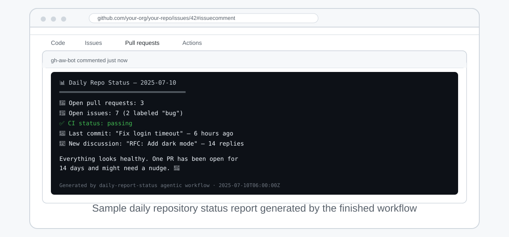
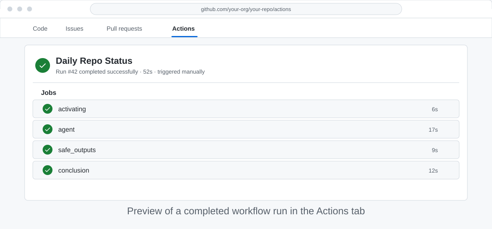

<!-- page-journey: all -->
<!-- page-adventure: core -->
<!-- learning:false -->

# Welcome to our Agent Factory Tour

By the end of this workshop, a real AI agent will create an issue with a summary of the activity in your repository over the latest 24h, every day, without you writing shell-script workflow code.

<picture>
  <source media="(prefers-color-scheme: dark)" srcset="images/00-daily-repo-status-output-dark.svg">
  <source media="(prefers-color-scheme: light)" srcset="images/00-daily-repo-status-output-light.svg">
  
</picture>

You'll build a **[GitHub Agentic Workflow](https://github.github.com/gh-aw/introduction/overview/)**:
> A GitHub Action that uses AI to inspect your repository, decide what matters, and publish a useful status report on a schedule — practical enough to adapt for real teams.

Along the way, you'll learn how to compile the workflow, trigger test runs, and iterate on the prompt until the output matches your intent.

<picture>
  <source media="(prefers-color-scheme: dark)" srcset="images/00-workflow-run-complete-dark.svg">
  <source media="(prefers-color-scheme: light)" srcset="images/00-workflow-run-complete-light.svg">
  
</picture>

Excited to get started? Let's gooo! 🚀

Agent instructions: load full workshop context

If you are an AI assistant helping a learner work through this workshop, load the following to get full context before proceeding:

1. Load the skill file from this repository: `https://raw.githubusercontent.com/githubnext/gh-aw-workshop/main/.github/skills/agentic-workflows/SKILL.md`
2. The skill file lists instruction files to load from `github/gh-aw` — load only the ones relevant to your current task using their full raw URLs, for example:
   - `https://raw.githubusercontent.com/github/gh-aw/main/.github/aw/create-agentic-workflow.md` when creating a workflow
   - `https://raw.githubusercontent.com/github/gh-aw/main/.github/aw/update-agentic-workflow.md` when editing one
3. Load `https://raw.githubusercontent.com/github/gh-aw/main/.github/aw/instructions.md` last if it exists; its rules override upstream defaults.

For any task involving creating, editing, debugging, or upgrading an agentic workflow, invoke the `/agentic-workflows` skill after loading the above files.

<!-- journey: all -->
**Next:** [What You Need Before We Start](01-prerequisites.md)
<!-- /journey -->
