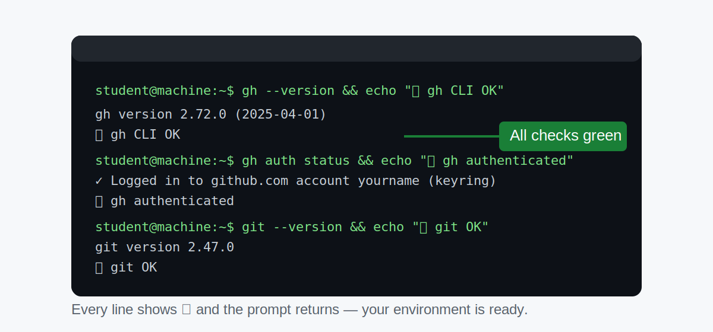

# Step 1: What You Need Before We Start

> _Starting with the right setup saves you from frustrating detours later._

## 🔀 Choose Your Setup Path

> [!IMPORTANT]
> **Not sure where to begin? Pick your path now:**
>
> | I am… | Go to… |
> |-------|--------|
> | New to coding or the terminal — or on a shared/school machine | ➡️ [Adventure A: Codespace (**recommended for beginners**)](02a-setup-codespace.md) — nothing to install, runs in your browser |
> | Comfortable with my terminal and local installs | ➡️ [Adventure B: Local Setup](02b-setup-local.md) |
>
> If you're unsure, **start with the Codespace path** — you can always switch later.

## 🎯 What You'll Do

You'll confirm that you have everything required before writing a single line of workflow code. By the end of this step you'll know which setup path to follow — Codespace or local terminal — and you'll be ready to move forward.

## Steps

> [!NOTE]
> **Already have a terminal open with `gh`, `git`, and `node` available?** Run this quick pre-flight check now. If you're starting fresh and haven't set up your environment yet, skip ahead to [Step 2a](02a-setup-codespace.md) or [Step 2b](02b-setup-local.md) and return here once your terminal is ready.
>
> ```bash
> # Pre-flight check -- run this once your terminal is open
> gh --version && echo "✅ gh CLI OK" || echo "❌ gh CLI missing — see install commands below"
> gh auth status && echo "✅ gh authenticated" || echo "❌ run: gh auth login"
> git --version && echo "✅ git OK" || echo "❌ git missing"
> node --version 2>/dev/null && echo "✅ node OK" || echo "ℹ️  node not required but useful"
> echo "Pre-flight complete."
> ```
>
> 
> _What success looks like: every line shows ✅ and the prompt returns without errors._

### 1. Confirm required vs optional prerequisites

- ✅ **Required:** `gh` CLI 2.x or newer (`gh --version`)
- ✅ **Required (local terminal path):** Git (`git --version`)
- ℹ️ **Optional:** Node.js (`node --version`) — not required for this workshop

If `gh` is missing, install it using one of these one-liners:

#### macOS (Homebrew)

```bash
brew install gh
```

#### Ubuntu/Debian

```bash
sudo apt install gh
```

#### Windows (winget)

```powershell
winget install GitHub.cli
```

Full installation docs: [cli.github.com](https://cli.github.com)

### 2. Check your GitHub account

You need a **free GitHub account**. If you don't have one yet, create it at [github.com/join](https://github.com/join).

> [!NOTE]
> You don't need a paid plan. Everything in this workshop works with a free GitHub account.

Authenticate your `gh` CLI now:

```bash
gh auth login
```

> [!IMPORTANT]
> **Verify your GitHub CLI authentication before continuing:**
>
> ```bash
> gh auth status
> ```
>
> If the output says you are not logged in, run:
>
> ```bash
> gh auth login
> ```
>
> Re-run `gh auth status` and confirm you see `Logged in to github.com` before proceeding to the next step.

### 3. Verify Git is available (local path only)

If you plan to work on your own computer, make sure Git is installed:

```bash
git --version
```

You should see something like `git version 2.x.x`. If you see an error, download Git from [git-scm.com](https://git-scm.com).

> [!TIP]
> If you'd rather skip Git setup entirely, use the Codespace path — it comes with Git, Node, and everything else pre-installed.

Need a quick terminal primer before continuing?

➡️ **[Side Quest: Terminal Basics](side-quest-terminal-basics.md)** — an optional walkthrough for opening a terminal, navigating folders, reading command output, and running your first practice commands.


### 4. Know what's coming

Here's a quick summary of what you'll have installed and running by the end of the workshop:

| Tool | What it does |
|------|-------------|
| **GitHub Codespace** or **local terminal** | Your development environment |
| **GitHub Actions** | Runs your automated workflows in the cloud |
| **gh CLI** | GitHub's official command-line tool |
| **gh-aw extension** | Adds agentic workflow commands to the gh CLI |

### 5. Choose your path

Now decide how you want to work:

> [!IMPORTANT]
> **Not sure which setup to use?**
> - **No coding experience, new to the terminal, or on a school/work machine?** → Use [Codespace (Step 2a)](02a-setup-codespace.md) — nothing to install.
> - **Comfortable with your terminal and local installs?** → Use [Local Setup (Step 2b)](02b-setup-local.md).

- **Codespace** — Everything runs in the browser. No installs. Ideal if you're on a shared machine or just want the fastest start.
- **Local terminal** — You'll work in your own terminal. Good if you prefer a local environment you already know.

## 🔀 Choose Your Path

| If you… | Go to… |
|---------|--------|
| Want to use GitHub Codespaces (recommended for beginners) | ➡️ [Adventure A: Set Up a Codespace](02a-setup-codespace.md) |
| Prefer to work in your local terminal | ➡️ [Adventure B: Set Up Your Local Terminal](02b-setup-local.md) |

## ✅ Checkpoint

- [ ] You have a GitHub account and can sign in
- [ ] gh CLI version 2.x or newer installed — verify with `gh --version`
- [ ] gh CLI is authenticated — run `gh auth login`, then verify with `gh auth status`
- [ ] You've decided whether to use Codespaces or your local terminal
- [ ] You know which file to open next

**Next:** Follow the link above for your chosen path — [Adventure A](02a-setup-codespace.md) or [Adventure B](02b-setup-local.md).
