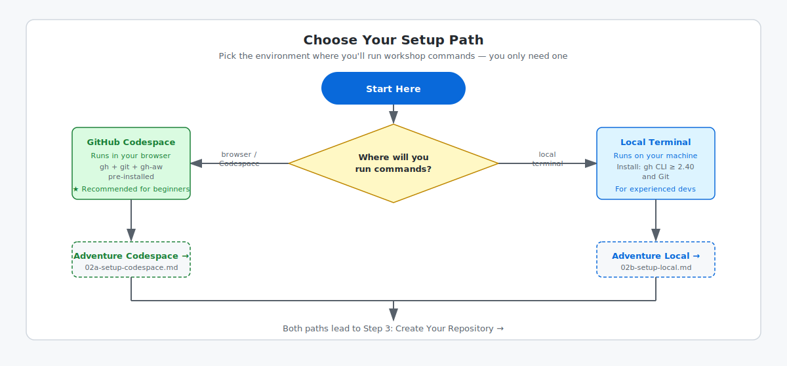

<!-- page-journey: all -->
<!-- page-adventure: core -->
<!-- learning:false -->

# Before we start

## 🎯 What You'll Do

In this step, you confirm your account and tool prerequisites, then choose your setup path. After this, you continue directly to the matching setup instructions instead of doing setup work here.

## Confirm account access

Sign in at [github.com](https://github.com). If you do not have an account yet, create one at [github.com/signup](https://github.com/signup).

## Choose your development environment

If you are unsure, start with a Codespace. It gives you a ready-to-use environment hosted in the cloud.

If you are **familiar with terminals**, use your usual local setup. We will go over the requirements.

> [!TIP]
> On a mobile device or using GitHub Copilot (CCA/Agents tab) with no access to a terminal? Choose the **GitHub UI path** — no installation or terminal is required. You will create your repository on github.com and author workflows directly from the Copilot or Agents tab in your browser.

## Verify AI engine access

Open [github.com/settings/copilot](https://github.com/settings/copilot) and confirm both show:

- **Copilot CLI is enabled**
- Some **Models are available**

Claude, Codex, or Gemini? Confirm your API key.

<!-- journey: codespace -->
**Next:** Open [Set Up a Codespace](02a-setup-codespace.md).
<!-- /journey -->
<!-- journey: local -->
**Next:** Open [Set Up Your Local Terminal](02b-setup-local.md).
<!-- /journey -->
<!-- journey: ui,copilot -->
**Next:** On [github.com/new](https://github.com/new), create a public repository named `my-agentic-workflows`. Check **Add a README file** and click **Create repository**. Then continue to [GitHub UI Path — No Installation Needed](06c-install-ui.md).
<!-- /journey -->
