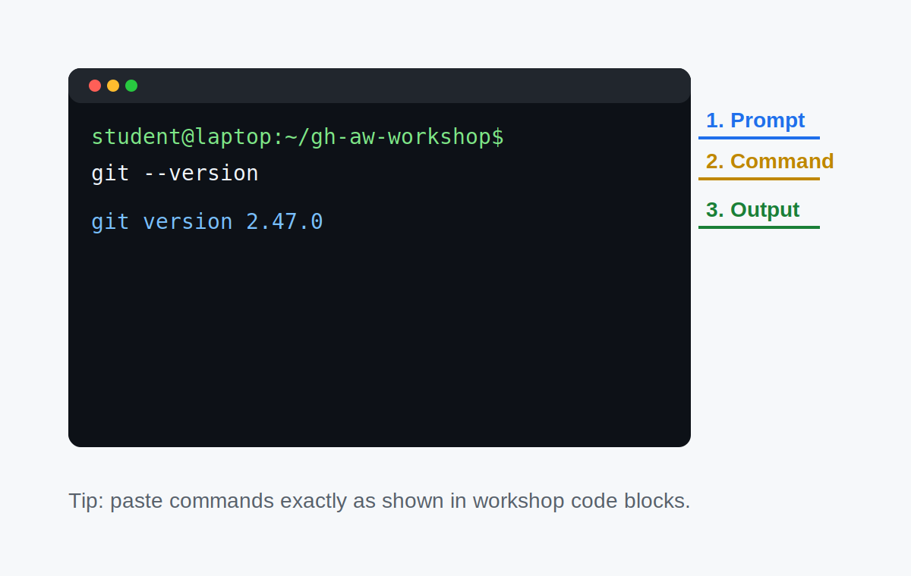

# Step 1: What You Need Before We Start

> _Starting with the right setup saves you from frustrating detours later._

## 🎯 What You'll Do

You'll confirm that you have everything required before writing a single line of workflow code. By the end of this step you'll know which setup path to follow — Codespace or local terminal — and you'll be ready to move forward.

## Steps

> [!IMPORTANT]
> The `gh` CLI (version 2.x or newer) is a required workshop prerequisite because
> you'll use it in [Step 6: Install the gh-aw CLI Extension](06-install-gh-aw.md).
>
> Verify it now:
>
> ```bash
> gh --version
> ```
>
> Expected output starts with `gh version 2.` (for example, `gh version 2.75.0`).
>
> If `gh` is missing, install it using one of these one-liners:
>
> **macOS (Homebrew):**
>
> ```bash
> brew install gh
> ```
>
> **Ubuntu/Debian:**
>
> ```bash
> sudo apt install gh
> ```
>
> **Windows (winget):**
>
> ```powershell
> winget install GitHub.cli
> ```
>
> Full installation docs: [cli.github.com](https://cli.github.com)

### 1. Check your GitHub account

You need a **free GitHub account**. If you don't have one yet, create it at [github.com/join](https://github.com/join).

> [!NOTE]
> You don't need a paid plan. Everything in this workshop works with a free GitHub account.

### 2. Verify Git is available (local path only)

If you plan to work on your own computer, make sure Git is installed:

```bash
git --version
```

You should see something like `git version 2.x.x`. If you see an error, download Git from [git-scm.com](https://git-scm.com).

> [!TIP]
> If you'd rather skip Git setup entirely, use the Codespace path — it comes with Git, Node, and everything else pre-installed.

<!-- markdownlint-disable MD033 -->
<details>
<summary><strong>New to the terminal?</strong> Open this quick visual guide.</summary>



- **Prompt**: where your terminal is currently "standing" (for example your user/computer name and folder).
- **Command**: what you type (`git --version`, `node --version`, etc.).
- **Output**: what the computer prints after running your command.

### Quick beginner FAQ

| Error | What it means | What to try |
|------|------|------|
| `command not found` | The tool is not installed (or not available in this terminal) | Install the tool, then close and reopen the terminal |
| `permission denied` | Your account cannot run that command as written | Re-run with the documented `sudo` step (Linux/macOS) or open an elevated terminal when instructions require it |
| "No such file or directory" / path errors | You're in a different folder than the command expects | Run `pwd` (macOS/Linux) or `cd` to the expected folder, then try again |

</details>
<!-- markdownlint-enable MD033 -->

### 3. Know what's coming

Here's a quick summary of what you'll have installed and running by the end of the workshop:

| Tool | What it does |
|------|-------------|
| **GitHub Codespace** or **local terminal** | Your development environment |
| **GitHub Actions** | Runs your automated workflows in the cloud |
| **gh CLI** | GitHub's official command-line tool |
| **gh-aw extension** | Adds agentic workflow commands to the gh CLI |

### 4. Choose your path

Now decide how you want to work:

- **Codespace** — Everything runs in the browser. No installs. Ideal if you're on a shared machine or just want the fastest start.
- **Local terminal** — You'll work in your own terminal. Good if you prefer a local environment you already know.

## 🔀 Choose Your Path

| If you… | Go to… |
|---------|--------|
| Want to use GitHub Codespaces (recommended for beginners) | ➡️ [Adventure A: Set Up a Codespace](02a-setup-codespace.md) |
| Prefer to work in your local terminal | ➡️ [Adventure B: Set Up Your Local Terminal](02b-setup-local.md) |

## ✅ Checkpoint

- [ ] You have a GitHub account and can sign in
- [ ] gh CLI version 2.x or newer installed — verify with `gh --version`
- [ ] You've decided whether to use Codespaces or your local terminal
- [ ] You know which file to open next

**Next:** Follow the link above for your chosen path — [Adventure A](02a-setup-codespace.md) or [Adventure B](02b-setup-local.md).
