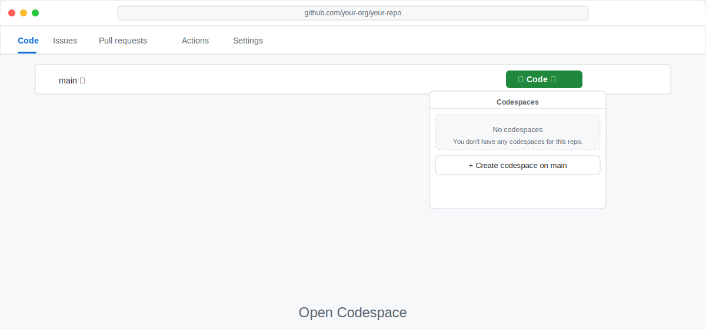
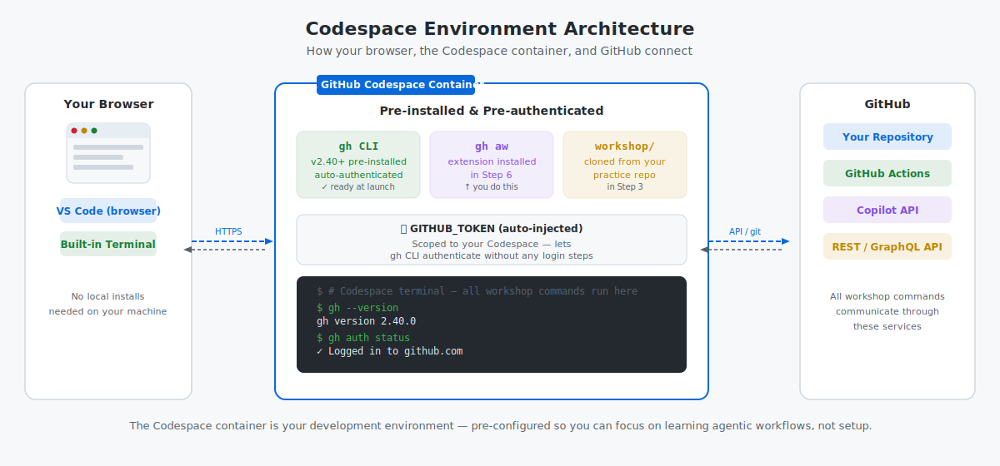

<!-- page-journey: codespace -->
<!-- page-adventure: setup -->
# Set Up a Codespace

## 🎯 What You'll Do

You'll launch a GitHub Codespace for this workshop, open the built-in terminal, and land in a ready-to-use environment for the next step.

## Steps

**Verify you are on the right path before continuing:**

- [ ] You have a GitHub account with access to GitHub Codespaces
- [ ] You want a browser-based terminal and do not need to install tools locally

> [!TIP]
> On a tablet or shared computer? The Codespace path is the easiest option — it runs entirely in your browser with no local installs. On a phone screen the terminal is harder to use; if possible, switch to a tablet or laptop for this workshop.

These steps take about 5 minutes. If you get stuck on any command, [Side Quest: Terminal Basics](side-quest-01-01-terminal-basics.md) is a 2-minute read.

### New repository

1. Create your own public repository at [github.com/new](https://github.com/new):
   - Choose yourself as owner.
   - Visibility **Private**, it's good to learn on our own. We can make it public later if we want to share our work.
   - Name it `my-agentic-workflows`.
   - Check **Add a README file**.
   - Click **Create repository**.

### Open the Codespace

1. In your new repository, click the green **Code** button.
2. Click the **Codespaces** tab.
   - Leave **main** selected as the branch.
   - Click **Create codespace on main**.
   - Wait 30–60 seconds for GitHub to prepare the container and open the editor.
3. The Codespace opens in a new browser tab showing a VS Code-style editor. Leave this tab open for the rest of the workshop.



Codespaces auto-save your work. If you close the tab, open [github.com/codespaces](https://github.com/codespaces) to resume where you left off.

<details>
<summary>Codespace not appearing or taking too long?</summary>

- **"Create codespace on main" is greyed out** — your account may not have Codespaces enabled. Check [github.com/settings/billing](https://github.com/settings/billing) or ask your organization admin.
- **Spinner runs more than 3 minutes** — refresh the browser tab. If still stuck, go to [github.com/codespaces](https://github.com/codespaces), find the pending Codespace, click **⋯ → Delete**, and try again.
- **"Codespace limit reached"** — you may have existing Codespaces using your quota. Visit [github.com/codespaces](https://github.com/codespaces), delete any you no longer need, and retry.
- **VS Code desktop opens instead of the browser** — click **Open in Browser** in the dialog, or close VS Code desktop and return to the browser tab.

</details>

### Open the Codespace terminal

1. When the Codespace editor loads, open the built-in terminal with **Ctrl+\`** (or **Cmd+Option+\`** on Mac).
2. Wait for the terminal prompt to appear.
3. Keep this terminal open. It is already inside your practice repository.

> [!TIP]
> If the terminal in your Codespace shows a `$` prompt, the container is ready. If you see an error, see [install troubleshooting](side-quest-06-01-install-troubleshooting.md).

<details>
<summary>First time in a terminal?</summary>

Type your command after the `$` prompt and press Enter. Output appears below; a new `$` prompt means the command finished. See [Side Quest: Terminal Basics](side-quest-01-01-terminal-basics.md) for more.

</details>

### Verify your Codespace is ready

The diagram below shows your Codespace connection to GitHub.



1. Run these commands in the Codespace terminal:

   ```bash
   gh --version
   ```
2. Confirm `gh --version` shows `gh version 2.40.0` or newer.

_What success looks like:_

```text
gh version 2.40.0 (2024-01-01)
```

You should see `gh version 2.40.0` or newer and a line confirming you're logged in to `github.com`.

## ✅ Checkpoint

- [ ] You confirmed your GitHub plan includes Codespaces access (free for public repositories)
- [ ] The Codespace editor is open in your browser
- [ ] The built-in terminal is open in your Codespace
- [ ] `gh --version` returns version 2.40.0 or newer
- [ ] The Codespace is attached to your `my-agentic-workflows` practice repository

<!-- journey: codespace -->
**Next:** [GitHub Actions Intro](04-github-actions-intro.md)
<!-- /journey -->
