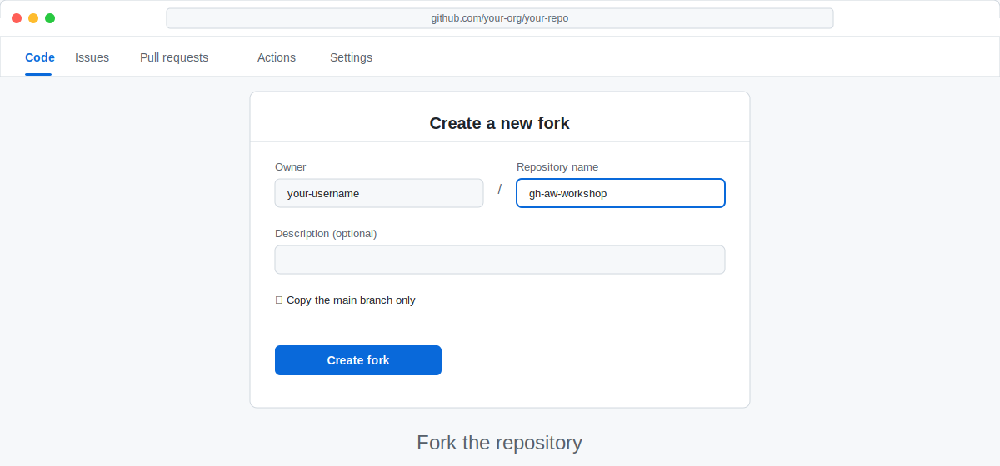

# Adventure A: Set Up a Codespace _(recommended for new users)_

> [!IMPORTANT]
> **Choose the setup path that matches how you work:**
>
> | I use… | Go to… |
> |------|------|
> | **GitHub Codespaces**, **copilot-app**, or **cloud-agent** | ✅ Stay on **Adventure A** (this page) |
> | A local terminal on your own machine (including **VS Code integrated terminal** outside Codespaces) | ➡️ Use [Adventure B: Set Up Your Local Terminal](02b-setup-local.md) |

Adventure A is the no-local-install path for **Codespace**, **VS Code (integrated terminal in Codespaces)**, **copilot-app**, and **cloud-agent** users.

_A Codespace gives you a full development environment in your browser — no installs, no version conflicts, just you and the workshop._

## 🎯 What You'll Do

You'll launch a GitHub Codespace for this workshop's practice repository, confirm that all the tools you need are already waiting for you, and arrive at the shared workshop path ready to write your first workflow.

## 📋 Before You Start

- You've completed [Step 1: What You Need Before We Start](01-prerequisites.md)
- You have a free GitHub account and are signed in

## Steps

### 1. Fork the workshop repository

The workshop repository contains a starter project and a pre-configured Codespace. You'll fork it so you have your own copy to experiment with.

1. Open [github.com/githubnext/gh-aw-workshop](https://github.com/githubnext/gh-aw-workshop) in your browser.
2. Click **Fork** (top-right corner).
3. Accept the defaults and click **Create fork**.



> [!NOTE]
> Forking creates your own copy of the repository under your account. All changes you make stay in your fork — you won't affect the original.

### 2. Open the Codespace

1. From your new fork, click the green **Code** button.
2. Click the **Codespaces** tab.
3. Click **Create codespace on main**.


GitHub will spin up a container with everything pre-installed. This takes about 30–60 seconds on first launch.

> [!TIP]
> Codespaces auto-saves your work. If you close the tab, open [github.com/codespaces](https://github.com/codespaces) to resume where you left off.

### 3. Verify the tools are ready

Once the Codespace editor loads, open the built-in terminal with **Ctrl+`** (or **Cmd+`** on Mac) and run these checks:

> [!TIP]
> **First time in a terminal?** A blank prompt is normal. Try:
> - `pwd` → prints your current folder path
> - `ls` → lists files and folders in the current location
> - `cd workshop` → moves into the `workshop` folder
> - `cd ..` → moves back up one folder
> - `git status` → shows `On branch main` and whether your working tree is clean

```bash
gh --version
```

You should see something like `gh version 2.x.x`.

```bash
gh extension list
```

You should see `github/gh-aw` listed. If you don't see it yet, don't worry — you'll install it in a later step.

> [!NOTE]
> The Codespace was built from a `.devcontainer` configuration that pre-installs the `gh` CLI. You don't need to install it yourself.

### 4. Authenticate the gh CLI

The `gh` CLI needs to be authorised to act on your behalf.

```bash
gh auth login
```

Follow the prompts. When asked, choose **GitHub.com** and then **Login with a web browser**. Copy the one-time code displayed, open the URL, and paste it.

> [!WARNING]
> Your Codespace is private to you, but it's still good practice to authenticate with the minimum scopes needed. The default scopes selected by `gh auth login` are exactly right for this workshop.

### 5. Confirm you're in the right repo

```bash
gh repo view --json name,owner | cat
```

You should see your username as `owner` and `gh-aw-workshop` as `name`.

## ✅ Checkpoint

- [ ] Your fork is created on GitHub
- [ ] The Codespace editor is open in your browser
- [ ] `gh --version` returns a version number
- [ ] `gh auth login` completed without errors

**Next:** [Step 3: Create Your Practice Repository](03-create-your-repo.md)

## 📚 See Also

- [Overview of GitHub Agentic Workflows](https://github.github.com/gh-aw/introduction/overview/)
