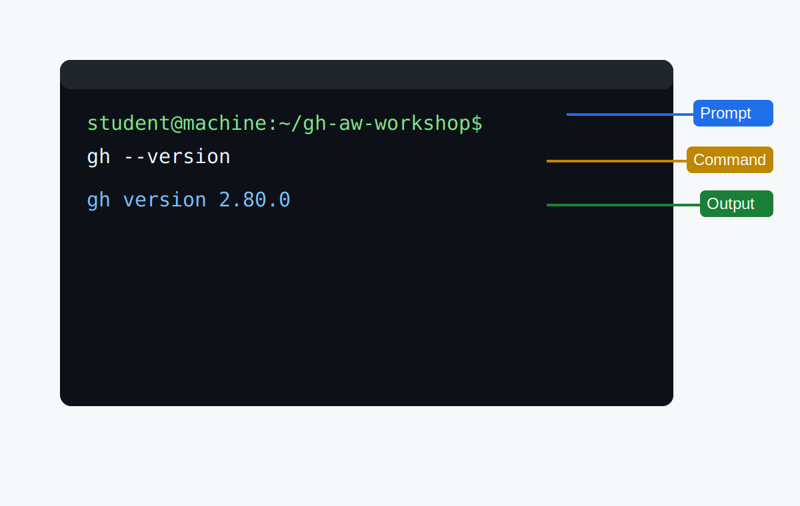
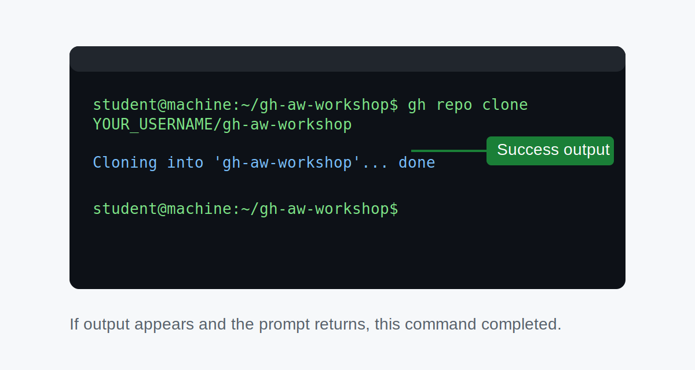
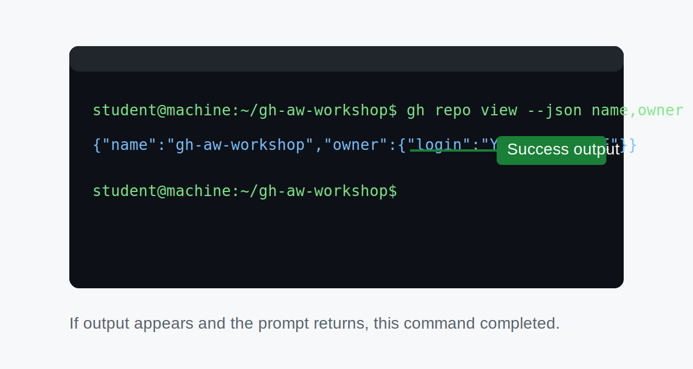

# Adventure B: Set Up Your Local Terminal

> [!IMPORTANT]
> **Not using a local terminal? → [Return to Adventure A (Codespace)](02a-setup-codespace.md)**
>
> **Using Copilot app or cloud agent?** These entry points don't include a local terminal.
> Open this repository in a [Codespace](02a-setup-codespace.md#open-the-codespace) first,
> then continue with [Adventure A](02a-setup-codespace.md) and run all commands in the Codespace terminal.

_Working locally means you'll use the tools and shell you already know — let's get them ready in a few quick steps._

## 🎯 What You'll Do

> [!IMPORTANT]
> If you run into trouble with any terminal step, switch to a Codespace at any time — all progress is preserved in your repository. ➡️ [Adventure A: Set Up a Codespace](02a-setup-codespace.md)

You'll install the tools you need on your own machine: Git and the `gh` CLI. You'll authenticate with GitHub, and by the end you'll be at exactly the same starting point as Codespace users — ready to write your first workflow.

## 📋 Before You Start

- You've completed [Step 1: What You Need Before We Start](01-prerequisites.md)
- You have a free GitHub account and are signed in
- You have a terminal application open (Terminal on macOS, Windows Terminal or Git Bash on Windows, any terminal on Linux)

> [!NOTE]
> **New to terminals?** A terminal (also called a shell or command line) is a text-based interface where you type commands to control your computer. If that sounds unfamiliar, you may find it easier to use [Adventure A: Codespace](02a-setup-codespace.md) instead — it sets everything up for you in the browser with no local installs required.

## 🧭 Terminal Basics

If this is your first time in a terminal, use this legend while running each step:



- **Prompt** = where you type
- **Command** = exactly what to copy/paste from the code block
- **Output** = what success or errors look like after pressing Enter

All command blocks below are copy-paste-ready (no leading `$`).

## Steps

### Pre-flight check your current `gh` state

Run this before installing anything:

```bash
gh auth status && gh extension list
```

_What success looks like:_ the command runs without shell errors and shows your current login state plus any installed extensions.

If the command fails with `gh: command not found`, continue to [Install the gh CLI](#install-the-gh-cli) below, then re-run this pre-flight check.

Expected output includes one of these login states:

```text
✓ Logged in to github.com account <your-username>
```

or:

```text
You are not logged into any GitHub hosts. Run gh auth login to authenticate.
```

`gh extension list` can show existing extensions or no entries if you have none yet.

> [!NOTE]
> **Using GitHub Enterprise Server (GHES) or GitHub Enterprise Cloud (GHEC)?** Review [Side Quest: Enterprise Setup Considerations](side-quest-enterprise-setup.md) before continuing.
> If you're blocked by SSO, proxy, or host-specific install issues, also use [Side Quest: Install `gh-aw` Troubleshooting](side-quest-06-01-install-troubleshooting.md).

### Create your practice repository

1. Open [github.com/new](https://github.com/new).
2. Enter `my-agentic-workflows` for **Repository name**.
3. Set **Visibility** to **Public**.
4. Check **Add a README file**.
5. Click **Create repository**.

> [!NOTE]
> Creating `my-agentic-workflows` now keeps setup ordering consistent with the Codespace path and avoids an empty repository.

### Verify Git

```bash
git --version
```


_What success looks like:_ a line like `git version 2.x.x`.

You should see `git version 2.x.x` or higher. If you see an error, download Git from [git-scm.com](https://git-scm.com) and re-run the check.

### Install the gh CLI

The `gh` CLI is GitHub's official command-line tool. Check whether it's already installed:

```bash
gh --version
```


_What success looks like:_ version details for `gh` are printed.

If not, follow the instructions for your platform at [cli.github.com](https://cli.github.com). The most common options:

**macOS:**

```bash
brew install gh
```


_What success looks like:_ installation completes and returns to prompt.

**Windows:**

```bash
winget install --id GitHub.cli
```


_What success looks like:_ package install reports success.

**Linux (Debian/Ubuntu):**

```bash
(type -p wget >/dev/null || (sudo apt update && sudo apt-get install wget -y)) \
&& sudo mkdir -p -m 755 /etc/apt/keyrings \
&& wget -qO- https://cli.github.com/packages/githubcli-archive-keyring.gpg | sudo tee /etc/apt/keyrings/githubcli-archive-keyring.gpg > /dev/null \
&& sudo chmod go+r /etc/apt/keyrings/githubcli-archive-keyring.gpg \
&& echo "deb [arch=$(dpkg --print-architecture) signed-by=/etc/apt/keyrings/githubcli-archive-keyring.gpg] https://cli.github.com/packages stable main" | sudo tee /etc/apt/sources.list.d/github-cli.list > /dev/null \
&& sudo apt update \
&& sudo apt install gh -y
```


_What success looks like:_ apt completes and `gh` is installed without errors.

### Authenticate the gh CLI

```bash
gh auth login
```


_What success looks like:_ interactive prompts complete and login succeeds.

Choose **GitHub.com** and then **Login with a web browser**. A one-time code will appear in your terminal — copy it, open the URL shown, and paste the code when prompted.

> [!WARNING]
> Never share the one-time code or your authentication token with anyone. If you accidentally commit a token, revoke it immediately in **Settings → Developer settings → Personal access tokens**.

### Clone your practice repository

Replace `YOUR_USERNAME` with your GitHub username:

```bash
gh repo clone YOUR_USERNAME/my-agentic-workflows
cd my-agentic-workflows
```



_What success looks like:_ clone finishes and `cd` returns you to a prompt inside `my-agentic-workflows`.

### Verify everything is in order

```bash
gh repo view --json name,owner | cat
gh --version
```



_What success looks like:_ both commands print output; `owner` is your GitHub username.

Both commands should return output without errors. The repo view should show your username as `owner` and `my-agentic-workflows` as `name`.

## 🛟 Troubleshooting

If setup commands fail, use [Side Quest: Install `gh-aw` Troubleshooting](side-quest-06-01-install-troubleshooting.md) for quick fixes (`command not found`, permissions, proxy, and GHES-specific setup), then return here.

## ✅ Verify your setup

Run this exact command from inside `my-agentic-workflows`:

```bash
gh auth status && gh extension list && gh repo view --json owner,name --jq '"\(.owner.login)/\(.name)"'
```

_What success looks like:_ no errors are shown across all command output, and the final line is exactly:

```text
<your-username>/my-agentic-workflows
```

You should see your actual GitHub username in place of `<your-username>` in that final output line.

If this combined check stops early, run each command on its own to find the failing step.

If you get any error, stop here and use [Side Quest: Install `gh-aw` Troubleshooting](side-quest-06-01-install-troubleshooting.md) before moving on.

## ✅ Checkpoint

- [ ] Your `my-agentic-workflows` repository exists on GitHub with a starter README
- [ ] `git --version` returns a version number
- [ ] `gh --version` returns a version number
- [ ] `gh auth login` completed without errors
- [ ] You've cloned the repository and `cd`-ed into it

**Next:** [Step 3: Open and Verify Your Practice Repository](03-create-your-repo.md)

## 📚 See Also

- [Overview of GitHub Agentic Workflows](https://github.github.com/gh-aw/introduction/overview/)
