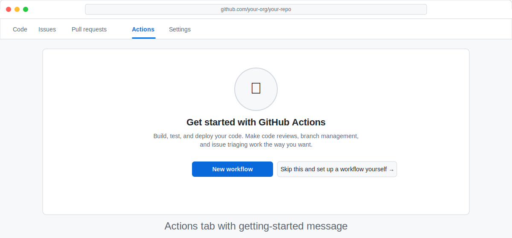

# Step 3b: Create Your Practice Repository — GitHub UI Path

> _When you're done with this step, you'll have a public `my-agentic-workflows` repository open in your browser, with GitHub Actions enabled and ready for the rest of the workshop — no terminal required._

<!-- Separate adjacent callouts -->

> [!NOTE]
> **Using the Copilot app or a mobile device?** You can complete this workshop entirely in the browser. Steps 4–10, 11 (UI builds), 13b, and 15–16 all have browser-friendly versions. Steps 17–21 may require terminal access for the most advanced activities, but optional terminal-based alternatives exist if you gain access later. Want to use a terminal now? Switch to the [Terminal path](03a-create-your-repo-terminal.md).

## 🎯 What You'll Do

You'll create your `my-agentic-workflows` repository, keep it open in your browser, and confirm GitHub Actions is enabled.

## 📋 Before You Start

- You've completed [Step 1: What You Need Before We Start](01-prerequisites.md)
- You have a GitHub account and are signed in

> [!NOTE]
> **Using GitHub Enterprise Server (GHES) or GitHub Enterprise Cloud (GHEC)?** Review [Side Quest: Enterprise Setup Considerations](side-quest-enterprise-setup.md) before continuing.

## Steps

### Create your practice repository

1. Open [github.com/new](https://github.com/new).
2. Enter `my-agentic-workflows` for **Repository name**.
3. Set **Visibility** to **Public**.
4. Check **Add a README file**.
5. Click **Create repository**.

Adding a README avoids an empty-repository setup edge case.

### Confirm GitHub Actions is enabled

From your repository page, click the **Actions** tab.

You should see a message like _"Get started with GitHub Actions"_.

> [!NOTE]
> GitHub Actions is enabled by default for new public repositories. If you see a prompt to enable it, click the button to turn it on.

### Verify your setup

Confirm `my-agentic-workflows` and your username appear in the page header.

> [!TIP]
> Bookmark the repository URL — you'll visit it often to watch workflows run.

## ✅ Checkpoint

- [ ] `my-agentic-workflows` exists in your GitHub account
- [ ] The repository is open in your browser
- [ ] The **Actions** tab is visible and enabled
- [ ] Your username appears as the repository owner

**Next:** [Step 4: What Are GitHub Actions?](04-github-actions-intro.md)
