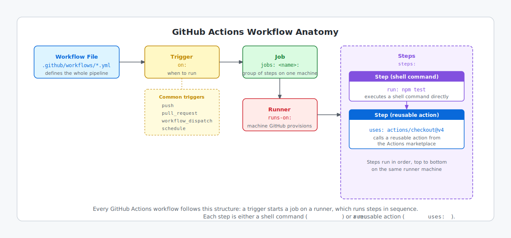

<!-- page-journey: all -->
<!-- page-adventure: core -->
# GitHub Actions in 5 Minutes

> [!TIP]
> <details>
> <summary><b>Already know GitHub Actions?</b> Check the three boxes below and skip ahead:</summary>
>
> - [ ] I know workflows live in `.github/workflows/` as YAML files
> - [ ] I can read `on`, `jobs`, and `steps` keys in a workflow file
> - [ ] I know each step runs on a GitHub-hosted runner
>
> **→ [Skip to What Are Agentic Workflows?](05-agentic-workflows-intro.md)**
> (or [jump to Install gh-aw](06-install-gh-aw.md) if you know both)
>
> </details>

## 🎯 What You'll Do

You'll do a fast refresher on the Actions primitives used in this workshop: [triggers](https://github.github.com/gh-aw/reference/triggers/), jobs, steps, and workflow files. After this step, you'll be able to read any classic GitHub Actions workflow file.

## 📋 Before You Start

- Practice repository is set up from a previous step.
- No tools or credentials needed for this step.

## Quick Refresher

A GitHub Actions workflow is a YAML file in `.github/workflows/` that tells GitHub:

- _when_ to run (`on`)
- _what_ to run (`jobs`)
- _how_ each job executes (`steps`)

```text
.github/
  workflows/
    hello.yml   ← each workflow file lives here
```

Annotated example — each comment names the key term (this is a standard Actions workflow, not an agentic workflow):

```yaml
# Standard GitHub Actions workflow — not an agentic workflow
name: Hello Workflow

on: workflow_dispatch         # trigger: the event that starts this workflow

jobs:
  hello:                      # job: a named group of steps on one machine
    runs-on: ubuntu-latest    # runner: the machine GitHub provisions for this job
    steps:
      - run: echo "Hello from GitHub Actions"   # step: a shell command on the runner
```

<details>
<summary>What is a runner?</summary>

A **runner** is the machine GitHub provisions for each job — fresh and isolated for every run.

```yaml
runs-on: ubuntu-latest   # also: windows-latest, macos-latest
```

You can also bring a **self-hosted runner** for custom hardware or private networks. Agentic workflows use the same hosted runners.

</details>

## Why This Matters for Agentic Workflows

Traditional workflows execute a fixed script path. Agentic workflows still use the same Actions foundation, but introduce AI-driven decision making inside that runtime.

## Label a sample workflow

The diagram below shows how the five key parts fit together in every workflow file.



Before reading on, label each highlighted part of the workflow below with its type:
`trigger`, `job`, `runner`, `step`, or `action`.

```yaml
on: [push]
jobs:
  test:
    runs-on: ubuntu-latest
    steps:
      - uses: actions/checkout@v4
      - run: echo "All checks passed"
```

- [ ] I labeled `on: [push]`
- [ ] I labeled `test:` (the job name under `jobs:`)
- [ ] I labeled `runs-on: ubuntu-latest`
- [ ] I labeled `uses: actions/checkout@v4`
- [ ] I labeled `run: echo "All checks passed"`

<details>
<summary>Reveal the labels</summary>

- `on: [push]` → **trigger** (when this workflow runs)
- `jobs: test:` → **job** (a group of steps that runs on one machine)
- `runs-on: ubuntu-latest` → **runner** (the machine type GitHub provisions)
- `uses: actions/checkout@v4` → **action** (a reusable step from the Actions marketplace)
- `run: echo "All checks passed"` → **step** (a shell command run directly on the runner)

</details>

## Try it: Explore a real workflow

Open a real workflow file and find the three core building blocks — no terminal or credentials required, just your browser.

1. Open any public repository on GitHub (for example, the [gh-aw-workshop](https://github.com/githubnext/gh-aw-workshop) repository).
2. Click the **Actions** tab.
3. Click any workflow in the left sidebar.
4. Click **View workflow file** (top right of the run list).
5. In the YAML, find and note:
   - The `on:` trigger — what event starts this workflow?
   - One `jobs:` entry — what is the job named?
   - One `steps` item — what command does it run?

## ✅ Checkpoint

- [ ] I can identify `on`, `jobs`, and `steps` in a workflow file
- [ ] I labeled all five parts of the sample workflow above (trigger, job, runner, action, step)
- [ ] I know workflows live in `.github/workflows/`
- [ ] I explored a real workflow and found its trigger, a job name, and a step command
- [ ] I answered the check-your-understanding questions
- [ ] I can continue to Step 5, or skip ahead to Step 6 if I already know this material

> [!TIP]
> This step covers several new terms quickly. If anything feels unclear — runner, trigger, action — the [gh-aw glossary](https://github.github.com/gh-aw/reference/glossary/) defines each one in a sentence. Bookmark it and return whenever you hit an unfamiliar term later in the workshop.

<!-- journey: all -->
**Next:** [What Are Agentic Workflows?](05-agentic-workflows-intro.md)
<!-- /journey -->


