# Step 5: What Are Agentic Workflows?

## 📋 Before You Start

**Enterprise users (GHEC, GHES, or EMU):** This step assumes your organization already has GitHub Copilot Enterprise available.

**Not on GHEC, GHES, or EMU?** Skip this section and continue to the next heading.

> [!IMPORTANT]
> Enterprise user (GHEC, GHES, or EMU)? Confirm you already completed the [enterprise prerequisite check in Step 1](01-prerequisites.md#enterprise-users) before continuing.
>
> If not, stop here, complete the [enterprise setup guide](side-quest-enterprise-setup.md), and return after your org admin has enabled your Copilot Enterprise access.

---

**⏱ In 30 seconds:** An agentic workflow is a plain-English task brief that an AI agent executes inside GitHub Actions. You write what you want — "summarize open issues and post a daily digest" — and the agent reads your repo, calls tools, reasons about the results, and posts the output automatically. No shell scripts. No brittle YAML. Just a goal and an agent that figures out the rest.



You'll finish this workshop with an automated workflow that checks your repository, decides what matters, and publishes a report your team can act on. This page gives you the payoff first, then explains the agentic workflow model behind it so the rest of the workshop feels concrete instead of abstract.
If you're evaluating whether agentic workflows are worth adopting for your team, this is the one page you need — it combines the business case with the technical model so you can decide quickly.

By the end of this workshop, your workflow produces a daily, stakeholder-ready repo status report like this:

```markdown
## Daily Repository Status — July 12

- ✅ CI health: 18 workflows succeeded, 1 failed (`docs-link-check`)
- 🔄 Pull requests: 7 open (2 need review, 1 stale > 14 days)
- 🐛 Issues: 4 new, 3 closed, 2 high-priority still open
- 🚀 Releases: No new tags in the last 24 hours

### Recommended next actions
1. Re-run `docs-link-check` and update broken external URLs.
2. Review PR #412 and PR #415 before noon.
3. Triage high-priority issue #398 with the platform team.
```

> [!IMPORTANT]
> **Coming from classic Actions? Unlearn these 3 things first:**
> 1. You do NOT write `jobs.steps` — write a goal in plain language instead.
> 2. The `.md` file is NOT documentation — it IS the workflow definition.
> 3. Output is not logs — it's a synthesized report the agent composes at runtime.

**TL;DR** — By the end of this workshop, a scheduled GitHub Actions workflow will automatically
generate a daily, stakeholder-ready status report for your repo — no script maintenance required.
This step explains what makes that possible.

_If you already know Actions, this step is the delta: what's new when workflows can reason, decide, and act._

> [!TIP]
> **Already know GitHub Actions and LLM concepts?** → [Jump to Step 6: Install gh-aw](06-install-gh-aw.md)

<!-- -->

> [!NOTE]
> **If you know GitHub Actions:** Agentic workflows look like Actions but the job runs an AI agent instead of shell commands. Here's what's different:
> - You define the goal in Markdown (`.md`) and compile it, instead of hand-authoring `jobs.steps` in YAML.
> - The agent decides how to complete the task at runtime, instead of executing a fixed command sequence.
> - The result is a synthesized report or recommendation, not just command logs from shell steps.

**Before** — classic GitHub Actions (you write every step):

```yaml
- name: List open issues
  run: gh issue list --json title,number | jq '.[] | .number, .title'
```

**After** — agentic workflow (you describe the goal):

```text
List all open issues that need triage and summarize them with recommended next steps.
```

That's the core shift. The agent handles the how at runtime.

## 🎯 What You'll Do

You'll connect what you already know about classic GitHub Actions to the agentic model used in this workshop.

This is not a re-introduction to Actions fundamentals — it's a focused view of what's different.

## Classic Actions vs Agentic Workflows

An agentic workflow is a Markdown file with two parts: a YAML frontmatter block that is fully backward compatible with GitHub Actions (same `on:`, `permissions:`, and trigger syntax you already know, plus a few agent-specific extras), and a body that is the plain-language prompt the agent receives. The `gh aw compile` command converts that Markdown file into a standard Actions workflow (`.lock.yml`) that runs the agent in a safe, sandboxed, gated job.

If you're coming from classic GitHub Actions, here's where the two models diverge:

- **File format:** Classic workflows are `.yml` files with `jobs.steps`. Agentic workflows are `.md` files (compiled to `.lock.yml`) — the task description is plain language below the frontmatter.
- **Execution:** Classic workflows are deterministic — same input, same output. Agentic workflows let the AI agent interpret the brief and decide how to act at runtime.
- **Runtime:** Classic workflows have no AI model involved. Agentic workflows use Copilot or another LLM as the runtime.
- **Best for:** Classic workflows excel at CI/CD pipelines, builds, and deployments. Agentic workflows are best for summaries, triage, reporting, and tasks that need judgment.

> [!NOTE]
> Both types of workflow live in `.github/workflows/` and use the same `on:` triggers and `permissions:` blocks — only the task description format changes.

Here is a complete minimal agentic workflow — the same structure you'll write in Step 7:

```yaml
---
name: Hello Agent
on:
  workflow_dispatch:
---

List all open issues that need triage and summarize them with recommended next steps.
```

> [!NOTE]
> **If you've used GitHub Actions before:** the key difference is that you write a _brief_ in plain language, not a sequence of shell commands — the agent decides how to fulfill it.

If you're coming from classic GitHub Actions, the shift is simple: keep your existing trigger/permission/review model, but replace scripted `jobs.steps` with a goal-oriented brief that an agent executes at runtime.

> [!TIP]
> **Optional side quest for Actions power users:** Want the one-page cheat sheet for what's new vs what stays the same? Read [Side Quest: Agentic Workflows for GitHub Actions Power Users](side-quest-05-01-actions-power-user.md), then return here.

## Platform Compatibility

> [!NOTE]
> **GHES users:** If you completed the [Enterprise Setup side quest](side-quest-enterprise-setup.md) before reaching this section, your environment should already be ready. If you skipped it, return to [Before You Start](#-before-you-start) at the top of this page.

| GitHub deployment | Agentic workflows supported? |
|---|---|
| **github.com** (free/Team/Enterprise) | ✅ Fully supported |
| **GitHub Enterprise Cloud (GHEC)** | ✅ Fully supported |
| **GitHub Enterprise Server (GHES) 3.12+** | ✅ Supported when Copilot Enterprise and network egress are configured by admin |
| **GitHub Enterprise Server (GHES) < 3.12** | ❌ Not supported — upgrade required |

> [!TIP]
> In this workshop, learn to iterate on agentic workflows by asking Copilot (or another capable agent) to use the `agentic-workflows` skill. Reading the workflow directly helps you understand it, but editing and debugging agentic workflows by hand is usually less effective. **Agents edit agents.**

## ✅ Checkpoint

- [ ] I can describe what an agentic workflow is in one sentence
- [ ] I can name at least one way agentic workflows differ from classic GitHub Actions

**Next:** [Step 6: Install the gh-aw CLI Extension](06-install-gh-aw.md)
