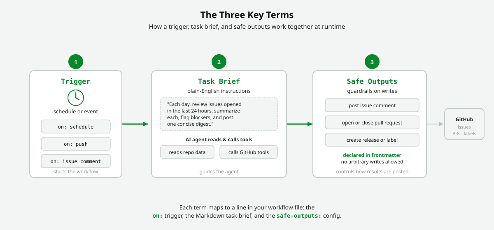
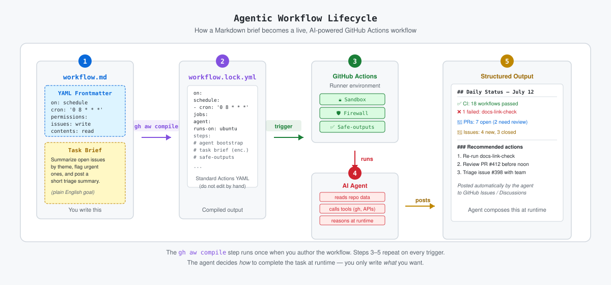
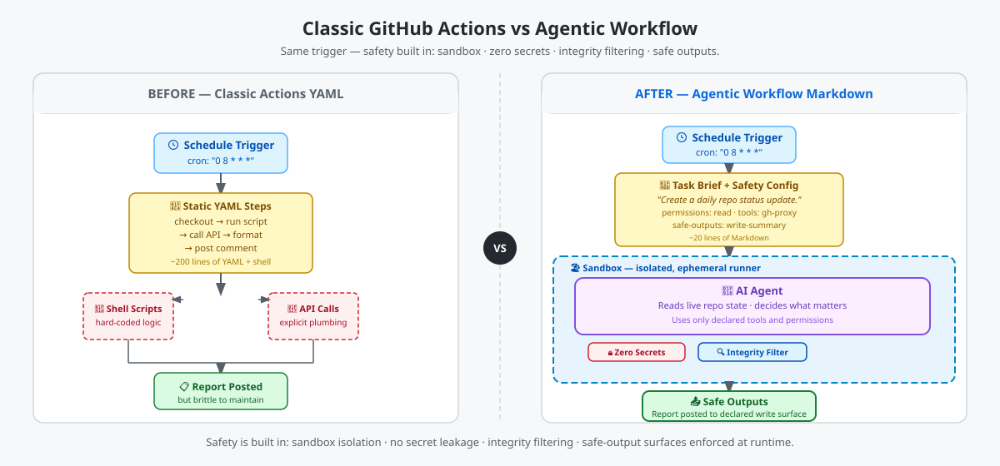

<!-- page-journey: all -->
<!-- page-adventure: core -->
# What Are Agentic Workflows?

**Already familiar with both GitHub Actions and AI agent execution environments?**

Before skipping, confirm you already know both of these:

- You can describe what an Actions workflow [trigger](https://github.github.com/gh-aw/reference/triggers/) does
- You have worked with AI agent execution environments in a production or CI/CD context

If both apply, [Skip to Install gh-aw](06-install-gh-aw.md).

## :clipboard: Before You Start

- You've read [What Are GitHub Actions?](04-github-actions-intro.md)

An [**Agentic Workflow**](https://github.github.com/gh-aw/introduction/overview/) is a plain-English task brief that an AI agent executes inside GitHub Actions. You write what you want — "summarize open issues and post a daily digest" — and the agent reads your repo, calls tools, and posts the output automatically.

Think of it like a scheduled digest: every morning it reads your inbox and sends you a summary — no keyboard required. The agent always runs in a sandbox and posts results through guardrailed safe outputs. You will explore security in [How Agentic Workflows Stay Safe](05b-agentic-workflows-security.md).

## Three key terms

| Term | What it means |
|---|---|
| [Trigger](https://github.github.com/gh-aw/reference/triggers/) | The event or schedule that starts the workflow |
| [Task brief](https://github.github.com/gh-aw/reference/markdown/) | The plain-English instructions you write for the agent |
| [Safe outputs](https://github.github.com/gh-aw/reference/safe-outputs/) | The guardrails that control how the workflow writes back to GitHub |

The diagram below shows how each term plays a role when the workflow runs.

<picture>
  <source media="(prefers-color-scheme: dark)" srcset="images/05-three-terms-dark.svg">
  <source media="(prefers-color-scheme: light)" srcset="images/05-three-terms-light.svg">
  
</picture>

For a full glossary, see [Side Quest: Agentic Workflows Deep Dive](side-quest-05-02-aw-deep-dive.md).

## The two-file structure

Before studying the diagram, write your prediction: what two files are involved, and which one does GitHub Actions actually run?

<picture>
  <source media="(prefers-color-scheme: dark)" srcset="images/05-workflow-lifecycle-dark.svg">
  <source media="(prefers-color-scheme: light)" srcset="images/05-workflow-lifecycle-light.svg">
  
</picture>

- **`.md` source file** — contains [YAML frontmatter](https://github.github.com/gh-aw/reference/frontmatter/) (trigger, permissions, runner) and your plain-English task brief. You author and edit this file.
- **`.lock.yml` compiled file** — [`gh aw compile`](https://github.github.com/gh-aw/reference/compilation-process/) generates it from the `.md`. GitHub Actions runs this file, not the `.md`. Never edit it by hand.

**Activity 1 — identify the parts:** Open any `.lock.yml` file in your repo and find the `on:` key. That is the compiled trigger that came from your [frontmatter](https://github.github.com/gh-aw/reference/frontmatter/).

```
# Example: open .github/workflows/my-workflow.lock.yml
# Find the "on:" key — that is your compiled trigger.
```

Now check your prediction: did you name both files and identify which one Actions runs (`.lock.yml`)?

## Activity 2 — agentic or standard?

The diagram below shows how the same schedule trigger leads to two very different outcomes — one driven by static YAML, the other by an AI agent with built-in safety guardrails.

<picture>
  <source media="(prefers-color-scheme: dark)" srcset="images/00-actions-vs-agentic-dark.svg">
  <source media="(prefers-color-scheme: light)" srcset="images/00-actions-vs-agentic-light.svg">
  
</picture>

Read each task and decide before revealing the answer.

**Task A:** Run lint and unit tests on every pull request, fail if any check exits non-zero.

<details>
<summary>Reveal Task A answer</summary>

**Standard Actions workflow.** Every run follows the same fixed steps. No judgment required.

</details>

**Task B:** Each morning, read all open issues, decide which look most urgent, and post a short triage summary.

<details>
<summary>Reveal Task B answer</summary>

**Agentic workflow.** The agent reads live data, applies judgment, and composes a different summary every run based on what it finds.

</details>

## Activity 3 — write a task brief

Write a one- or two-sentence task brief for this goal before revealing the example:

> Post a daily issue digest that summarizes newly opened issues and flags anything urgent.

```
Write your brief here before revealing the example.
```

<details>
<summary>Reveal one possible brief</summary>

You are a repository triage assistant. Each day, review issues opened in the last 24 hours, summarize each in one sentence, flag potential blockers, and post one concise digest comment for maintainers.

</details>

Check your brief against these three criteria:

- Does it include a **time window** (for example, "last 24 hours")?
- Does it specify the **output format** (single digest comment)?
- Does it define at least one **priority signal** (for example, blockers)?

If any answer is no, revise your brief before continuing.

> [!TIP]
> Want annotated examples and more exercises? See [Side Quest: Agentic Workflows Deep Dive](side-quest-05-02-aw-deep-dive.md).

## :white_check_mark: Checkpoint

- [ ] You can describe what an agentic workflow is in one sentence
- [ ] You can explain one difference between an agentic and a standard Actions workflow
- [ ] You know the three key terms: trigger, task brief, safe outputs
- [ ] You know that `gh aw compile` generates `.lock.yml` from the `.md` source
- [ ] You identified the `on:` key in a compiled `.lock.yml` file
- [ ] Your task brief includes a time window, output format, and priority signal

<details>
<summary>Still uncertain? Try this before moving on</summary>

Does `gh aw compile` change what the agent does at runtime? Decide first.

<details>
<summary>Reveal</summary>

No. Compile converts `.md` to `.lock.yml`. Runtime output comes from your task brief and live repo state.

</details>

</details>

<!-- journey: all -->
**Next:** [How Agentic Workflows Stay Safe](05b-agentic-workflows-security.md)
<!-- /journey -->
