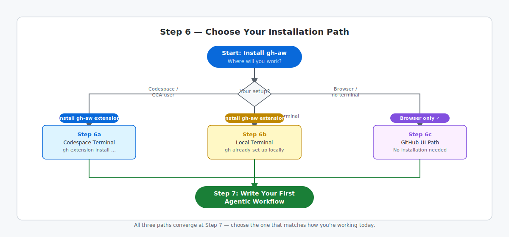

# Step 6: Install the gh-aw CLI Extension

`gh-aw` is the CLI extension that compiles your agentic workflow Markdown files and triggers runs from your terminal. If you're on the GitHub UI path, `gh-aw` runs on GitHub's infrastructure — no local installation is needed.

## Choose Your Path

The diagram below shows how the three paths diverge and then rejoin at Step 7.

| Path | Best for | Continue |
|---|---|---|
| **Codespace terminal** | Learners using a GitHub Codespace, including GitHub Copilot Cloud Agent (CCA) users | [Step 6a: Install gh-aw — Codespace Terminal](06a-install-terminal.md) |
| **Local terminal** | Learners running a local terminal with `gh` already set up | [Step 6b: Install gh-aw — Local Terminal](06b-install-local.md) |
| **GitHub UI** | Browser-only learners (Copilot Chat, Copilot app, or no terminal access) | [Step 6c: GitHub UI Path — No Installation Needed](06c-install-ui.md) |

All paths converge at [Step 7: Write Your First Agentic Workflow](07-your-first-workflow.md).

## ✅ Checkpoint

- [ ] You know which path matches your setup
- [ ] You've clicked through to the matching page above
- [ ] You understand that the GitHub UI path skips installation entirely
- [ ] You're ready to proceed to Step 7 after completing your chosen path

**Next:** Continue with your chosen path above.

## 📚 See Also

- [Overview of GitHub Agentic Workflows](https://github.github.com/gh-aw/introduction/overview/)
- [Side Quest: Install gh-aw Troubleshooting](side-quest-06-01-install-troubleshooting.md)
- [Side Quest: Configure GitHub Copilot for Agentic Workflows](side-quest-06-03-copilot-token.md)
