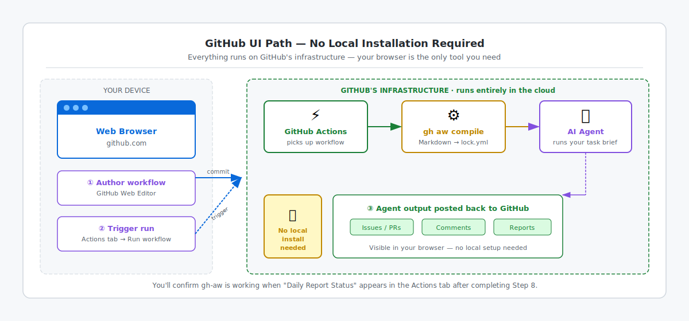

# Step 6c: GitHub UI Path — No Installation Needed

> [!NOTE]
> Changed your mind and want a terminal? Switch to [Step 6a: Codespace Terminal](06a-install-terminal.md) or [Step 6b: Local Terminal](06b-install-local.md).

## 🎯 What You'll Do

You'll confirm that the GitHub UI path does not require a local `gh-aw` installation and proceed directly to authoring your first workflow in the browser.

## 📋 Before You Start

- You've completed [Step 5: What Are Agentic Workflows?](05-agentic-workflows-intro.md)
- You are signed in to [github.com](https://github.com)
- You have your practice repository ready (from [Step 3b: GitHub UI Path](03b-create-your-repo-ui.md))

## Why no installation is needed

The compiled `.lock.yml` file is what GitHub actually runs. In Step 7b you'll paste the complete [compiled workflow](https://github.github.com/gh-aw/reference/compilation-process/) directly into the web editor — no local compile step needed. GitHub's infrastructure then executes the compiled workflow when you trigger it from the Actions tab.

You'll author workflow files using the GitHub web editor in Step 7b and trigger them from the Actions tab in Step 8. You'll confirm `gh-aw` is working when **Daily Report Status** appears in your workflow list.

## Triggering your workflow from the browser

CCA and mobile learners are already authenticated — you signed in to GitHub to reach this step. No additional authentication or terminal is needed.

After you commit a workflow file in [Step 7b](07b-your-first-workflow-ui.md) or a later step, navigate to the **Actions** tab in your repository, select the workflow name in the sidebar, and click **Run workflow**. You do not need `gh aw run`.

If you want a browser-only scenario with no terminal, [Adventure E in Step 10](10-choose-your-scenario.md#adventure-e-browser-only-daily-status-workflow-for-cca-and-mobile) walks you through using the Agentic Workflows agent (Copilot app or Agents tab) to create, compile, and commit a daily status workflow — no terminal required at any stage.

## What to do next

Continue to [Step 7b: Write Your First Agentic Workflow — GitHub UI Path](07b-your-first-workflow-ui.md).

## ✅ Checkpoint

- [ ] You are signed in to github.com
- [ ] You have your practice repository open and ready
- [ ] You understand that the GitHub UI path does not require a local `gh-aw` installation
- [ ] You understand that you will confirm `gh-aw` is working in [Step 8](08-run-your-workflow.md) via the Actions tab
- [ ] You know that CCA and mobile learners can trigger workflows from the **Actions** tab without `gh aw run`

**Next:** [Step 7b: Write Your First Agentic Workflow — GitHub UI Path](07b-your-first-workflow-ui.md)

## 📚 See Also

- [Overview of GitHub Agentic Workflows](https://github.github.com/gh-aw/introduction/overview/)
- [Compilation Process](https://github.github.com/gh-aw/reference/compilation-process/)
- [Agentic Authoring guide](https://github.github.com/gh-aw/guides/agentic-authoring/)
