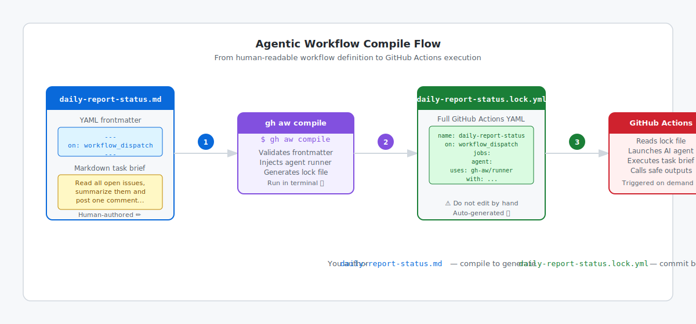

# Step 7: Write Your First Agentic Workflow

_Writing your first workflow is the moment theory becomes practice — let's make something real._

## 🎯 What You'll Do

You'll create `.github/workflows/daily-report-status.md`, a small workflow that reads repository issues and posts one controlled response.

## 📋 Before You Start

- Completed [Step 6: Install the gh-aw CLI Extension](06-install-gh-aw.md)
- The `gh aw` command is available in your terminal (or you'll use the GitHub UI path)
- If you are using Terminal or Copilot paths, `gh aw init` has been run and pushed in your practice repository
- If you skipped the Copilot access check in Step 1, complete [Step 7d: Confirm Model Access](07d-confirm-model-access.md) before choosing your path.

## Choose Your Path

| Path | What you'll do | Continue |
|---|---|---|
| **Terminal path** | Build the workflow incrementally in two short parts, compile after each meaningful change, then commit and push | [Write the workflow with the Terminal path](07a-your-first-workflow-terminal.md) |
| **GitHub UI path** | Paste the complete workflow into the web editor, then use the **Agentic Workflows** agent in the **Agents** tab to compile and commit the lock file | [Write the workflow with the GitHub UI path](07b-your-first-workflow-ui.md) |
| **GitHub Copilot path** | Ask an agent to create and validate the workflow, then review and merge its pull request | [Write the workflow with GitHub Copilot](07c-your-first-workflow-copilot.md) |

The Terminal path gives you early compiler feedback. The GitHub UI path skips local compile checkpoints and uses the **Agentic Workflows** agent in the **Agents** tab to generate the lock file. The GitHub Copilot path delegates `gh aw compile` to the agent's session workspace.

All three authoring paths converge at [Step 7d: Confirm Model Access](07d-confirm-model-access.md) before you run the workflow.

## Before You Continue

In one sentence, where will you manually start the first `workflow_dispatch` run in your chosen path?

## ✅ Checkpoint

- [ ] You chose one path (Terminal, GitHub UI, or GitHub Copilot) and are ready to follow that step
- [ ] You can explain in one sentence how `daily-report-status.md` differs from `daily-report-status.lock.yml`
- [ ] You know the compile command for an agentic workflow file: `gh aw compile`
- [ ] You know the compiled file location: `.github/workflows/daily-report-status.lock.yml`

**Next:** Continue with your chosen path above.
