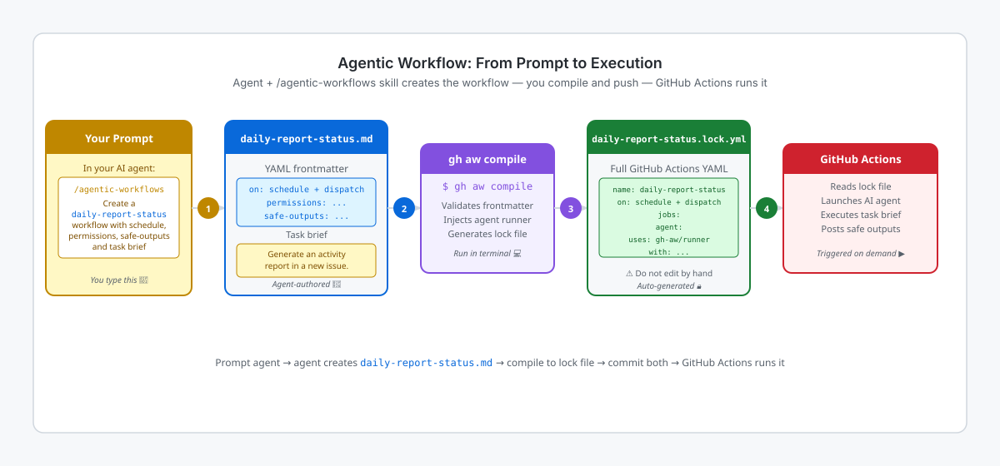
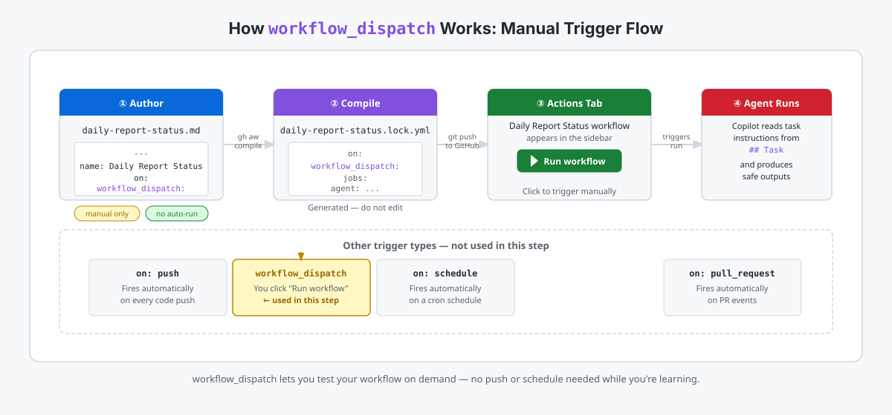

<!-- page-journey: all -->
<!-- page-adventure: core -->
# Write Your First Agentic Workflow

_Writing your first workflow is the moment theory becomes practice — let's make something real._

## 🎯 What You'll Do

You'll use Copilot to create `.github/workflows/daily-report-status.md` — a scheduled workflow that triggers once a day.

You'll start with `daily-report-status.md` and end with `daily-report-status.lock.yml`, the compiled workflow that GitHub Actions runs.



## 📋 Before You Start

- Completed [Install the gh-aw CLI Extension](06-install-gh-aw.md)
- The `gh aw` command works in your terminal
- You already ran `gh aw init` and pushed `.github/skills/agentic-workflows/`

## Create your first workflow

> [!NOTE]
> Use **Copilot CLI** (`gh copilot suggest`) for all agentic workflow tasks in this workshop. Copilot CLI is the same harness that agentic workflows use at runtime, so your prompts behave the same way locally as they do in automation — Copilot Chat (Agent Mode) runs in a different harness and may produce different results.

In Copilot CLI, run this prompt:

```text
/agentic-workflows Create a daily-report-status workflow that runs on a daily schedule. Compile it after creating it.
```

The agent creates the file and compiles it for you. If you hit a compile error, use [Side Quest: Using `gh aw compile` to Catch Errors Early](side-quest-07-01-compile-workflow.md).

<picture>
  <source media="(prefers-color-scheme: dark)" srcset="images/07a-workflow-dispatch-trigger-dark.svg">
  <source media="(prefers-color-scheme: light)" srcset="images/07a-workflow-dispatch-trigger-light.svg">
  
</picture>

## ✅ Checkpoint

- [ ] `.github/workflows/daily-report-status.md` exists
- [ ] `daily-report-status.lock.yml` was generated by the agent

<!-- journey: all -->
**Next:** [Add Instructions and Finish the Workflow](07a-part2-your-first-workflow-instructions.md)
<!-- /journey -->
