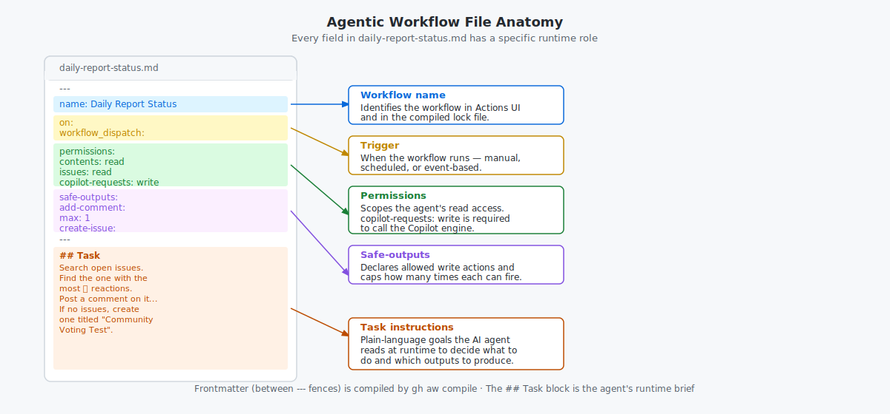

# Step 7a (Part 2): Add Instructions and Finish the Workflow — Terminal Path

_You now have a valid starter file. In this part, you complete it and push it._

## 🎯 What You'll Do

You'll finish `.github/workflows/daily-report-status.md` by adding:

- `permissions` and `safe-outputs` in frontmatter
- a `## Task` instructions block below frontmatter
- a final compile check, commit, and push

## 📋 Before You Start

- Completed [Part 1](07a-your-first-workflow-terminal.md)
- `gh aw compile` already passes once

## Steps

Each section of your workflow file serves a distinct purpose at runtime — the diagram below shows what each part controls.



### Add `permissions` and `safe-outputs`

In `.github/workflows/daily-report-status.md`, update frontmatter so it looks like this:

```yaml
---
name: Daily Report Status
on:
  workflow_dispatch:
permissions:
  contents: read
  issues: read
  copilot-requests: write
safe-outputs:
  add-comment:
    max: 1
  create-issue:
    max: 1
---
```

### Add your task instructions

Below the closing `---`, add:

```markdown
## Task

Search the open issues in this repository.
Find the issue with the most 👍 reactions.
Post a comment on that issue saying:
"This issue has the most community support! We'll prioritise it in our next planning session."

If there are no open issues, create one titled "Community Voting Test" and post the same comment.
```

### Validate, then commit and push

Before you run the workflow, confirm Copilot access is in place — this is the most common reason first runs fail:

> [!IMPORTANT]
> <details>
> <summary><b>Confirm Copilot access before you push</b></summary>
> 
> - Your frontmatter includes `copilot-requests: write` under `permissions` (already done in the step above).
> - Your GitHub account has an active Copilot subscription — check at [github.com/settings/copilot](https://github.com/settings/copilot).
> 
> If either is missing, the workflow will fail with a `401 Unauthorized` error the moment it tries to call the Copilot engine. See [Side Quest: Configure GitHub Copilot for Agentic Workflows](side-quest-06-03-copilot-token.md) for details and troubleshooting.
>
> </details>

Run:

```bash
gh aw compile
```

Optional while editing: `gh aw compile --watch`.

Then commit and push:

```bash
git add .github/workflows/daily-report-status.md
git commit -m "Add daily-report-status agentic workflow"
git push
```

For follow-up edits, prefer asking an agent to update workflows with the `agentic-workflows` skill instead of hand-editing every line.

## ✅ Checkpoint

- [ ] `.github/workflows/daily-report-status.md` includes `permissions` with `copilot-requests: write`
- [ ] `.github/workflows/daily-report-status.md` includes `safe-outputs` for `add-comment` and `create-issue`
- [ ] The `## Task` instructions block in your workflow file describes a concrete task in plain language
- [ ] `gh aw compile` reports valid
- [ ] The file is committed and pushed to `main`
- [ ] You are ready to trigger the workflow in [Step 8: Run and Watch Your Workflow](08-run-your-workflow.md)
