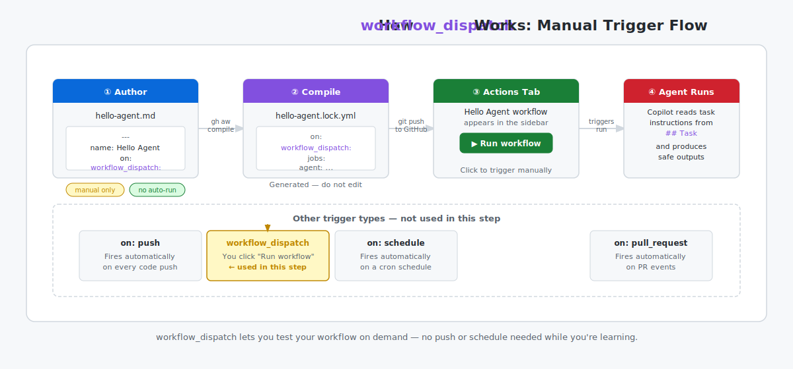

# Step 7a: Write Your First Agentic Workflow — Terminal Path

_Writing your first workflow is the moment theory becomes practice — let's make something real._

> [!NOTE]
> Want to work without a terminal? Switch to the [GitHub UI path](07b-your-first-workflow-ui.md).

## 🎯 What You'll Do

You'll create the first version of `.github/workflows/daily-report-status.md` with just two [frontmatter](https://github.github.com/gh-aw/reference/frontmatter/) fields:

- `name` (workflow label)
- `on.workflow_dispatch` (manual trigger)

Then you'll run your first compile check.

## 📋 Before You Start

- Completed [Step 6: Install the gh-aw CLI Extension](06-install-gh-aw.md)
- The `gh aw` command works in your terminal
- You already ran `gh aw init` and pushed `.github/skills/agentic-workflows/`
- Your practice repository is open (from [Step 3](03-create-your-repo.md))

## Steps

### Create the workflows directory

```bash
mkdir -p .github/workflows
```

### Create your first workflow file

```bash
touch .github/workflows/daily-report-status.md
```

Open `.github/workflows/daily-report-status.md` in your editor.

<details>
<summary>Using [VS Code](side-quest-01-02-environment-reference.md#visual-studio-code-vs-code)? Quick setup for cleaner YAML editing</summary>

- Install the [YAML extension for VS Code](https://marketplace.visualstudio.com/items?itemName=redhat.vscode-yaml)
- Set `editor.tabSize` to `2`
- Enable `editor.formatOnSave`

</details>

> [!IMPORTANT]
> This `.md` file is **not** the workflow GitHub Actions executes. You write the goal in Markdown; `gh aw compile` generates the `.lock.yml` file that Actions actually runs.

### Add the starter frontmatter

Paste this at the top of the file:

```yaml
---
name: Daily Report Status
on:
  workflow_dispatch:
---
```

- `name` is what you see in the Actions UI.
- `workflow_dispatch` means you can run it manually while testing.



<details>
<summary>Terminal tip (VS Code + Copilot)</summary>

In VS Code, open the integrated terminal with ``Ctrl+` `` (macOS: ``Cmd+` ``) and run `gh aw` commands there.

If you're unsure about a command, you can ask:

```bash
gh copilot suggest "how do I install a gh extension"
```

</details>

### Run your first compile check

```bash
gh aw compile
```

Expected result:

You see a green success message and a generated `.lock.yml` file next to `daily-report-status.md`.

If you hit an error, use [Side Quest: Using `gh aw compile` to Catch Errors Early](side-quest-07-01-compile-workflow.md).

After this first manual setup, prefer asking an agent to edit workflows with the `agentic-workflows` skill.

<!-- journey: terminal -->
Continue to [Part 2: Add instructions, safe outputs, and finish](07a-part2-your-first-workflow-instructions.md).
<!-- /journey -->

## ✅ Checkpoint

- [ ] `.github/workflows/daily-report-status.md` exists
- [ ] The file starts with valid frontmatter fences (`---` ... `---`)
- [ ] The frontmatter includes `name` and `on.workflow_dispatch`
- [ ] `gh aw compile` succeeds and generates `daily-report-status.lock.yml`
- [ ] `gh extension list` shows `github/gh-aw` is installed

## 📚 See Also

- [Overview of GitHub Agentic Workflows](https://github.github.com/gh-aw/introduction/overview/)
- [Frontmatter reference](https://github.github.com/gh-aw/reference/frontmatter/)
- [Triggers reference](https://github.github.com/gh-aw/reference/triggers/#dispatch-triggers-workflowdispatch)
- [Compilation Process](https://github.github.com/gh-aw/reference/compilation-process/)
- [Workflow Structure](https://github.github.com/gh-aw/reference/workflow-structure/)
