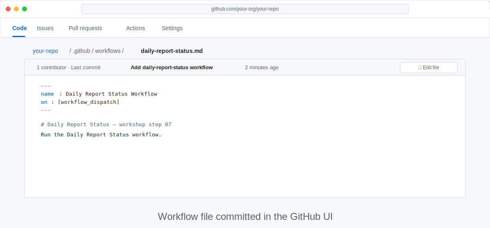
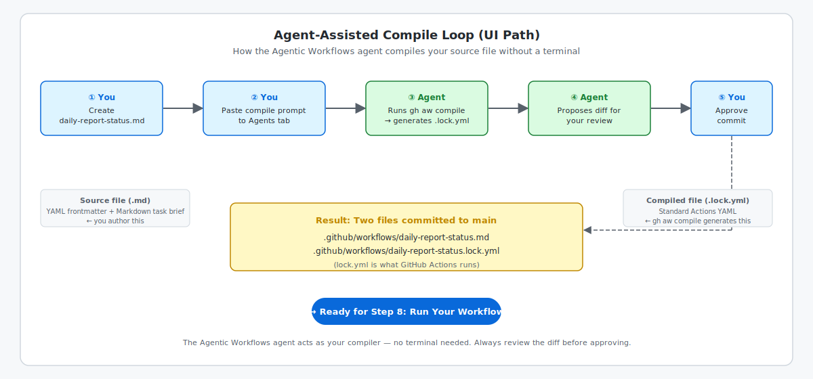

<!-- page-journey: ui -->
<!-- page-adventure: core -->
# Write Your First Agentic Workflow — GitHub UI Path

> [!NOTE]
> Want compiler feedback while you work? Switch to the [Terminal path](07a-your-first-workflow-terminal.md).

## 🎯 What You'll Do

You'll create a complete `daily-report-status.md` workflow in the GitHub web editor, then use the **Agentic Workflows** agent in the **Agents** tab to compile and commit the generated `daily-report-status.lock.yml` file without using a terminal.

## 📋 Before You Start

- Your practice repository is open in your browser
- You can create files in the repository
- The repository is available in the **Agents** tab

## Understand the file

An agentic workflow source file is a Markdown task brief with YAML [frontmatter](https://github.github.com/gh-aw/reference/frontmatter/). GitHub Actions runs the compiled `.lock.yml`; you edit the `.md` source first, then [compile](https://github.github.com/gh-aw/reference/compilation-process/) it into the `.lock.yml` file before Step 8.

## Create the workflow

1. Click **Add file** → **Create new file**.
2. Enter `.github/workflows/daily-report-status.md` as the filename.
3. Paste the complete content below:

   ```markdown
   ---
   name: Daily Report Status
   on:
     workflow_dispatch:
   permissions:
     contents: read
     issues: read
     copilot-requests: write
   safe-outputs:
     add-comment:
       max: 1
     create-issue:
       max: 1
   ---

   ## Task

   Search the open issues in this repository.
   Find the issue with the most 👍 reactions.
   Post a comment on that issue saying:
   "This issue has the most community support! We'll prioritise it in our next planning session."

   If there are no open issues, create one titled "Community Voting Test" and post the same comment.
   ```

4. Select **Commit directly to the `main` branch**.
5. Click **Commit changes**.



## Compile the workflow in the Agents tab

The diagram below shows what happens when you ask the agent to compile your workflow file — no terminal needed.



Open your repository's **Agents** tab and start a new session with the **Agentic Workflows** agent.

Paste this prompt:

```text
Compile `.github/workflows/daily-report-status.md` with `gh aw compile`.

If the compile succeeds, commit the generated `.github/workflows/daily-report-status.lock.yml` file to `main` and show me the diff before I approve it.

If the compile fails, fix the workflow and show me the diff before you commit.
```

Review the proposed diff. Confirm both `.github/workflows/daily-report-status.md` and `.github/workflows/daily-report-status.lock.yml` are included before you approve the commit.

> [!NOTE]
> This path skips local compile checkpoints. The **Agentic Workflows** agent must generate the `.lock.yml` file before the workflow appears in **Actions**.

<!-- Separate adjacent callouts -->

> [!TIP]
> You can ask Copilot to create or revise this file with the `agentic-workflows` skill. Review the proposed diff before you approve it.

## ✅ Checkpoint

- [ ] `.github/workflows/daily-report-status.md` exists in the repository
- [ ] `.github/workflows/daily-report-status.lock.yml` exists in the repository
- [ ] The file contains the complete frontmatter and task brief
- [ ] You reviewed the agent's compile diff before approving the commit
- [ ] Both workflow files are committed to `main`
- [ ] You are ready to choose the workflow's billing and authentication method

<!-- journey: ui -->
**Next:** [Step 7d: Confirm Model Access](07d-confirm-model-access.md)
<!-- /journey -->


