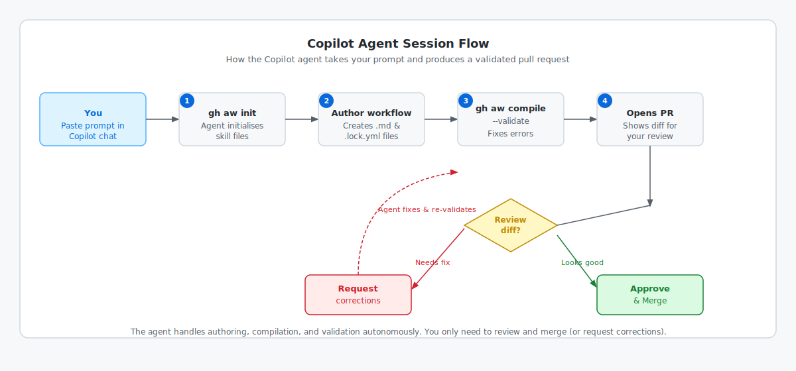

<!-- page-journey: copilot -->
<!-- page-adventure: core -->
# Write Your First Agentic Workflow — GitHub Copilot Path

## 🎯 What You'll Do

You'll ask an agent in the [GitHub Copilot app](side-quest-01-02-environment-reference.md#github-copilot-app) or Agents tab to create and validate `daily-report-status.md`, then review and merge its pull request.



## 📋 Before You Start

- Your practice repository is connected to the GitHub Copilot app or available in the Agents tab
- You have an active GitHub Copilot plan
- You completed [No Installation Needed — GitHub UI Path](06c-install-ui.md) and merged the repository-initialization pull request

## Start a session

Open your practice repository in the GitHub Copilot app and start a session in **Interactive** mode so you can steer the work, or open the repository's **Copilot** or **Agents** tab and start a new session.

> [!IMPORTANT]
> **Agents tab:** You must start your message with `/agentic-workflows` to invoke the skill. Without this prefix the agent does not have agentic workflow authoring context and may not produce a valid workflow. Skip to the **Agents tab** prompt further down on this page — it already includes the prefix.

**GitHub Copilot app — paste this prompt:**

```text
Using the agentic-workflows skill, create a workflow using https://raw.githubusercontent.com/github/gh-aw/main/create.md

The workflow must:
- Be named "Daily Report Status"
- Support manual runs with [`workflow_dispatch`](https://github.github.com/gh-aw/reference/triggers/)
- Use `contents: read`, `issues: read`, and `copilot-requests: write`
- Allow at most one comment and at most one new issue through safe outputs (https://github.github.com/gh-aw/reference/safe-outputs/)
- Search open issues for the issue with the most 👍 reactions and comment:
  "This issue has the most community support! We'll prioritise it in our next planning session."
- Create an issue titled "Community Voting Test" and post the same comment if no open issues exist

Run `gh aw compile` in the session workspace, fix any errors, commit the source and generated lock file, and open a pull request. Show me the diff before merging.
```

**Agents tab — paste this prompt instead:**

```text
/agentic-workflows Follow the prompt above to create the Daily Report Status workflow.
```

> [!NOTE]
> The `agentic-workflows` skill is installed during [Step 6c](06c-install-ui.md). If it is not yet available in your repository, return to that step and merge the initialization pull request first.

The agent runs validation in its isolated session workspace. You do not need a terminal for this path.
Before you approve the merge, the agent presents the file changes in its session response for you to review.

> [!NOTE]
> To keep `gh aw compile --watch` running while you edit, use a local or Codespaces terminal instead.

## Review and merge

1. Confirm `.github/workflows/daily-report-status.md` contains the requested trigger, [permissions](https://github.github.com/gh-aw/reference/permissions/), safe outputs, and task.
2. Confirm `.github/workflows/daily-report-status.lock.yml` exists.
3. Ask the agent to correct anything that does not match the prompt.
4. Merge the pull request into `main`.

## ✅ Checkpoint

- [ ] `.github/workflows/daily-report-status.md` exists in the repository
- [ ] `.github/skills/agentic-workflows/` exists in the repository from the initialization step
- [ ] The agent validated the workflow in its session workspace
- [ ] You reviewed the source and generated lock file
- [ ] You merged the pull request into `main`
- [ ] You are ready to choose the workflow's billing and authentication method

<!-- journey: copilot -->
**Next:** [Confirm Model Access](07d-confirm-model-access.md)
<!-- /journey -->
