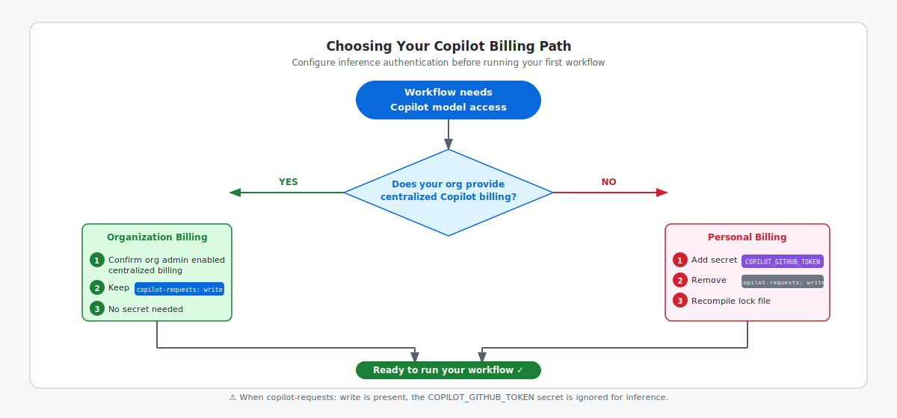

<!-- page-journey: all -->
<!-- page-adventure: core -->
# Confirm Model Access

## 📋 Before You Start

- `daily-report-status.md` and `daily-report-status.lock.yml` are committed to your practice repository.

## 🎯 What You'll Do

You'll choose the billing and authentication method for the first workflow, configure it, and confirm the source and lock files agree before you continue to [Step 8](08-run-your-workflow.md).

## Confirm the workflow engine

Open `.github/workflows/daily-report-status.md`. The Step 7 workflow has no `engine:` line, so it uses GitHub Copilot.

Claude and Codex are optional [engines](https://github.github.com/gh-aw/reference/engines/) introduced in later side quests. You do not need an Anthropic or OpenAI API key for this first run.

If you are working in Claude Code or OpenAI Codex, keep this first workflow on Copilot and switch later if you want:

- **Claude Code:** use [Side Quest: Configure an Anthropic API Key](side-quest-11-06-anthropic-key.md) and the [Claude entry in the environment reference](side-quest-01-02-environment-reference.md#claude).
- **OpenAI Codex:** use [Side Quest: Configure an OpenAI API Key](side-quest-11-07-openai-key.md) and the [OpenAI Codex entry in the environment reference](side-quest-01-02-environment-reference.md#openai-codex).

## Choose one Copilot billing path

Choose exactly one method. The diagram below shows both paths and the key configuration difference between them.



### Organization with centralized Copilot billing

Use this path when the organization that owns the repository has centralized Copilot billing enabled for Actions.

1. Ask your organization administrator to confirm centralized billing is enabled.
2. Keep `copilot-requests: write` in the workflow's `permissions:` block.
3. Complete [Method 1: Copilot Requests Permission](side-quest-06-03a-copilot-requests-permission.md).

The workflow uses the organization subscription. You do not need a personal Copilot token for this path.

### Personal billing

Use this path for a personal repository, or when the owning organization does not provide centralized Copilot billing.

1. Remove `copilot-requests: write` from `daily-report-status.md`.
2. If you are using a terminal, run:


   ```bash
   gh aw secrets bootstrap --engine copilot
   ```

   This guided flow checks whether `COPILOT_GITHUB_TOKEN` is needed, prompts for it if missing, and stores it as a repository secret.
3. If you are staying in the browser, use [Method PAT (UI-only)](side-quest-06-03c-copilot-github-token-ui-only.md).
4. Recompile and commit `daily-report-status.lock.yml`.

If you want the full manual PAT procedure, use [Method PAT: `COPILOT_GITHUB_TOKEN`](side-quest-06-03b-copilot-github-token.md).

> [!IMPORTANT]
> When `copilot-requests: write` is present, the workflow ignores `COPILOT_GITHUB_TOKEN` for inference. Remove the permission and recompile when you choose personal billing.

## Check the final configuration

Open `daily-report-status.md` and confirm it matches the method you selected:

| Billing path | `copilot-requests: write` | Required secret |
|---|---|---|
| Organization centralized billing | Present | None |
| Personal billing | Removed | `COPILOT_GITHUB_TOKEN` |

## ✅ Checkpoint

- [ ] I confirmed the first workflow uses GitHub Copilot
- [ ] I chose organization centralized billing or personal billing
- [ ] I completed the matching authentication guide
- [ ] My source and compiled lock file use the selected method
- [ ] Both workflow files are committed to `main`
- [ ] I am ready for [Run and Watch Your Workflow](08-run-your-workflow.md)

<!-- journey: all -->
**Next:** [Run and Watch Your Workflow](08-run-your-workflow.md)
<!-- /journey -->
