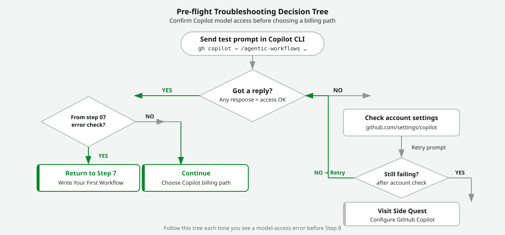

<!-- page-journey: all -->
<!-- page-adventure: core -->
# Confirm Model Access

## :clipboard: Before You Start

This step has two entry points:

- **Arriving from step 07 (error recovery):** Workflow files do not need to exist yet — fix model access first, then return to [Write Your First Agentic Workflow](07-your-first-workflow.md).
- **Arriving as the next step after step 07 (normal flow):** `daily-report-status.md` and `daily-report-status.lock.yml` are committed to your practice repository.

## :dart: What You'll Do

You'll run a one-sentence test prompt, confirm Copilot is reachable, choose your [billing](https://github.github.com/gh-aw/reference/billing/) path, and configure the workflow before continuing to [Step 8](08-run-your-workflow.md).

## Verify model access

1. In the terminal already open in your Codespace, run:

```bash
gh copilot
```

1. Send this prompt:

```prompt
/agentic-workflows what trigger does a scheduled workflow use?
```

1. Any reply confirms the model and skill are accessible. Continue to **Choose a billing path**.

> [!IMPORTANT]
> If you see an error instead of a reply, check [github.com/settings/copilot](https://github.com/settings/copilot) to confirm Copilot is enabled. If the problem persists, see [Side Quest: Configure GitHub Copilot for Agentic Workflows](side-quest-06-03-copilot-token.md), then return here.

If you arrived from the step 07 access check and the test prompt succeeded, return to [Write Your First Agentic Workflow](07-your-first-workflow.md) now.

<picture>
  <source media="(prefers-color-scheme: dark)" srcset="images/07d-preflight-troubleshoot-dark.svg">
  <source media="(prefers-color-scheme: light)" srcset="images/07d-preflight-troubleshoot-light.svg">
  
</picture>

## Choose a billing path

> [!NOTE]
> For golden-ticket workshops, billing is pre-provisioned by your org. Use the **Organization centralized billing** path unless your instructor says otherwise.

Follow the full setup steps in [Side Quest: Copilot Billing Paths](side-quest-07d-billing-paths.md), then return here once your workflow file and [lock file](https://github.github.com/gh-aw/reference/glossary/#workflow-lock-file-lockyml) are committed.

## :white_check_mark: Checkpoint

- [ ] I sent the test prompt in Copilot CLI and received a reply
- [ ] I confirmed no access errors appeared
- [ ] I chose a billing path and completed all configuration steps
- [ ] My source file and compiled lock file reflect the chosen method
- [ ] Both files are committed to `main`
- [ ] I am ready for [Run and Watch Your Workflow](08-run-your-workflow.md)

<!-- journey: all -->
**Next:** [Run and Watch Your Workflow](08-run-your-workflow.md)
<!-- /journey -->
