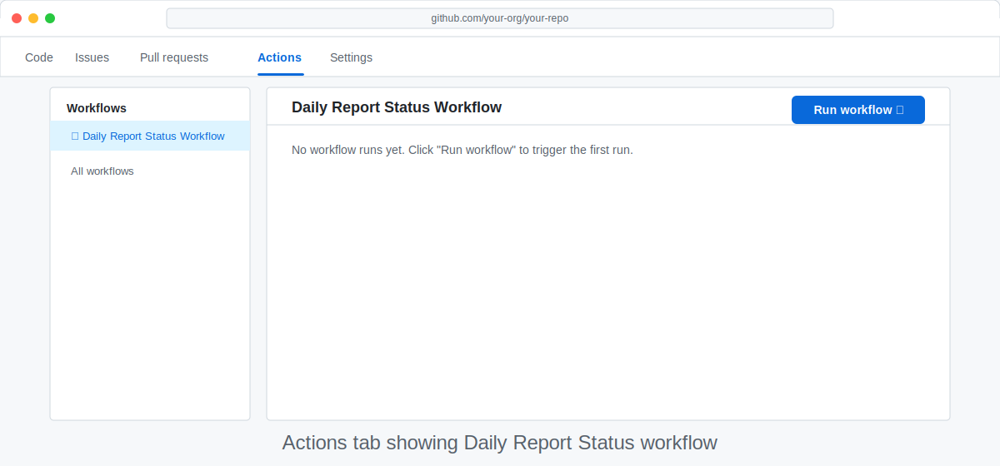
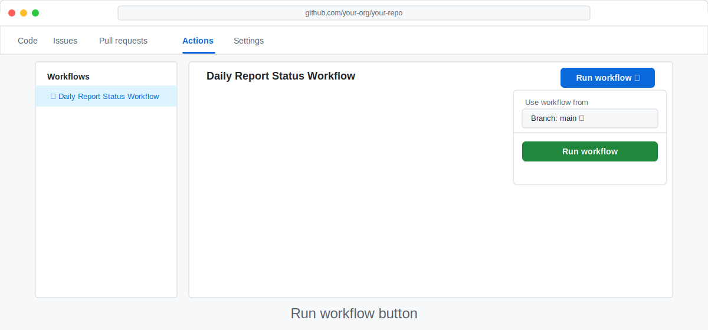
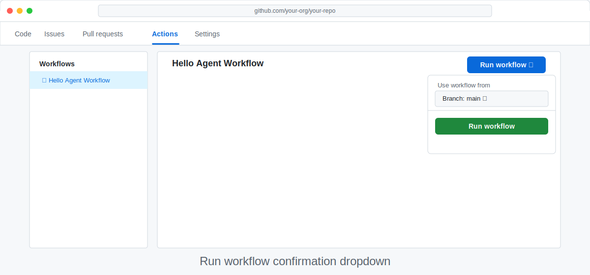
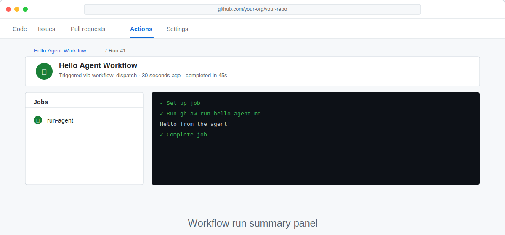

# Step 8: Run and Watch Your Workflow

> _Reading about agents is one thing — watching one work in real time is something else entirely._

## 🎯 What You'll Do

You'll trigger the `hello-agent` workflow you wrote in Step 7 and watch it run live inside GitHub Actions. By the end you'll have seen a real AI agent reason through a task, make GitHub API calls, and post a comment — all without you writing a single line of code to do it.

## 📋 Before You Start

- Completed [Step 7: Write Your First Agentic Workflow](07-your-first-workflow.md)
- `.github/workflows/hello-agent.md` is committed and pushed to `main`
- Your browser is open to your practice repository on GitHub

## Steps

### Trigger manually via GitHub Actions UI (recommended)

1. In your repository, click the **Actions** tab at the top of the page.

   

2. In the left workflow sidebar, click **Hello Agent**, then click **Run workflow**.

   

3. In the confirmation dropdown, keep the default branch selected and click the green **Run workflow** button.

   

> [!NOTE]
> If you don't see **Hello Agent** in the list yet, wait 30 seconds and refresh. GitHub takes a moment to register newly pushed workflow files.
>
> **Troubleshooting: Codespaces CLI trigger failures (`actions:write`)**
> If `gh aw run hello-agent` fails in a Codespace with an `actions:write` permission/token error, trigger the run from the **Actions** tab UI instead (the section above). The UI path is the most reliable fallback when the Codespaces token has limited workflow scopes.
> [!NOTE]
> **For terminal users:** in some Codespaces environments, `gh aw run` can fail with an `actions:write` token scope error. If that happens, use the UI steps above.

Terminal users can trigger the same run with:

```bash
gh aw run hello-agent
```

Reference: [`gh aw run` CLI docs](https://github.com/github/gh-aw/blob/main/docs/src/content/docs/setup/cli.md)

### Watch the run in progress

After a few seconds, a new row appears in the run list with a yellow spinning icon — that means the workflow is running. Click the row to open the run details.

You'll see a single job. Click it to open the live log view.

### Read the log as the agent works

The log streams in real time. Unlike a traditional CI job — which shows build commands — an agentic workflow log shows the agent's **reasoning steps**:

```
🤔 Planning...  Searching for open issues with 👍 reactions
🔧 Tool call:   github.list_issues  (state=open, sort=reactions-+1)
📥 Result:      3 issues found
🤔 Thinking...  Issue #4 has the most 👍 reactions (7)
🔧 Tool call:   github.add_comment  (issue_number=4)
✅ Done
```

Each line tells you what the agent is doing:
- **Planning** lines show the agent deciding its next action.
- **Tool call** lines show it making an API call.
- **Result** lines show what came back from that call.
- **Done** means the agent finished the task within its safe-output limits.

> [!TIP]
> If you're used to CI logs that scroll by in milliseconds, agentic logs can feel slow — the agent is actually pausing to think. That's normal and expected.

### Check the outcome

Once the run shows a green ✅ checkmark, go to the **Issues** tab of your repository. You should see a new comment on an existing issue — or a brand-new issue created by the agent if your repo had none.

Open the comment and read it. Then look back at the workflow file you wrote. Notice how the plain-English instructions you wrote translated directly into real GitHub actions.

> [!NOTE]
> The agent may have picked a different issue than you expected, or created a new issue with a slightly different title. That's fine — it's reasoning from live data and following the instructions you gave it. If the result surprises you, look at your instructions and consider how you might make them more precise.

### View the run summary

Navigate back to the **Actions** tab and click the completed run. Scroll down past the jobs to the **Summary** section. Agentic workflows often post a structured summary here showing what the agent did and which safe-output operations it performed.



### Re-run with a twist (optional)

Want to experiment? Instead of editing `.github/workflows/hello-agent.md` directly, ask Copilot, Claude, or ChatGPT to update it with the `agentic-workflows` skill. For example, ask the agent to change the task so it adds a label to the issue instead of posting a comment, then review the diff, push the change, and trigger another run.

This is the core loop of agentic workflow development: **design → agent edit → run → observe → refine**.

## ✅ Checkpoint

- [ ] The **Hello Agent** workflow appears in the **Actions** tab
- [ ] I triggered a manual run and watched it complete
- [ ] I can read the agent's reasoning steps in the live log
- [ ] A comment or issue was created in my repository by the agent
- [ ] I understand the difference between a tool call and a safe-output operation

**Next:** [Step 9: Reading Workflow Output](09-understand-output.md)
