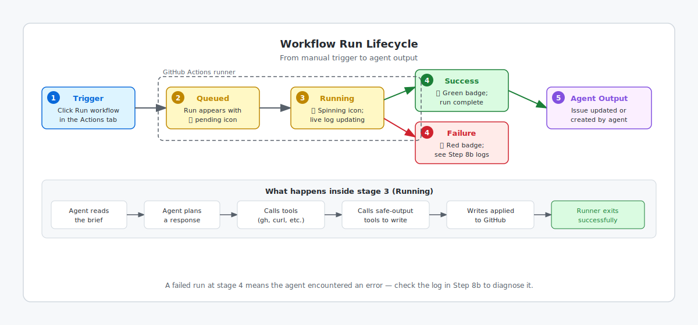

<!-- page-journey: all -->
<!-- page-adventure: core -->
# Run and Watch Your Workflow

_Watching an agent work in real time makes the workflow feel concrete._

## 🎯 What You'll Do

You'll trigger the `daily-report-status` workflow from Step 7, watch it start in the **Actions** tab, and confirm it finishes successfully.

## 📋 Before You Start

- Completed [Confirm Model Access](07d-confirm-model-access.md)
- `daily-report-status.md` and `daily-report-status.lock.yml` are committed to `.github/workflows/` on `main`
- Your practice repository has at least one open issue (create one in the **Issues** tab if not)

## Pre-flight check

A stale or missing lock file is the leading cause of `model-access-not-configured` failures at this step. Run these checks before triggering the workflow — each takes less than a minute.

**Lock file is present and current.** Open `.github/workflows/` in your repository on GitHub and confirm both files are there:

- `daily-report-status.md` (source)
- `daily-report-status.lock.yml` (compiled lock file)

If either file is missing, return to [Step 7](07-your-first-workflow.md) to complete the workflow creation steps. If the lock file is present but you are unsure it is current, recompile and push before continuing:

```bash
gh aw compile
git add .github/workflows/daily-report-status.md .github/workflows/daily-report-status.lock.yml
git commit -m "chore: sync lock file" && git push
```

**Billing configuration matches the lock file.** Open `daily-report-status.lock.yml` (or `daily-report-status.md`) and confirm the `permissions:` block matches the billing path you chose in Step 7d:

| Billing path | `copilot-requests: write` present |
|---|---|
| Organization centralized billing | Yes |
| Personal billing | No — and `COPILOT_GITHUB_TOKEN` is set in **Settings → Secrets → Actions** |

Any mismatch means returning to [Confirm Model Access](07d-confirm-model-access.md) to fix the configuration and recompile.

## Run the workflow

This step is UI-first because it works for every learner, even if your terminal token does not have permission to trigger workflows.

If you prefer the terminal, you can use [`gh aw run daily-report-status`](https://github.github.com/gh-aw/setup/cli/#run) as an advanced option. If that command fails in Codespaces, use the GitHub UI path instead or follow [Side Quest: Fix Codespaces `actions:write` Errors](side-quest-08-01-codespaces-actions-write.md).

### Before you click Run

- [ ] I completed [Confirm Model Access](07d-confirm-model-access.md) and my chosen billing method (organization centralized billing or `COPILOT_GITHUB_TOKEN`) is active
- [ ] **Daily Report Status** appears in the **Actions** sidebar
- [ ] I have at least one open issue in my practice repository

### Trigger the workflow via GitHub Actions UI

Open your practice repository in GitHub and click **Actions** in the top navigation. In the left sidebar, select **Daily Report Status**.


Click **Run workflow**, keep the default branch selected, and click the green **Run workflow** button. If **Daily Report Status** is missing, refresh the page and confirm both workflow files are on `main`. If you used the GitHub Copilot path, return to [Step 7c](07c-your-first-workflow-copilot.md) and confirm the workflow pull request was merged. If you used the Terminal path, run `gh aw compile` to check for compile errors.

If the run fails immediately with a model-access or authentication error, return to [Step 7d](07d-confirm-model-access.md) and confirm the selected billing method matches the workflow.


### Watch the run start

The diagram below shows the full lifecycle of a workflow run, from the moment you click **Run workflow** through to the agent updating your repository.



After a few seconds, a new run appears with a yellow spinning icon. Click the run, then click the job name to open the live log.

You do not need to decode every line yet. For now, just confirm that the workflow is active and the log is updating as the agent plans and uses tools.

### Confirm the run finished

Wait for the run to turn green with a ✅. Then open the **Issues** tab in your repository and confirm that the agent updated an issue or created a new one.

## ✅ Checkpoint

- [ ] The **Daily Report Status** workflow appears in the **Actions** tab
- [ ] I triggered a manual run from the GitHub UI
- [ ] I opened the live log while the run was active
- [ ] The run completed with a green ✅

<!-- journey: all -->
**Next:** [Interpret Your First Run](08b-interpret-your-run.md)
<!-- /journey -->

