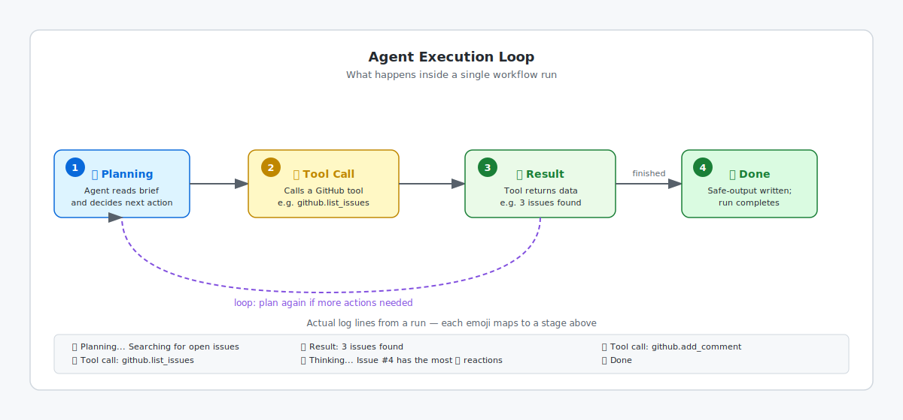

<!-- page-journey: all -->
<!-- page-adventure: core -->
# Interpret Your First Run

_Your first run is more useful when you can explain what the agent did and why._

## 🎯 What You'll Do

You'll read the live log from Step 8, find the workflow's output, and learn three quick checks for common run problems.

## 📋 Before You Start

- Completed [Run and Watch Your Workflow](08-run-your-workflow.md)
- Your **Daily Report Status** workflow has at least one completed run

## Read the live log

Open the completed **Daily Report Status** run from the **Actions** tab and click the job name. The log usually moves through a simple pattern: the agent thinks, calls a [tool](https://github.github.com/gh-aw/reference/tools/), receives a result, and finishes.



```text
🤔 Planning...  Searching for open issues with 👍 reactions
🔧 Tool call:   github.list_issues
📥 Result:      3 issues found
🤔 Thinking...  Issue #4 has the most 👍 reactions
🔧 Tool call:   github.add_comment
✅ Done
```

The important question is not "Can I read every line?" It is "Can I tell where the agent decided, where it acted, and whether it finished?" Find the first `Tool call` in your own run and fill in the template below:

```text
First Tool call I saw:         [tool name, e.g. github.list_issues]
What it was trying to do:      [one sentence description]
```

## Check the output

After the run finishes, scroll to the **Summary** section on the run page. This gives you the short version of what the agent believes it did, including the safe-output action it used.

Then verify the real output in your repository. For **Daily Report Status**, that usually means opening the issue the agent touched and confirming the comment or new issue is actually there. The GitHub change is the ground truth behind the [safe-output](https://github.github.com/gh-aw/reference/safe-outputs/) record.


## Check common error patterns first

If your run does not look right, start with these quick checks before changing the workflow:

- **The workflow never appears in Actions** — confirm the workflow file is committed on `main`, then refresh. If you use the terminal path, run `gh aw compile` to catch compile errors.
- **The log shows lots of thinking but no useful action** — your instructions may be too vague. Keep the run open, then refine the workflow body in a later step.
- **The run finishes but nothing changed in GitHub** — make sure your repository has an open issue and that the workflow had permission to write.

Knowing what a failed run looks like helps you spot permission issues at a glance, before you spend time re-reading the brief:

```text
🤔 Planning...  Searching for open issues
🔧 Tool call:   github.list_issues
📥 Error:       403 Forbidden — insufficient permissions
❌ Failed
```

For a deeper troubleshooting guide, see [Side Quest: Diagnosing Common Agent Output Patterns](side-quest-09-01-debug-output.md).

## Reflect

Before you mark the checkpoint, take two minutes to apply what you just read to your own run.

**Practice prompt 1 — trace the decision:** Find the first `Tool call` in your run log and answer: what question was the agent trying to answer at that moment, and what information did it get back?

**Practice prompt 2 — judge the outcome:** Compare the run summary to the actual GitHub change (the comment or issue). Did the agent do what you expected? Write one sentence saying what matched and, if anything, what was different.

Put your answers in a scratch file, your editor, or wherever you keep notes. You will refer back to this comparison when you refine the workflow in the next step.

## ✅ Checkpoint

- [ ] I opened the run summary and found the safe-output note
- [ ] I verified the real GitHub output that the workflow created
- [ ] I traced the first tool call and noted what the agent was trying to do
- [ ] I compared the run summary to the actual GitHub change and noted the result
- [ ] I know the first check to make if a run is missing, confused, or finished without writing anything
- [ ] I can identify whether a run failed due to a permission error, a vague brief, or a missing output

<!-- journey: all -->
**Next:** [Refine Your Workflow with Agentic Editing](09-agentic-editing.md)
<!-- /journey -->

