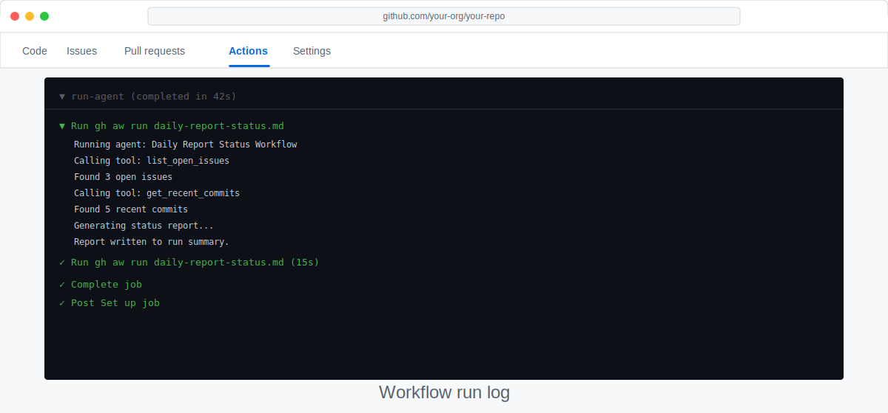

# Test and Improve Your Workflow

> _Running a workflow once is good; understanding why it did what it did — and making it better — is where the real learning happens._

## 🎯 What You'll Do

You'll trigger your daily-status workflow manually, read the resulting issue comment, and make at least one targeted improvement to the prompt or YAML. By the end of this step your workflow will feel like yours, not a template you copied.

## 📋 Before You Start

- You have installed the `gh-aw` extension in [Step 6: Install the `gh-aw` CLI Extension](06-install-gh-aw.md).
- You have completed one of the scenario build steps: [Step 11a](11a-build-daily-status.md), [Step 11b](11b-build-daily-docs.md), or [Step 11c](11c-build-pr-reviewer.md).
- Your workflow file is committed and pushed to `main`.

## Steps

### Trigger the workflow manually

Open a browser, navigate to your repository, and click the **Actions** tab.

Find your **Daily Repo Status** workflow in the left sidebar and click it. Then click **Run workflow** → **Run workflow** (green button) to launch a manual run.

> [!TIP]
> You can also trigger it from the terminal:
> ```bash
> gh aw run daily-status
> ```

### Watch the run live

Click the run that just appeared. You will see a job named something like **run** or **agent**. Click it to watch the live log stream.

Look for two things:
- The step where the agent reads your repository data
- The step where the agent posts (or skips) the comment



### Check the output

Once the run finishes (green ✅), open an issue in your repository titled **Daily Status Reports**. The agent should have posted a comment in the format you defined in the prompt.

Read it critically. Ask yourself:
- Did the numbers look correct?
- Is the tone right — too formal, too casual?
- Is anything missing (e.g., no mention of stale PRs)?

If you are not sure whether the result is "good enough," compare it to these examples:

#### Needs improvement

```markdown
### Daily Repo Status

- 7 open issues
- 2 open PRs
- 1 PR needs review
```

Why this still needs work:
- It is technically correct, but it sounds robotic.
- It does not include the age of the oldest open PR, so you cannot spot stale work.
- It gives you numbers, but not much help interpreting them.

#### Good output after one iteration

```markdown
### Daily Repo Status

Good morning! You have 7 open issues and 2 open PRs.

- Oldest open PR: #42, open for 6 days
- 1 PR is waiting for review
- No stale issues need attention today

Your queue looks manageable today — one review pass would keep things moving.
```

Use this pass/fail check on your own output:
- Pass if the facts match your repository, the tone sounds human, and the comment includes the key detail you wanted to improve.
- Fail if it is still missing important context, still sounds generic, or still does not match the format you had in mind.

If it fails, make one small prompt change and run the workflow again.

### Improve the agent instructions

Open `.github/workflows/daily-status.md` in your editor. The agent instructions live in the **Markdown body** — the plain-English text below the closing `---` fence. This is the section that starts with `# Daily Repo Status Report`.

Make one concrete change to the body. Some ideas:

| Problem noticed | Suggested fix |
|-----------------|---------------|
| Report is too verbose | Add _"Keep the report under 100 words."_ to the Guidelines section |
| Missing PR age info | Add _"Include the age of the oldest open PR."_ to the Your Task list |
| Tone feels robotic | Add _"Write in a friendly, conversational tone."_ to the Guidelines section |

For example, your updated Guidelines section might look like:

```markdown
## Guidelines

- Post only one comment. If you have already posted today, skip.
- Keep the report factual. Do not invent numbers.
- Keep the report under 100 words.
- Include the age of the oldest open PR if any exist.
- Write in a friendly, conversational tone.
- If no open issue exists, create one titled "Daily Status Reports" and post the first comment there.
```

> [!NOTE]
> The agent instructions are **not** stored in the YAML frontmatter — they live in the Markdown body below the closing `---` fence. The frontmatter only contains machine-readable configuration (triggers, permissions, tools, and safe-outputs).

### Commit, push, and re-run

**Terminal:**

```bash
git add .github/workflows/daily-status.md
git commit -m "refine: tighten daily status prompt"
git push
```

<details>
<summary>🖥️ GitHub UI alternative</summary>

Navigate to `.github/workflows/daily-status.md` in your repository, click the **pencil icon (✏️)**, make your changes, then click **Commit changes**.

</details>

Trigger another manual run and compare the new comment with the old one. Repeat until you are happy.

> [!NOTE]
> Every iteration teaches you something about prompt engineering. Small, focused changes are easier to evaluate than large rewrites.

### Read the run log for errors

If a run shows a red ❌, click the failed step to see the raw log. Common causes:

- **Missing permissions** — check the `permissions:` block in the frontmatter; for example, `issues: read` must be present. Note: write access for posting comments is handled by `safe-outputs`, not by `issues: write`.
- **Compile error** — run `gh aw compile .github/workflows/daily-status.md --validate` locally to see the exact YAML error and line number. **UI path / no terminal:** check the failed Actions step log — compile errors appear in the step output. The [Side Quest: YAML Frontmatter Pitfalls](side-quest-11-02-yaml-frontmatter.md) covers the most common mistakes (tabs, indentation, missing quotes) with before/after examples and copy-paste fixes.
- **API rate limit** — wait a few minutes and try again.

> [!WARNING]
> If the agent posts duplicate comments, check that your prompt contains the line _"If you have already posted today, skip."_

## ✅ Checkpoint

- [ ] You have triggered at least two manual runs
- [ ] The workflow posts a correctly formatted status comment on your issue
- [ ] You have made at least one improvement to the prompt
- [ ] Your improved workflow has run at least once and produced output that matches your formatting expectations
- [ ] You understand how to read the Actions log to diagnose failures

**Next:** [Step 13: Schedule It to Run Every Day](13-schedule-it.md)

## 📚 See Also

- [Overview of GitHub Agentic Workflows](https://github.github.com/gh-aw/introduction/overview/)
- [Triggers reference](https://github.github.com/gh-aw/reference/triggers/)
- [Safe Outputs reference](https://github.github.com/gh-aw/reference/safe-outputs/)
