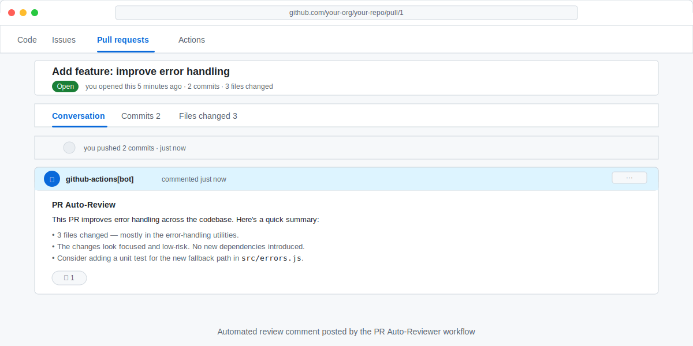

<!-- page-journey: all -->
<!-- page-adventure: advanced -->
# Build Your First Event-Driven Workflow: PR Auto-Reviewer

_You've built a scheduled workflow. Now build one that fires when something happens — and posts a useful review the moment a pull request opens._

## 🎯 What You'll Do

Create a new agentic workflow triggered by the `pull_request` event. When a contributor opens or updates a PR, your workflow will read the changed files and the PR description, then post an automated review comment summarising what changed and flagging anything worth a second look.

By the end you will have a working PR reviewer workflow and understand how event-driven triggers differ from scheduled ones.

## 📋 Before You Start

- You have a working `daily-report-status` workflow from [Test and Improve Your Workflow](12-test-and-iterate.md).
- You understand the two-file structure (`.md` source + `.lock.yml`) from earlier steps.

## Why Event-Driven Triggers?

Your daily-status workflow runs on a schedule — it wakes up on its own, checks what happened, and reports. A PR reviewer workflow is different: it runs the moment a developer opens or updates a pull request, with the full PR context handed to it automatically.

This is the `pull_request` trigger:

```yaml
on:
  pull_request:
    types: [opened, synchronize]
```

`opened` fires when a PR is first created. `synchronize` fires every time a new commit is pushed to the PR branch. Together they cover the full PR lifecycle without any manual intervention.

Event-driven workflows are the foundation of most real-world agentic review automation. The same pattern powers auto-labellers, summary generators, and quality checklists — three of which you can explore in the side quests at the end of this step.

## Create the Workflow File

In your practice repository, create `.github/workflows/pr-reviewer.md`:

```markdown
---
name: PR Auto-Reviewer
on:
  pull_request:
    types: [opened, synchronize]
permissions:
  pull-requests: write
  contents: read
safe-outputs:
  create-issue-comment:
    limit: 1
---

You are a helpful PR reviewer. When a pull request is opened or updated:

1. Read the list of changed files and the PR title and description.
2. Write a short summary (3–5 sentences) of what the PR does.
3. List up to three things a reviewer should pay close attention to, based on the file names and PR description alone.
4. Post the summary and checklist as a single comment on the pull request.

Keep the tone constructive and specific. Do not speculate about code you have not seen.
```

A few things to notice in this frontmatter:

- `permissions: pull-requests: write` lets the agent post a comment on the PR.
- `safe-outputs: create-issue-comment: limit: 1` caps the workflow at one comment per run, preventing spam if the workflow is triggered repeatedly.
- The agent brief uses only information available in the trigger context (changed file paths, PR title, PR description) — it does not need to read raw file contents to produce a useful first-pass review.

## Compile and Push

From your repository root, compile the workflow:

```bash
gh aw compile
```

Then commit both files:

```bash
git add .github/workflows/pr-reviewer.md .github/workflows/pr-reviewer.lock.yml
git commit -m "feat: add PR auto-reviewer workflow"
git push
```

> [!TIP]
> If you want to watch the compiler update the lock file every time you save, run `gh aw compile --watch` instead and keep it running in a background terminal while you edit.

## Test It by Opening a PR

Create a small branch with a trivial change — for example, add a comment to any file — and open a pull request against your default branch.

The workflow fires automatically within a few seconds of the PR being created. To watch it:

1. Go to the **Actions** tab of your repository.
2. Find the **PR Auto-Reviewer** run next to your pull request.
3. Open the run and watch the agent step process the PR context.
4. Navigate back to the pull request and check the **Conversation** tab — your automated review comment should appear there.



## Inspect the Agent's Reasoning

Open the run log and look for the agent's `[plan]` and `[tool]` lines. You should see the agent:

1. Reading the PR metadata (title, description, file list).
2. Planning its summary based on available context.
3. Calling the `create-issue-comment` tool to post the result.

If the agent posted a comment but it feels generic, the brief is working but may need tightening. Try adding a sentence like:

```text
When the PR only touches test files, note that explicitly and skip the "things to watch" list.
```

Then recompile, push, and update the PR branch to trigger another run.

## ✅ Checkpoint

- [ ] I created `.github/workflows/pr-reviewer.md` with a `pull_request` trigger
- [ ] `gh aw compile` completed without errors and `.lock.yml` is committed and pushed
- [ ] I opened a test pull request and the workflow triggered automatically
- [ ] The workflow posted exactly one comment on my pull request
- [ ] I can explain why `safe-outputs: create-issue-comment: limit: 1` matters for an event-driven workflow

<!-- journey: all -->
**Next:** [What's Next? Keep Exploring](14-next-steps.md)
<!-- /journey -->

---

## Go Further: PR Reviewer Patterns

Ready to extend this workflow? These side quests each cover a popular PR reviewer pattern:

- [Pattern: Auto-Label PRs by Content](side-quest-13-01-pr-labeler-pattern.md) — apply labels based on which files changed.
- [Pattern: Generate a PR Summary Comment](side-quest-13-02-pr-summary-pattern.md) — post a structured summary that PR authors can use as a release note draft.
- [Pattern: PR Review Checklist](side-quest-13-03-pr-checklist-pattern.md) — check PRs against a quality checklist and post results.
