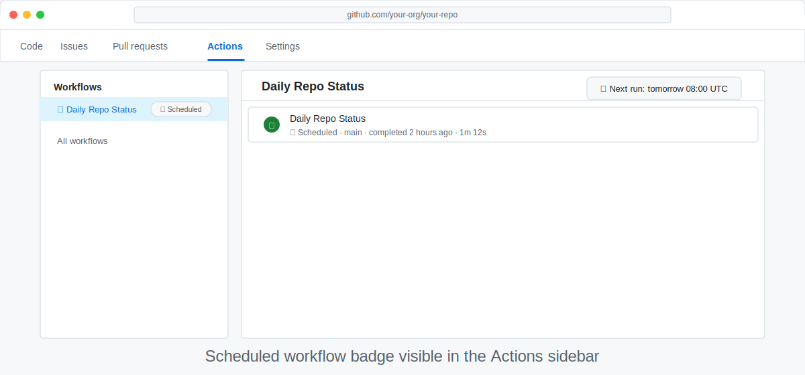

# Schedule It to Run Every Day

> _Automating the trigger is what turns a one-off script into a true workflow — after this step your report will arrive without you lifting a finger._

## 🎯 What You'll Do

You'll update the `schedule` trigger in your workflow using gh-aw's fuzzy schedule syntax so GitHub Actions runs it at exactly the cadence you want. By the end, you'll know how to express any recurring schedule in plain English.

## 📋 Before You Start

- You have installed the `gh-aw` extension in [Step 6: Install the `gh-aw` CLI Extension](06-install-gh-aw.md).
- You have a working, manually tested workflow from [Test and Improve Your Workflow](12-test-and-iterate.md).
- Your workflow file lives at `.github/workflows/daily-status.md`.

## What a compile error looks like

If `gh aw compile` reports a YAML parse error after you change the schedule, start by checking indentation in the `on:` block first. Want a deeper walkthrough with broken/fixed examples and common fixes? See [Side Quest: Using `gh aw compile` to Catch Errors Early](side-quest-07-01-compile-workflow.md).

## Steps

### Open your workflow file

In your editor (or Codespace), open `.github/workflows/daily-status.md`.

<details>
<summary>🖥️ GitHub UI alternative</summary>

Navigate to `.github/workflows/daily-status.md` in your repository on GitHub and click the **pencil icon (✏️)** to open the file in the web editor.

</details>

### Locate the `on:` block

You should already have a `schedule: daily` trigger and a `workflow_dispatch` trigger:

```yaml
on:
  schedule: daily
  workflow_dispatch: {}
```

### Choose your schedule

gh-aw accepts natural-language [schedule expressions](https://github.github.com/gh-aw/reference/triggers/) — no cron syntax needed. Common choices are `daily`, `daily on weekdays`, `weekly`, `hourly`, and `every 6 hours`, and `gh aw compile` expands them into the correct cron expression automatically.

> [!TIP]
> Want the full reference table, example compiled cron values, and help choosing the right cadence? See [Side Quest: Fuzzy Schedule Expressions](side-quest-13-01-schedule-expressions.md).

Pick the cadence that fits your team and update the `schedule:` line accordingly. For example, to run only on weekdays:

```yaml
on:
  schedule: daily on weekdays
  workflow_dispatch: {}
```

> [!TIP]
> Keep `workflow_dispatch` in the file even after you go to production. It lets you re-run the report on demand without changing the schedule.
> **Compile checkpoint:** Save your file, then run:
> ```bash
> gh aw compile .github/workflows/daily-status.md
> ```
> A green output means your YAML is valid so far. If you see a red error, check indentation in the `on:` block you just edited.
> For auto-recompile while editing, run `gh aw compile .github/workflows/daily-status.md --watch`.

### Compile and validate

**Terminal:**

```bash
gh aw compile .github/workflows/daily-status.md
```

You should see `✅ Compiled successfully`. The compiled `.yml` will contain the expanded cron expression — you don't need to write or maintain it by hand.

> [!NOTE]
> **GitHub UI path:** You won't be able to validate YAML until after committing. Run `gh aw compile` in a Codespace if you want early feedback.

### Commit and push the schedule trigger

**Terminal:**

```bash
git add .github/workflows/daily-status.md
git commit -m "chore: schedule daily status workflow"
git push
```

<details>
<summary>🖥️ GitHub UI alternative</summary>

After updating the `schedule:` line in the web editor (opened in step 1), click **Commit changes**.

</details>

### Confirm the schedule is registered

Navigate to your repository on GitHub, then **Actions → daily-status**. On the right-hand sidebar you'll see a **This workflow has a schedule trigger** badge.



> [!WARNING]
> GitHub may delay the very first scheduled run by up to 15 minutes after you push. If the workflow doesn't fire at the expected time, check **Actions** for queued runs before assuming something is broken.

### Wait for or trigger a run

You can wait for the next scheduled time, or click **Run workflow** → **Run workflow** to trigger it immediately and confirm everything still works.

## ✅ Checkpoint

- [ ] Your `on:` block contains both `workflow_dispatch` and a `schedule` fuzzy expression
- [ ] The schedule expression reflects the cadence you actually want
- [ ] `gh aw compile .github/workflows/daily-status.md` reports no errors
- [ ] You have pushed the change and can see the schedule badge in the Actions UI
- [ ] At least one scheduled (or manual) run has completed successfully after the change

**Next:** [What's Next? Keep Exploring](14-next-steps.md)

## 📚 See Also

- [Triggers reference](https://github.github.com/gh-aw/reference/triggers/)
