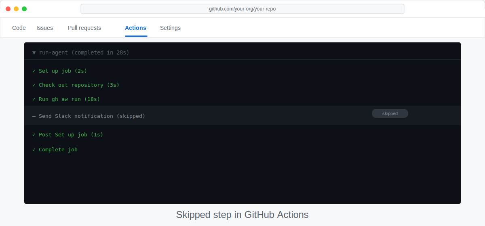

# Make Your Workflow Smarter with Conditional Logic

> _A workflow that always runs is useful — a workflow that only runs when it matters is elegant._

## 🎯 What You'll Do

Add a conditional check to your daily-status workflow so it only posts a summary when there have been recent commits. You'll learn how to use shell commands to gather context and pass that context into your AI prompt.

## 📋 Before You Start

- You have a working daily-status workflow from [Build: Daily Repo Status Workflow](11-build-daily-status.md).
- You understand how to edit and re-run a workflow from [Test and Improve Your Workflow](12-test-and-iterate.md).

## Steps

### Understand the problem

Right now your daily-status workflow runs every weekday — even on days when nothing happened. That means noisy, unhelpful summaries like "No activity to report." Conditional logic lets you skip the AI call entirely on quiet days.

The approach:
1. Run a shell command to count recent commits.
2. Store the result in an output variable.
3. Use an `if:` condition in your workflow to skip the summary step when the count is zero.

### Add a commit-count step

Open your daily-status workflow file (e.g., `.github/workflows/daily-status.md`) and add a new step **before** the AI prompt step:

```yaml
- name: Count recent commits
  id: recent
  run: |
    COUNT=$(git log --oneline --since="24 hours ago" | wc -l | tr -d ' ')
    echo "commit_count=$COUNT" >> $GITHUB_OUTPUT
```

This shell command:
- Uses `git log` with a time filter to list commits from the last 24 hours.
- Counts the lines with `wc -l`.
- Writes the result to `$GITHUB_OUTPUT` so the next step can read it.

> [!NOTE]
> `$GITHUB_OUTPUT` is a special GitHub Actions file. Anything you write in the format `key=value` becomes available to later steps as `steps.<id>.outputs.key`.

### Add a condition to your AI step

Now find the step that calls your AI prompt and add an `if:` line:

```yaml
- name: Generate daily summary
  if: steps.recent.outputs.commit_count != '0'
  uses: ...
```

Replace `uses: ...` with whatever your existing AI step looks like. The `if:` line tells Actions to skip this step entirely when `commit_count` is `0`.

> [!TIP]
> You can use `${{ steps.recent.outputs.commit_count }}` inside your prompt text too — for example: "Summarise the last ${{ steps.recent.outputs.commit_count }} commits."

### Test it locally first

Use `workflow_dispatch` to trigger the workflow manually. Check the run log:

- If there were recent commits, the summary step should run.
- If not, you should see the step marked as **skipped** (a grey icon in the Actions UI).



### Commit and push your conditional logic

```bash
git add .github/workflows/daily-status.md
git commit -m "feat: skip summary on days with no commits"
git push
```

> [!WARNING]
> Make sure `$GITHUB_OUTPUT` is written before the AI step runs. Steps execute in order, so keep the commit-count step first.

## ✅ Checkpoint

- [ ] Your workflow has a `count recent commits` step with `id: recent`
- [ ] Your AI summary step includes `if: steps.recent.outputs.commit_count != '0'`
- [ ] You triggered the workflow manually and confirmed the conditional behaviour in the run log
- [ ] The workflow still posts a summary on days with commits

**Next:** [What's Next? Keep Exploring](14-next-steps.md)
