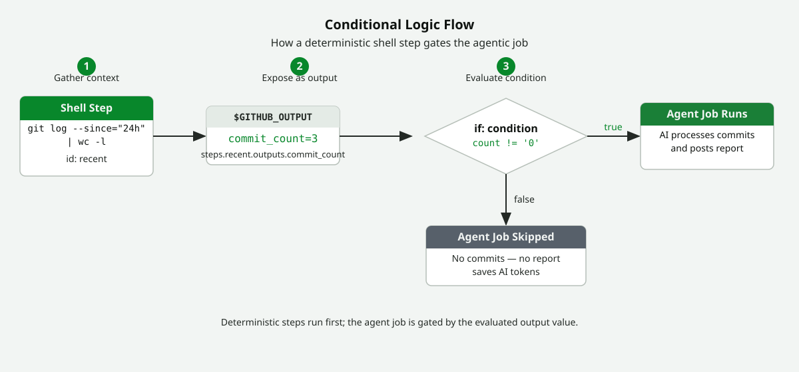

<!-- page-journey: all -->
<!-- page-adventure: advanced -->
# Make Your Workflow Smarter with Conditional Logic

> _A workflow that always runs is useful — a workflow that only runs when it matters is elegant._

## 🎯 What You'll Do

Add a conditional check to your daily-status workflow so it only posts a summary when there have been recent commits. You'll learn how to use shell commands to gather context, expose that context as step outputs, and wire it into an `if:` condition that short-circuits the agent job entirely on quiet days.

## 📋 Before You Start

- You have a working daily-status workflow from [Build: Daily Repo Status Workflow](07-your-first-workflow.md).
- You understand how to edit and re-run a workflow from [Refine, Test, and Improve Your Workflow](09-agentic-editing.md).

## Steps

### Understand the problem

Your daily-status workflow currently runs every weekday regardless of repository activity, which means it can produce empty or near-empty summaries like "No activity to report" on quiet days. Over time these hollow reports erode confidence in the tool because readers learn to ignore them. Conditional logic solves this by inspecting repository state in a deterministic shell step before any AI processing begins, then skipping the agent job entirely when the precondition is not met.

The approach breaks into three parts:
1. Run a shell command to count commits from the last 24 hours and write the result to `$GITHUB_OUTPUT`.
2. Reference that output using the `steps` context expression `${{ steps.recent.outputs.commit_count }}`.
3. Add a top-level `if:` key in the workflow [frontmatter](https://github.github.com/gh-aw/reference/frontmatter/) that skips the agent job when the count evaluates to zero.

<picture>
   <source media="(prefers-color-scheme: dark)" srcset="images/15-conditional-flow-dark.svg">
   <source media="(prefers-color-scheme: light)" srcset="images/15-conditional-flow-light.svg">
   
</picture>

### Add a commit-count step

In your Copilot CLI session in the terminal, paste:

```prompt
/agentic-workflows update .github/workflows/daily-status.md to add a shell step
that counts commits from the last 24 hours and writes the result to $GITHUB_OUTPUT
as `commit_count`, with step id `recent`.
```

The skill adds this step to the frontmatter `steps:` block and recompiles the lock file.

<details>
<summary>✏️ Manual edit path</summary>

Open your daily-status workflow file (e.g., `.github/workflows/daily-status.md`) and add the following block inside the YAML frontmatter under `steps:`:

```markdown
steps:
  - name: Count recent commits
    id: recent
    run: |
      COUNT=$(git log --oneline --since="24 hours ago" | wc -l | tr -d ' ')
      echo "commit_count=$COUNT" >> $GITHUB_OUTPUT
```

After adding it, run `gh aw compile` to regenerate the lock file.

</details>

Here is the step structure the skill will add:

```markdown
steps:
  - name: Count recent commits
    id: recent
    run: |
      COUNT=$(git log --oneline --since="24 hours ago" | wc -l | tr -d ' ')
      echo "commit_count=$COUNT" >> $GITHUB_OUTPUT
```

This shell command uses `git log` with a `--since` time filter to list only commits from the last 24 hours, pipes the output through `wc -l` to count the lines, strips surrounding whitespace with `tr -d ' '`, and writes the final integer to `$GITHUB_OUTPUT` — a special GitHub Actions file that shares values between steps using `key=value` notation. The `id: recent` field is essential: it creates a named slot in the `steps` context so the value can be referenced as `steps.recent.outputs.commit_count` in later steps or in the top-level `if:` condition.

> [!NOTE]
> <details>
> <summary>`$GITHUB_OUTPUT` makes step outputs available to later steps as `steps.<id>.outputs.key`.</summary>
>
> For a deeper explanation of how the `steps` context works alongside other context objects (`github`, `env`, `runner`), how to use built-in expression functions like `contains()` and `toJSON()`, and how to chain conditions with `&&` and `||`, see [Side Quest: GitHub Actions Expressions and Contexts](side-quest-15-01-expressions-and-contexts.md).
>
> </details>

### Add a top-level condition in frontmatter

In the same frontmatter block, add a top-level `if:` key at the same indentation level as `on:` and `steps:`:

```markdown
if: steps.recent.outputs.commit_count != '0'
```

This condition is embedded into the generated lock file during [compilation](https://github.github.com/gh-aw/reference/compilation-process/); at runtime, GitHub Actions evaluates it and skips the agent job entirely whenever `commit_count` evaluates to `'0'`. You can also reference the count inside your prompt text to give the model concrete context — for example: `"Summarise the last ${{ steps.recent.outputs.commit_count }} commits"` anchors the analysis to the actual number of changes rather than leaving the model to guess the scope.

### Go further: chain conditions for a weekend skip

Now that the commit-count condition is in place, you can extend the workflow to also skip on weekends. This exercise reinforces how to combine multiple conditions in a single `if:` expression.

> [!TIP]
> See [Side Quest: Chaining Conditions — Run an Agent Only When Security Findings Exist](side-quest-15-02-chaining-conditions.md) for a hands-on walkthrough: add a Dependabot alert-count step and chain it with a branch check so the agent only runs when there are real findings to act on.

### Commit and push your conditional logic

```bash
git add .
git commit -m "feat: skip summary on days with no commits"
git push
```

## ✅ Checkpoint

- [ ] Your workflow has a `count recent commits` step with `id: recent`
- [ ] Your workflow frontmatter includes `if: steps.recent.outputs.commit_count != '0'`
- [ ] Both `.github/workflows/daily-status.md` and `.github/workflows/daily-status.lock.yml` are compiled, committed, and pushed
- [ ] You triggered the workflow manually and confirmed the conditional behaviour in the run log
- [ ] The workflow still posts a summary on days with commits

<!-- journey: all -->
**Next:** [Connect a Live Data Source to Your Workflow](16-connect-data-source.md)
<!-- /journey -->
