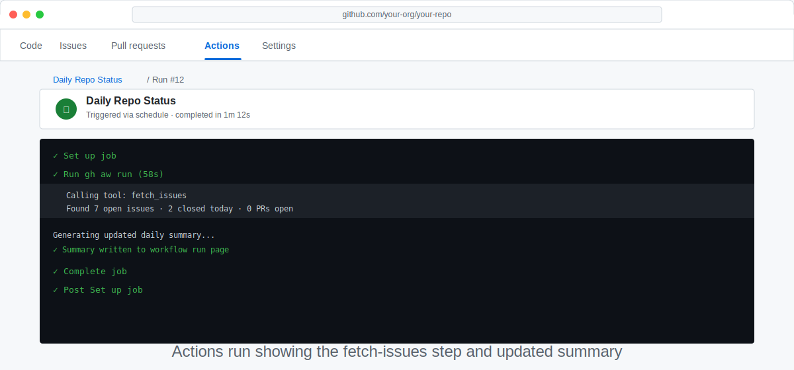

# Connect a Live Data Source to Your Workflow

> _Workflows become truly powerful when they act on real, up-to-the-minute data — not just canned prompts._

## 🎯 What You'll Do

You'll extend your daily-status workflow to fetch open issues from your repository using the [GitHub CLI](side-quest-01-02-environment-reference.md#github-cli-gh), then inject that data into your AI prompt. By the end, your summary will include an overview of outstanding issues alongside the commit activity.

## 📋 Before You Start

- You have installed the `gh-aw` extension in [Step 6: Install the `gh-aw` CLI Extension](06-install-gh-aw.md).
- You have a working daily-status workflow from [Build: Daily Repo Status Workflow](11a-build-daily-status.md).
- You're comfortable running and iterating on workflows from [Test and Improve Your Workflow](12-test-and-iterate.md).

## Steps

### Understand the data-flow pattern

[gh-aw workflows](https://github.github.com/gh-aw/introduction/overview/) run inside GitHub Actions, so your workflow can fetch live repository data before the AI writes anything. In this step, you will use shell steps to collect data and a later prompt section to turn that data into a summary.

Think of it as a handoff. First, the workflow gathers facts in a predictable way. Then, the prompt reads those saved results and asks the AI to explain what matters.

> [!TIP]
> If step outputs, here-document syntax, or the scripted versus agentic split are new to you, skim [Side Quest: Passing Data Between Steps with $GITHUB_OUTPUT](side-quest-16-01-github-output.md) and [Side Quest: Deterministic vs Agentic Data Ops](side-quest-16-04-deterministic-vs-agentic-data-ops.md).

### Fetch commit history

Open `.github/workflows/daily-status.md` and add two steps to the `steps:` block in the frontmatter.

First, fetch the recent commit log:

```yaml
- name: Fetch recent commits
  id: recent          # step ID — referenced as steps.recent.outputs.…
  run: |
    # Lists commits from the last 24 hours (max 10), format: "<hash> <subject>"
    COMMIT_LOG=$(git log --oneline --since="24 hours ago" --format="%h %s" | head -10)
    # <<EOF writes a multi-line value to $GITHUB_OUTPUT
    echo "commit_log<<EOF" >> $GITHUB_OUTPUT
    echo "$COMMIT_LOG" >> $GITHUB_OUTPUT
    echo "EOF" >> $GITHUB_OUTPUT
```

🤔 Pause and predict: What will the `commit_log` output contain if no commits were made in the last 24 hours? Form your prediction now and verify it after you trigger a run.

### Fetch open issues

Next, add a step to fetch open issues:

```yaml
- name: Fetch open issues
  id: issues          # step ID — referenced as steps.issues.outputs.…
  run: |
    # Fetch the 10 most recent open issues, formatted as "#42 Fix the bug"
    ISSUE_LIST=$(gh issue list --state open --limit 10 \
      --json number,title \
      --jq '.[] | "#\(.number) \(.title)"')
    # Count all open issues
    ISSUE_COUNT=$(gh issue list --state open --json number --jq 'length')
    echo "open_issues<<EOF" >> $GITHUB_OUTPUT
    echo "$ISSUE_LIST" >> $GITHUB_OUTPUT
    echo "EOF" >> $GITHUB_OUTPUT
    echo "open_issues_count=$ISSUE_COUNT" >> $GITHUB_OUTPUT
  env:
    GH_TOKEN: ${{ secrets.GITHUB_TOKEN }}  # provided automatically — no setup needed
```

✏️ Try it: Run `gh issue list --state open --json number --jq 'length'` in your terminal and note the count. After you trigger a workflow run, check whether the workflow reports the same total.

🤔 Pause and predict: What will the AI receive if the issue list is empty? Will the prompt still produce a useful output?

### Inject data into your AI prompt

The AI prompt lives in the Markdown body after the frontmatter. Update that section so it uses the step outputs:

```markdown
---
# … your existing frontmatter with the two new steps …
---

Summarise recent activity in this repository.

Recent commits (last 24 hours):
${{ steps.recent.outputs.commit_log }}

Open issues (${{ steps.issues.outputs.open_issues_count }} total):
${{ steps.issues.outputs.open_issues }}

Write a concise, friendly update — two short paragraphs.
Highlight anything that looks urgent in the issue list.
```

GitHub resolves the step-output expressions before the AI sees the prompt, so the model receives plain text instead of workflow syntax.

🤔 Pause and predict: If the `commit_log` output is empty, does the prompt still make sense to the AI? What one-line change would make the instruction more robust?

✏️ Try it: Change `"two short paragraphs"` to `"one bullet list per topic"` and re-run. Notice how the output format shifts.

### Compile and test

```bash
gh aw compile
```

Fix any errors, then push and trigger a manual run:

```bash
git add .github/workflows/daily-status.md
git commit -m "feat: inject open issues into daily summary prompt"
git push
```

Open the **Actions** tab and verify the new steps appear and the AI summary mentions both commits and issues.



> [!TIP]
> If your repository has no open issues, the AI will say so — that's expected. Create a test issue to see the integration in action.

### Try other data sources

Once you're comfortable with this pattern, the same technique works for:

| Data | Command |
|------|---------|
| Open pull requests | `gh pr list --state open` |
| Recent releases | `gh release list --limit 5` |
| Failed workflow runs | `gh run list --status failure --limit 5` |
| Repository stats | `gh api repos/:owner/:repo` |

## ✅ Checkpoint

- [ ] Your workflow has a recent-commits step with `id: recent`
- [ ] Your workflow has an open-issues step with `id: issues`
- [ ] Your AI prompt uses both saved outputs
- [ ] `gh aw compile` reports no errors
- [ ] A manual run completes and the summary mentions both commits and open issues
- [ ] You can explain how the workflow passes fetched data into the prompt
- [ ] You can describe what happens if the recent commit output is empty and how your prompt handles it

**Next:** [Give Your Agent More Tools with MCP](17-add-mcp-tools.md)

> [!TIP]
> <details>
> <summary>Security reading: token exfiltration and long-lived credential risks</summary>
>
> Now that your workflow reads live repository data, you're exposing a surface that attackers can try to exploit:
>
> - **Token exfiltration**: learn how crafted issue or PR content can attempt to leak your `GITHUB_TOKEN` — and how gh-aw stops it — in [Side Quest: Token and Secret Exfiltration in Agentic Workflows](side-quest-16-03-token-exfiltration.md).
> - **Long-lived credential risks**: if your workflow ever needs a personal access token (PAT), read [Side Quest: Long-Lived Credential Risks in Agentic Workflows](side-quest-16-05-long-lived-credentials.md) to understand why PATs create a larger attack surface and how `permissions:` minimization and `network.allowed-domains` contain the blast radius.
>
> </details>

## 📚 See Also

- [Overview of GitHub Agentic Workflows](https://github.github.com/gh-aw/introduction/overview/)
- [Triggers reference](https://github.github.com/gh-aw/reference/triggers/)
