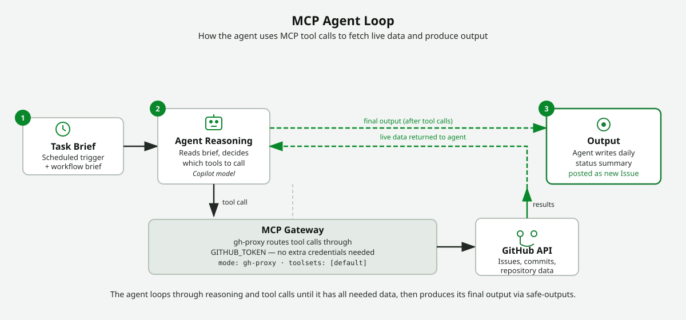

<!-- page-journey: all -->
<!-- page-adventure: advanced -->
# Give Your Agent More Tools with MCP

> _MCP servers turn your agent from a text generator into an active participant that can read, fetch, and act._

## :dart: What You'll Do

You'll add an [MCP (Model Context Protocol)](https://github.github.com/gh-aw/guides/mcps/) server to your workflow's [frontmatter](https://github.github.com/gh-aw/reference/frontmatter/), giving the AI agent access to a new set of [tools](https://github.github.com/gh-aw/reference/tools/) it can call at runtime. By the end, your daily-status workflow will be able to do more than just generate text — it can interact with live data sources using structured tool calls.

## :clipboard: Before You Start

- You have installed the `gh-aw` extension in [Install the `gh-aw` CLI Extension](06-install-gh-aw.md).
- You have a working daily-status workflow from [Build: Daily Repo Status Workflow](07-your-first-workflow.md).
- You're comfortable editing the YAML frontmatter section at the top of your workflow file.

## Steps

### Understand what MCP adds

MCP (Model Context Protocol) connects external tool servers to the agent so it can call structured operations — like listing issues or fetching commits — and weave the live results into its output. Without MCP, the agent only knows what you wrote in the brief; with MCP, it can go out and look things up itself.

<picture>
   <source media="(prefers-color-scheme: dark)" srcset="images/17-mcp-agent-loop-dark.svg">
   <source media="(prefers-color-scheme: light)" srcset="images/17-mcp-agent-loop-light.svg">
   
</picture>

> [!TIP]
> <details>
> <summary><b>Optional Side Quests:</b></summary>
>
> - Want a deeper look at how the agentic loop changes, what the `tools:` block does, and how to read tool calls in the Actions log? Work through [Side Quest: How MCP Tool Servers Work](side-quest-17-01-mcp-concepts.md).  
> - Want a beginner-friendly security mental model for why sandboxing matters, where the agent runs, and what safe output looks like? Work through [Side Quest: Agentic Workflow Security Architecture (Explain Like You're 5)](side-quest-17-02-security-architecture.md).  
> - Want to understand how malicious content in issues or PRs can try to redirect your agent — and how gh-aw's design limits the damage? Work through [Side Quest: Prompt Injection Attacks in Agentic Workflows](side-quest-17-03-prompt-injection.md).  
> - Want to see how an over-powered workflow can give a misdirected agent more authority than the task really needs? Work through [Side Quest: Permission Escalation in Agentic Workflows](side-quest-17-04-permission-escalation.md).  
> - Want to understand how a compromised MCP server could feed poisoned data to your agent — and how `network.allowed` and minimal [permissions](https://github.github.com/gh-aw/reference/permissions/) defend against it? Work through [Side Quest: Supply Chain Attacks via MCP Tool Servers](side-quest-17-05-supply-chain-mcp.md).  
> - Want to see how crafted issue or PR content can embed misleading text into agent output — and how `safe-outputs` label scoping keeps reviewers from being fooled? Work through [Side Quest: Output Injection via Safe Outputs](side-quest-17-06-output-injection.md).  
> - Want to understand how a misdirected agent with write access could commit backdoors or overwrite sensitive files — and how `contents: read`, `protected-files`, and `safe-outputs: create-pull-request` prevent it? Work through [Side Quest: Repository Poisoning via Agentic Write Access](side-quest-17-07-repo-poisoning.md).  
> Then come back here.
>
> </details>

### Add an MCP server to your workflow

In the terminal that is already open in your Codespace, run:

```bash
gh copilot
```

In Copilot CLI, send this prompt:

```prompt
/agentic-workflows update .github/workflows/daily-status.md to add a `tools:` block
with `github: mode: gh-proxy, toolsets: [default]` to the frontmatter, and update
the task brief to tell the agent to use GitHub tools to fetch the last 5 commits and
all open issues labelled `bug`, then write a daily summary and post it as a new issue.
```

The skill adds the `tools:` block and updates the brief. Review the diff before committing.

Here is the `tools:` block the skill will add:

```markdown .github/workflows/daily-status.md
---
name: Daily Status Report
on:
  workflow_dispatch: {}
  schedule: daily on weekdays
permissions:
  contents: read
tools:
  github:
    mode: gh-proxy
    toolsets: [default]
---
```

<details>
<summary>:desktop_computer: Terminal path</summary>

Open your daily-status workflow file (`.github/workflows/daily-status.md`) and find the YAML frontmatter at the top. Add a `tools` block with the content shown above, then run `gh aw compile`.

</details>

> [!NOTE]
> The `github` tool entry tells gh-aw to start the [GitHub MCP server](https://github.github.com/gh-aw/guides/mcps/) in proxy mode. The agent can then call GitHub tools — listing issues, fetching commits, reading file contents — scoped to the permissions you've declared above.

<!-- -->

> [!NOTE]
> <details>
> <summary><b>Enterprise users (GHEC, GHES, EMU): confirm MCP proxy availability before continuing.</b></summary>
>
> `mode: gh-proxy` routes all GitHub tool calls through the `GITHUB_TOKEN` that Actions provides automatically — no extra credentials or setup needed on github.com or GHEC.
>
> On GHES, the GitHub MCP server is supported from GHES 3.16+. If your instance is older, the `tools:` block will [compile](https://github.github.com/gh-aw/reference/compilation-process/) without errors but the agent's tool calls will fail at runtime. Verify your GHES version and confirm with your admin that the Copilot MCP proxy feature is enabled for your organization.
>
> If MCP is unavailable in your environment, the [Connect a Live Data Source](16-connect-data-source.md) step covers an alternative approach using deterministic shell steps that only require `GITHUB_TOKEN` and the `gh` CLI — no MCP server needed.
>
> </details>

### Reference the tools in your task brief

Below the frontmatter, update the task brief to tell the agent it can use the MCP tools:

```markdown .github/workflows/daily-status.md
You have access to GitHub tools via MCP. Use them to:
1. Fetch the last 5 commits on the default branch.
2. List all open issues labelled `bug`.
3. Write a concise daily summary combining both.
Post the summary as a new issue titled "Daily Status — {today's date}".
```

The agent will read this brief, decide which MCP tool calls to make, and weave the results into its final output — all without you scripting each API call manually.

### Push and trigger a run

The `/agentic-workflows` skill recompiles the lock file automatically. Commit both files and push:

```bash
git add .
git commit -m "feat: add MCP tools to daily status workflow"
git push
```

### Watch the agent reason

Open the run log in **Actions**. You'll see the agent interleaving tool calls with its reasoning — it fetches data, processes it, then produces the summary. That's the agentic loop in action.

## :white_check_mark: Checkpoint

- [ ] Your frontmatter has a `tools:` block with `github: mode: gh-proxy`
- [ ] Your task brief mentions what the agent should do with the tools
- [ ] The source and compiled workflow files are committed and pushed
- [ ] A manual run completes and the log shows at least one MCP tool call
- [ ] The workflow output reflects live data retrieved via MCP, not just static text

<!-- journey: all -->
**Next:** [Share and Reuse Your Agentic Workflows](18-share-and-reuse.md)
<!-- /journey -->
