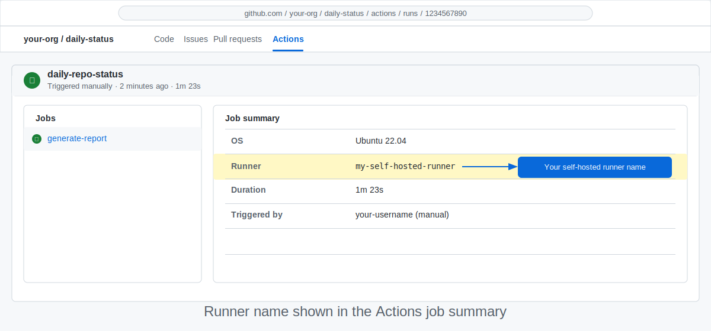

<!-- page-journey: all -->
<!-- page-adventure: advanced -->
# Run Your Agentic Workflow on a Self-Hosted Runner

> _Enterprise teams often need workflows to run on their own infrastructure — this step shows you exactly how._

## 🎯 What You'll Do

You will update your workflow's [frontmatter](https://github.github.com/gh-aw/reference/frontmatter/) to target a self-hosted runner using a runner label.
By the end of this step, your agentic workflow will queue on a runner your organisation manages
rather than a GitHub-hosted machine.

## 📋 Before You Start

- Your agentic workflow runs successfully (see [Step 12: Test and Iterate](12-test-and-iterate.md)).
- A self-hosted runner is registered and **online** for your repository or organisation.
  If you need to set one up first, see [Side Quest: Enterprise Setup Considerations](side-quest-enterprise-setup.md).
- You know the label assigned to your runner (for example, `self-hosted`, `ubuntu-self-hosted`, or a custom label your admin configured).

> [!NOTE]
> Not on an enterprise plan? GitHub-hosted runners work for the main workshop path. Come back to this step if you later move to a GHES or GHEC environment with self-hosted runners.

## Understand runner targeting in frontmatter

An agentic workflow's frontmatter is compatible with standard GitHub Actions YAML.
The `runs-on:` field tells Actions which runner to use — it works identically for
agentic workflows and classic jobs.

Your current workflow likely targets a GitHub-hosted runner. Look for the `runs-on:` field in your frontmatter:

```yaml
runs-on: ubuntu-latest
```

The only change needed is the value of `runs-on:`.

## ✏️ Exercise: Update your frontmatter

Update your workflow's `runs-on:` field to point at your self-hosted runner.

### Open your workflow file

Open `.github/workflows/daily-status.md` (or whichever workflow you want to move).

<details>
<summary>🖥️ GitHub UI path</summary>

1. In your repository on GitHub, navigate to `.github/workflows/daily-status.md`.
2. Click the **pencil icon (✏️)** to open the editor.
3. Edit the `runs-on:` line as described below.
4. Click **Commit changes**.

</details>

<details>
<summary>💻 Terminal path</summary>

Open the file in your editor of choice:

```bash
code .github/workflows/daily-status.md
```

</details>

### Change the `runs-on:` value

Replace `ubuntu-latest` with your runner's label.
Use a list if your runner has multiple required labels:

Single label:

```yaml
runs-on: self-hosted
```

Multiple labels (all must match):

```yaml
runs-on: [self-hosted, linux, x64]
```

The labels must exactly match what your admin registered on the runner.
Ask your admin if you are unsure — they can find the labels in the runner's
registration settings (Settings → Actions → Runners).

> [!TIP]
> Labels act as filters. A workflow job is dispatched to the first idle runner that satisfies all labels in the list. Adding `linux` alongside `self-hosted` ensures the job only lands on Linux runners when your fleet is mixed.


<details>
<summary>Advanced: ephemeral and isolated runners</summary>

### Ephemeral and JIT runners

Ephemeral runners are destroyed after a single job — each run starts on a fresh machine,
preventing state from leaking between executions. Register one using the ephemeral flag
and target it with the same label strategy described above.

Just-in-time (JIT) runners are provisioned on demand and deregistered immediately after use.
They require a registration token scoped to your organisation or repository and are typically
managed by a runner controller such as actions-runner-controller.

### Proxy and network requirements

Self-hosted runners in enterprise environments often sit behind an outbound proxy.
The agentic engine needs to reach model endpoints and GitHub APIs.

If your runner uses a proxy, set these environment variables in the runner's system
configuration **before** registering it, or ask your admin to confirm they are already set:

```bash
HTTPS_PROXY=https://proxy.example.com:3128
HTTP_PROXY=http://proxy.example.com:3128
NO_PROXY=localhost,127.0.0.1,github.example.com
```

You do **not** need to add these to the workflow file itself — the runner process
inherits them from the system environment automatically.

> [!NOTE]
> The exact proxy hostname and port come from your network team or enterprise admin. The values above are examples only.

### Network isolation

If your runner operates in an air-gapped or restricted environment, ensure it can reach
the GitHub API, your model endpoint, and any MCP tool servers your workflow calls.
Work with your network admin to allowlist these endpoints before running agentic workflows.

</details>

## ✏️ Exercise: Compile and commit

Recompile after editing the frontmatter, then commit both files:

```bash
gh aw compile daily-status
```

Commit both the `.md` source and the regenerated `.lock.yml`:

```bash
git add .github/workflows/daily-status.md .github/workflows/daily-status.lock.yml
git commit -m "chore: target self-hosted runner for daily-status workflow"
git push
```

UI-first learners: after committing the `.md` file via the web editor, open a Codespace or
the GitHub web terminal and run `gh aw compile daily-status` to regenerate the `.lock.yml`.
Commit the updated lock file before triggering your next workflow run.

> [!TIP]
> You can also use the `/agentic-workflows` Copilot skill to edit the workflow — it compiles and commits both files together, so you never end up with a stale lock file.

## ✏️ Exercise: Verify the run lands on your runner

1. Go to the **Actions** tab in your repository.
2. Click Run workflow.
3. Open the run and look at the job summary.
4. Confirm the Runner field shows your self-hosted runner name (not `GitHub Actions`).



## ✅ Checkpoint

- [ ] Your workflow's `runs-on:` value matches the label of your self-hosted runner
- [ ] `gh aw compile` (if used) completed without errors
- [ ] `daily-status.md` and its `.lock.yml` file are committed and pushed
- [ ] A manual workflow run started without an error
- [ ] The Actions job summary Runner field shows your self-hosted runner's name, not `GitHub Actions`
- [ ] The workflow run log shows your runner's hostname in the job header
- [ ] You can explain why a list of labels (`[self-hosted, linux, x64]`) narrows runner selection
- [ ] You know where to find proxy and ephemeral runner guidance if your environment needs it
- [ ] No workflow steps failed due to runner availability or label mismatch

<!-- journey: all -->
**Next:** [What's Next? Keep Exploring](14-next-steps.md)
<!-- /journey -->

For more details, see [Self-Hosted Runners reference](https://github.github.com/gh-aw/reference/self-hosted-runners/), [Frontmatter reference](https://github.github.com/gh-aw/reference/frontmatter/), [Self-hosted runners documentation](https://docs.github.com/en/actions/hosting-your-own-runners/managing-self-hosted-runners/about-self-hosted-runners), [Runner labels reference](https://docs.github.com/en/actions/hosting-your-own-runners/managing-self-hosted-runners/using-labels-with-self-hosted-runners), [Side Quest: Enterprise Setup Considerations](side-quest-enterprise-setup.md), and [Connect a Live Data Source to Your Workflow](16-connect-data-source.md).

