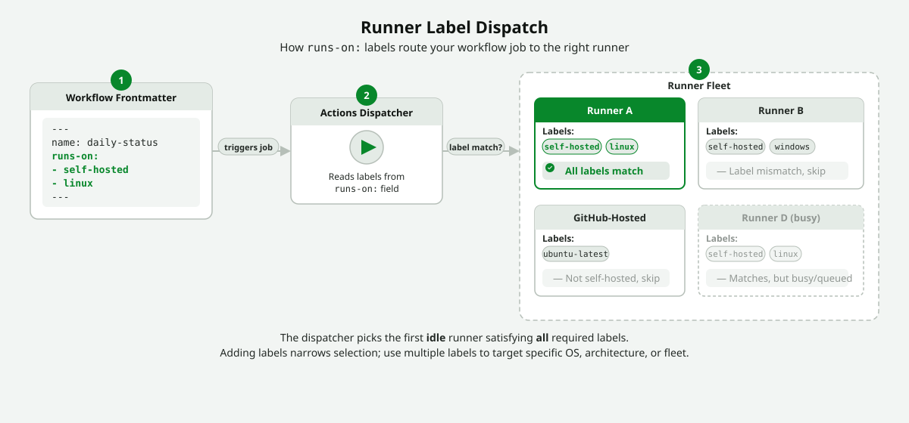
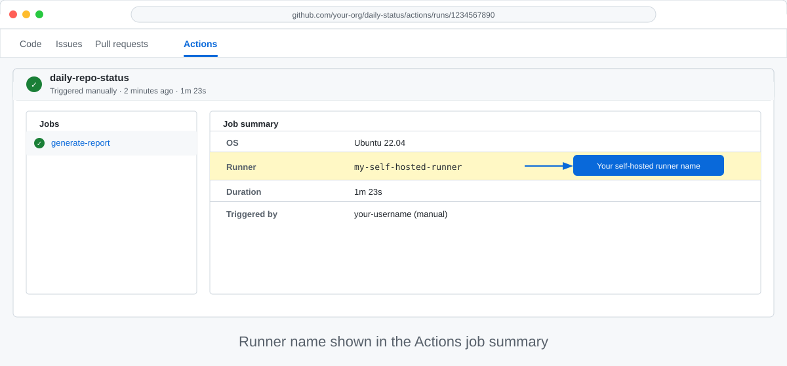

<!-- page-journey: all -->
<!-- page-adventure: advanced -->
# Run Your Agentic Workflow on a Self-Hosted Runner

> _Enterprise teams often need workflows to run on their own infrastructure — this step shows you exactly how._

## :dart: What You'll Do

Update your workflow's [frontmatter](https://github.github.com/gh-aw/reference/frontmatter/) to target a self-hosted runner using a runner label.
By the end of this step, your agentic workflow queues on a runner your organisation manages
rather than a GitHub-hosted machine.

## :clipboard: Before You Start

- Your agentic workflow runs successfully (see [Refine, Test, and Improve Your Workflow](09-agentic-editing.md)).
- A [self-hosted runner](https://github.github.com/gh-aw/reference/self-hosted-runners/) is registered and **online** for your repository or organisation.
  If you need to set one up first, see [Side Quest: Enterprise Setup Considerations](side-quest-enterprise-setup.md).
- You know the label assigned to your runner (for example, `self-hosted`, `ubuntu-self-hosted`, or a custom label your admin configured).

> [!NOTE]
> Not on an enterprise plan? GitHub-hosted runners work for the main workshop path. Come back to this step if you later move to a GHES or GHEC environment with self-hosted runners.

## Understand runner targeting in frontmatter

An agentic workflow's frontmatter is compatible with standard GitHub Actions YAML.
The `runs-on:` field tells Actions which runner to use — it works identically for
agentic workflows and classic jobs.

The diagram below shows how Actions reads your labels and dispatches the job to the first idle runner that satisfies all of them.

<picture>
  <source media="(prefers-color-scheme: dark)" srcset="images/24-runner-label-dispatch-dark.svg">
  <source media="(prefers-color-scheme: light)" srcset="images/24-runner-label-dispatch-light.svg">
  
</picture>

Your current workflow likely targets a GitHub-hosted runner. Look for the `runs-on:` field in your frontmatter:

```markdown .github/workflows/daily-status.md
---
runs-on: ubuntu-latest
---
```

The only change needed is the value of `runs-on:`.

## :pencil2: Exercise: Update your frontmatter

Update your workflow's `runs-on:` field to point at your self-hosted runner.

### Open your workflow file

Open `.github/workflows/daily-status.md` (or whichever workflow you want to move).

Open the file in your editor of choice:

```bash
code .github/workflows/daily-status.md
```

### Change the `runs-on:` value

Replace `ubuntu-latest` with your runner's label.
Use a list if your runner has multiple required labels:

Single label:

```markdown .github/workflows/daily-status.md
---
runs-on: self-hosted
---
```

Multiple labels (all must match):

```markdown .github/workflows/daily-status.md
---
runs-on: [self-hosted, linux, x64]
---
```

The labels must exactly match what your admin registered on the runner.
Ask your admin if you are unsure — they can find the labels in the runner's
registration settings (Settings → Actions → Runners).

> [!TIP]
> Labels act as filters. A workflow job is dispatched to the first idle runner that satisfies all labels in the list. Adding `linux` alongside `self-hosted` ensures the job only lands on Linux runners when your fleet is mixed.

Running in an enterprise environment? See [Side Quest: Self-Hosted Runner Infrastructure Deep Dive](side-quest-24-01-runner-infrastructure.md) for guidance on [ephemeral](https://github.github.com/gh-aw/reference/ephemerals/) and JIT runners, proxy configuration, and [network](https://github.github.com/gh-aw/reference/network/) isolation for air-gapped environments.

## :pencil2: Exercise: Compile and commit

Recompile after editing the frontmatter, then commit both files:

```bash
gh aw compile daily-status
```

Commit both the `.md` source and the regenerated `.lock.yml`:

```bash
git add .
git commit -m "chore: target self-hosted runner for daily-status workflow"
git push
```

> [!TIP]
> You can also use the `/agentic-workflows` Copilot skill to edit the workflow — it compiles and commits both files together, so you never end up with a stale [lock file](https://github.github.com/gh-aw/reference/compilation-process/).

## :pencil2: Exercise: Verify the run lands on your runner

1. Go to the **Actions** tab in your repository.
2. Click Run workflow.
3. Open the run and look at the job summary.
4. Confirm the Runner field shows your self-hosted runner name (not `GitHub Actions`).

<picture>
  <source media="(prefers-color-scheme: dark)" srcset="images/24-self-hosted-runner-job-dark.svg">
  <source media="(prefers-color-scheme: light)" srcset="images/24-self-hosted-runner-job-light.svg">
  
</picture>

## :white_check_mark: Checkpoint

- [ ] Your workflow's `runs-on:` value matches the label of your self-hosted runner
- [ ] `gh aw compile` (if used) completed without errors
- [ ] `daily-status.md` and its `.lock.yml` file are committed and pushed
- [ ] A manual workflow run started without an error
- [ ] The Actions job summary Runner field shows your self-hosted runner's name, not `GitHub Actions`
- [ ] The workflow run log shows your runner's hostname in the job header
- [ ] You can explain why a list of labels (`[self-hosted, linux, x64]`) narrows runner selection
- [ ] You know where to find proxy and ephemeral runner guidance if your environment needs it
- [ ] No workflow steps failed due to runner availability or label mismatch

<!-- journey: all -->
**Next:** [Audit and Monitor Your Agentic Workflows](25-audit-and-observability.md)
<!-- /journey -->
