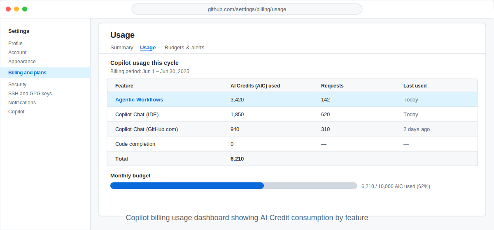

<!-- page-journey: all -->
<!-- page-adventure: advanced -->
# Manage Costs and AI Credit Budgets

> _Agentic workflows consume [AI Credits (AIC)](https://github.github.com/gh-aw/reference/cost-management/#ai-credits-aic) on every run — learning to measure, predict, and control that spend turns a powerful tool into a sustainable one._

## 🎯 What You'll Do

You'll review your workflow's AI Credit consumption in the GitHub billing dashboard, estimate monthly costs for a scheduled workflow, and apply at least one technique to keep spending within budget.

## 📋 Before You Start

- You have completed [Audit and Monitor Your Agentic Workflows](25-audit-and-observability.md).
- You have run your workflow at least once and seen token usage data in `gh aw logs` output.
- _(Enterprise users)_ Your GitHub administrator has confirmed that Copilot Enterprise billing is enabled for your organisation.

## Steps

### Understand AI Credits

Every agentic workflow run uses an AI model to process your task brief and produce output. GitHub bills this inference as **AI Credits (AIC)**.

- One AIC corresponds roughly to 1,000 input tokens processed by the model.
- A typical daily-status workflow run costs between 0.5 and 3 AIC depending on brief length and tool calls.
- You pay for both input and output tokens, but input dominates cost for most briefs.

> [!NOTE]
> Exact pricing and AIC conversion rates are listed on the [GitHub billing documentation page](https://docs.github.com/en/billing/managing-billing-for-github-copilot/about-billing-for-github-copilot). Rates vary by Copilot plan.

### Check current usage in the billing dashboard

1. Open **github.com** and click your profile picture → **Settings**.
2. In the left sidebar, click **Billing and plans**.
3. Scroll to the **Copilot** section and click **Usage**.
4. Look for the **Agentic Workflows** row. It shows AIC consumed this billing cycle.



### Estimate monthly cost for a scheduled workflow

Use the per-run cost from `gh aw logs` to project monthly spend.

```bash
gh aw logs daily-status --count 5
```

Look at the **AIC** column. Average the last five runs, then multiply:

```
monthly cost = average AIC per run × runs per day × 30
```

If your workflow averages 1.5 AIC and runs once a day: `1.5 × 1 × 30 = 45 AIC per month`. Share this estimate with your GitHub administrator before enabling a high-frequency schedule.

### Project costs with [gh aw forecast](https://github.github.com/gh-aw/setup/cli/#forecast-experimental)

`gh aw forecast` uses your actual run history and Monte Carlo simulation to project future AIC consumption. Run it for a single workflow to see a P10/P50/P90 probability distribution:

```bash
gh aw forecast daily-status
```

Use the **P90** figure as a conservative upper bound when requesting a spending limit from your administrator or setting `max-daily-ai-credits`.

> [!TIP]
> For the full walkthrough — weekly projections, limiting history with `--days`, forecasting all workflows, and deriving a `max-daily-ai-credits` value from the P90 — see [Side Quest: Project Future AI Credit Costs with `gh aw forecast`](side-quest-26-01-forecast-costs.md).

### Reduce token consumption and set guardrails

A few techniques keep spend in check:

- **Shorten the task brief** — fewer input tokens per run.
- **Filter data before passing it to the agent** — smaller context lowers cost.
- **Cache results with persistent memory** — skip re-processing unchanged data. See [Make Your Workflow Remember Across Runs](20-persistent-memory.md).
- **Reduce run frequency** — fewer runs means fewer AIC.

Three [frontmatter](https://github.github.com/gh-aw/reference/frontmatter/) fields enforce hard limits directly in the workflow file:

- **[`timeout-minutes`](https://github.github.com/gh-aw/reference/rate-limiting-controls/#timeouts)** cancels the entire Actions job if it exceeds the limit. The run fails and you are billed only for tokens consumed before cancellation.
- **[`max-ai-credits`](https://github.github.com/gh-aw/reference/cost-management/#cap-ai-credits-per-run)** caps the AIC a single run may consume, enforced by the AWF firewall. The default when omitted is 1000 AIC. Set to a negative value (e.g. `-1`) to disable enforcement and token steering.
- **[`max-daily-ai-credits`](https://github.github.com/gh-aw/reference/cost-management/#cap-daily-ai-credits-per-workflow)** caps the total AIC consumed by this workflow across the last 24 hours for the triggering user. Runs that would exceed the cap are blocked before they start. A system default threshold applies when this field is omitted; set to `-1` to disable the guardrail, or provide an explicit integer value to override the default.

```yaml
---
name: Daily Status Report
on:
  schedule: daily on weekdays
timeout-minutes: 10
max-ai-credits: 1000
max-daily-ai-credits: 2500
---
```

In this example, each run is capped at 1000 AIC and the 24-hour total is capped at 2500 AIC — roughly two full runs before the daily guardrail engages. Compile after editing:

```bash
gh aw compile
```

## ✅ Checkpoint

- [ ] You located your AIC usage for this billing cycle in the GitHub billing dashboard
- [ ] You calculated an estimated monthly AIC cost for your scheduled workflow
- [ ] You ran `gh aw forecast` and identified the P50 and P90 projections for your workflow
- [ ] You added `max-ai-credits` and `max-daily-ai-credits` to your workflow frontmatter
- [ ] You added or verified a `timeout-minutes` value in your workflow frontmatter
- [ ] You identified at least one technique to reduce token consumption

<!-- journey: all -->
**Next:** [What's Next? Keep Exploring](14-next-steps.md)
<!-- /journey -->
