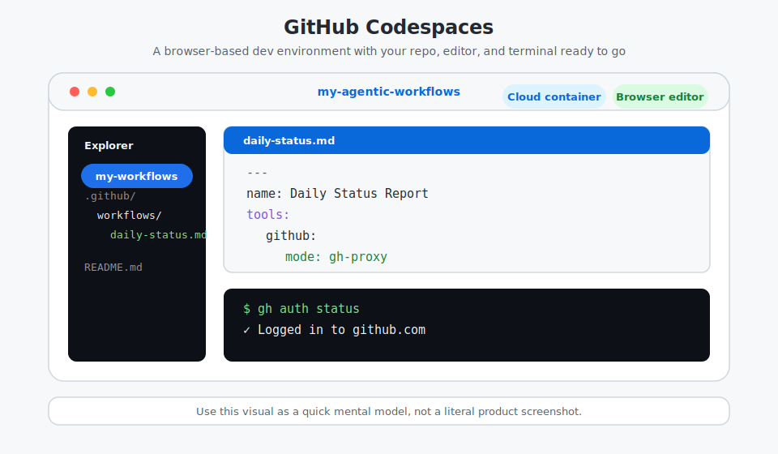
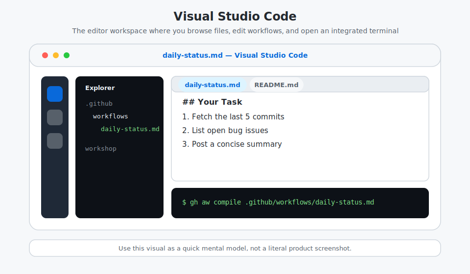
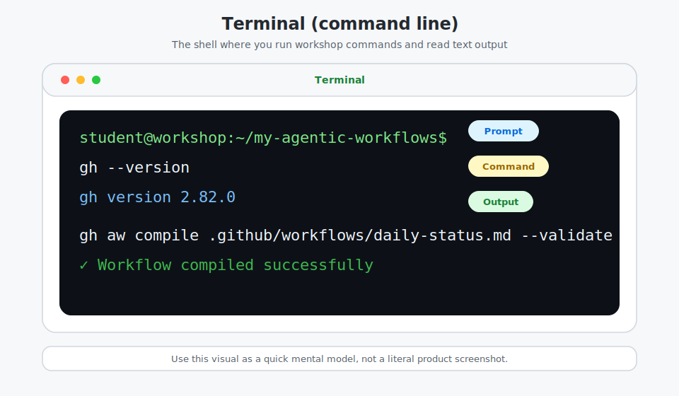
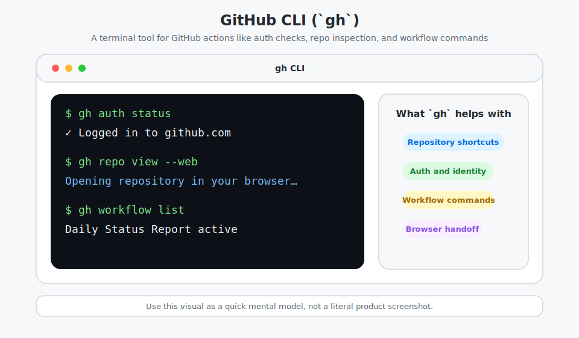
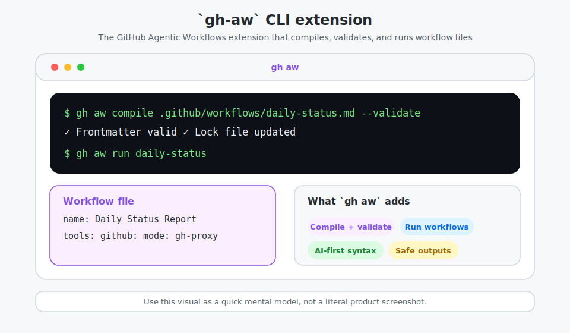
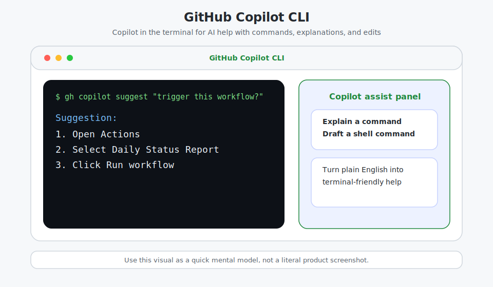
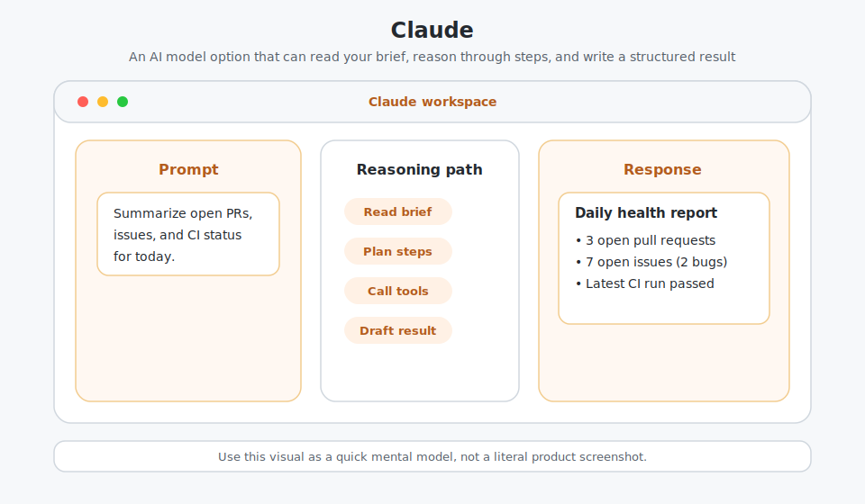
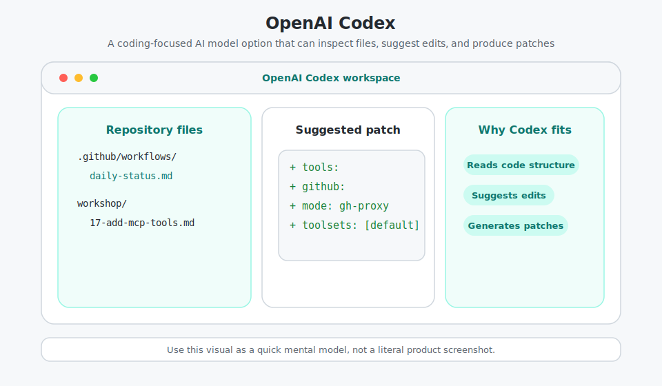

# Side Quest: Environment Reference

> _Optional: use this quick glossary and visual reference to understand the environments and AI tools used throughout the workshop._

## Environment and tool glossary

| Term | What it means in this workshop | Official documentation |
|------|------|------|
| **GitHub Codespaces** | Your cloud development environment when you choose the browser-based setup path. | [GitHub Codespaces docs](https://docs.github.com/en/codespaces) |
| **Visual Studio Code (VS Code)** | The editor experience used inside Codespaces (and optionally on your local machine). | [Visual Studio Code docs](https://code.visualstudio.com/docs) |
| **Terminal (command line)** | The shell where you run workshop commands (`gh`, `gh aw`, `git`, and more). | [GitHub CLI manual](https://cli.github.com/manual/) |
| **GitHub CLI (`gh`)** | GitHub's official CLI, required for this workshop. | [GitHub CLI docs](https://cli.github.com/manual/) |
| **`gh-aw` CLI extension** | The GitHub Agentic Workflows extension you install and use in the terminal. | [Install `gh-aw`](https://github.com/github/gh-aw#readme) |
| **GitHub Copilot CLI** | Copilot in the terminal for AI-assisted command and development help. | [GitHub Copilot CLI docs](https://docs.github.com/en/copilot/concepts/agents/copilot-cli/about-copilot-cli) |
| **Claude** | Anthropic's AI model family available in some GitHub Copilot and agentic workflow contexts. | [Claude documentation](https://docs.anthropic.com/) |
| **OpenAI Codex** | OpenAI coding model family that can be used in coding and agent workflows. | [OpenAI Codex](https://openai.com/codex/) |

## Conceptual screenshots

These visuals are simplified mental models, not literal product screenshots. Use them to recognize what each name refers to when it appears in later steps.

### Development environments

#### GitHub Codespaces

You use Codespaces when you want a ready-to-go development environment in your browser.

#### Visual Studio Code (VS Code)

You use VS Code to browse files, edit workflows, and keep a terminal open beside your work.

#### Terminal (command line)

You use the terminal whenever the workshop asks you to run `gh`, `gh aw`, or `git` commands.

### Workshop tools and model options

#### GitHub CLI (`gh`)

You use `gh` for GitHub-specific terminal tasks like authentication checks, repository shortcuts, and workflow commands.

#### `gh-aw` CLI extension

You use `gh aw` to compile, validate, and run agentic workflow files.

#### GitHub Copilot CLI

You use GitHub Copilot CLI when you want AI help inside the terminal.

#### Claude

You may see Claude as one of the AI model options that can read a brief, reason through a task, and produce an output.

#### OpenAI Codex

You may see OpenAI Codex as a coding-focused model option that reads files and suggests edits.

## ✅ Checkpoint

- [ ] You can identify each environment and tool name used in the tutorial
- [ ] You can match each item to its conceptual screenshot
- [ ] You know where to find official docs for each item
- [ ] You're ready to continue with setup or return to your current workshop step

When you're done here, return to [Step 1: What You Need Before We Start](01-prerequisites.md).
