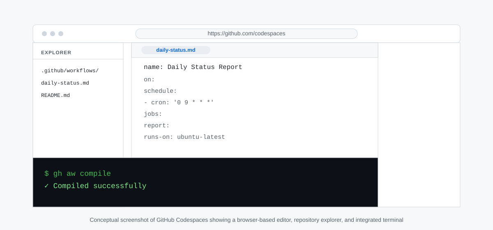
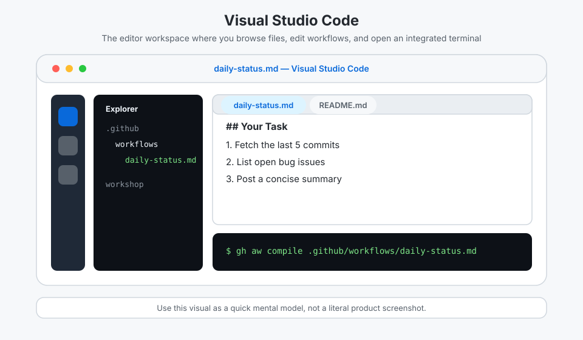
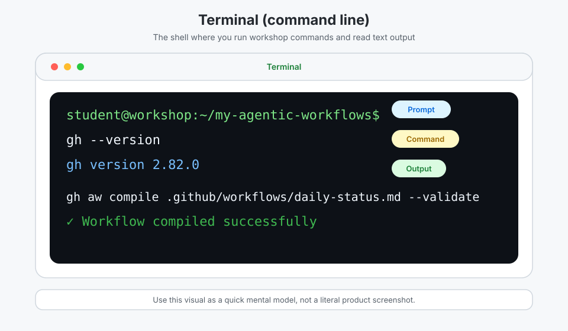
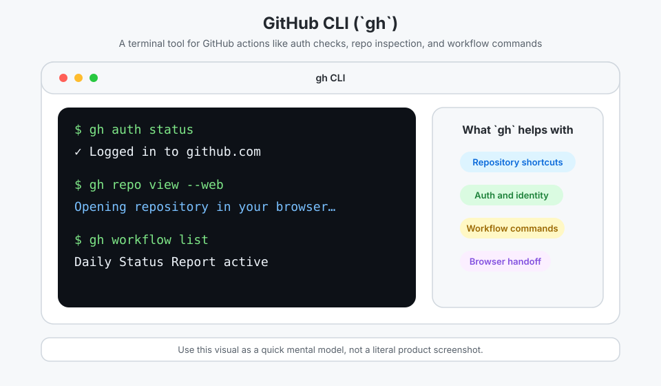
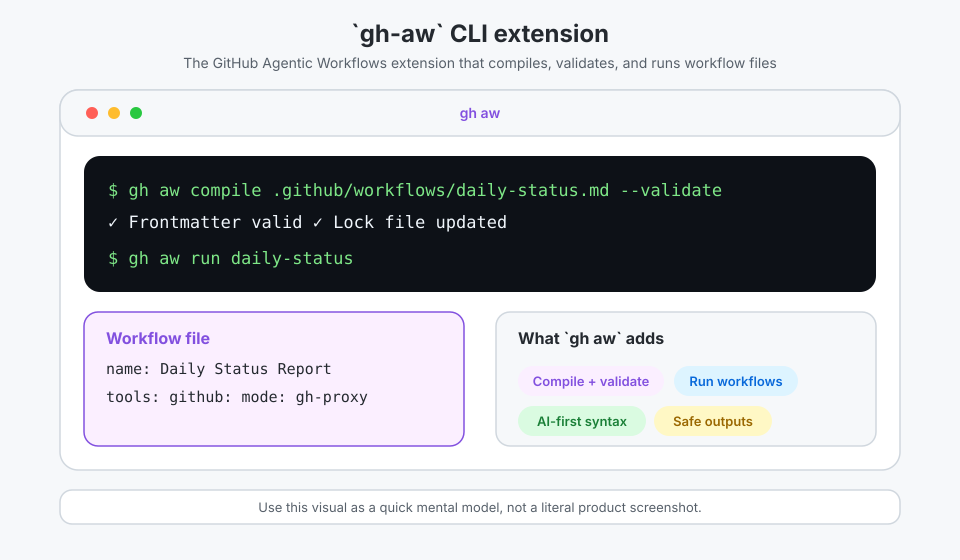
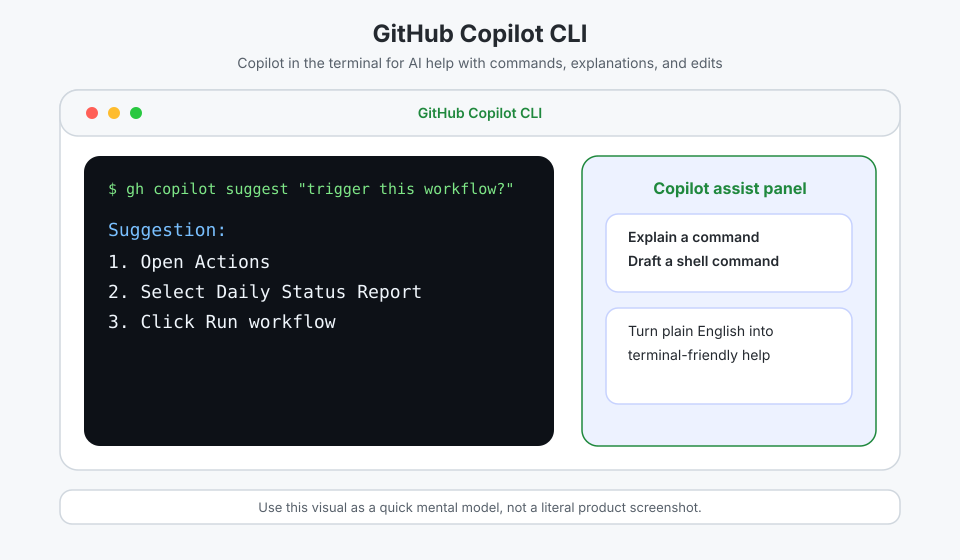
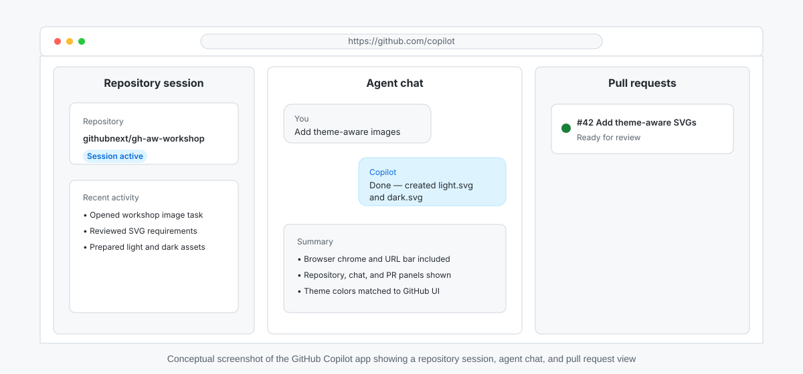
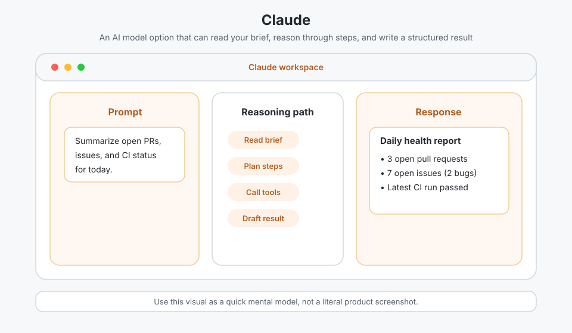
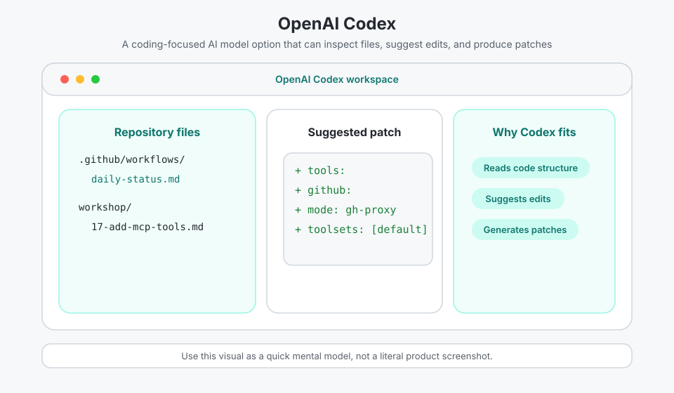

<!-- page-journey: all -->
<!-- page-adventure: side-quest -->
# Side Quest: Environment Reference

> _Optional: use this quick glossary and visual reference to understand the environments and AI tools used throughout the workshop._

Workshop instructions name specific environments and tools. This page maps each name to its role so you can follow along without stopping to wonder what "the terminal" or "Copilot CLI" means.

## :clipboard: Before You Start

You have a terminal open inside your practice repository (see [Set Up a Codespace](02a-setup-codespace.md) or the optional [Local Terminal side quest](side-quest-02-01-local-terminal.md)).

## Environment and tool glossary

| Term | Role in this workshop | When you use it | Official documentation |
|------|------|------|------|
| **GitHub Codespaces** | Your cloud development environment — a browser-based editor with a built-in terminal. | Opening files, running terminal commands, and editing workflows without any local install. | [GitHub Codespaces docs](https://docs.github.com/en/codespaces) |
| **Visual Studio Code (VS Code)** | The editor experience used inside Codespaces (and optionally on your local machine). | Browsing files, viewing diffs, and editing workflow markdown. | [Visual Studio Code docs](https://code.visualstudio.com/docs) |
| **Terminal (command line)** | The shell where you run workshop commands (`gh`, `gh aw`, `git`, and more). | Any step that shows a `bash` code block. | [GitHub CLI manual](https://cli.github.com/manual/) |
| **GitHub CLI (`gh`)** | GitHub's official CLI, required for this workshop. | Authentication checks, running workflows, and interacting with GitHub from the terminal. | [GitHub CLI docs](https://cli.github.com/manual/) |
| **`gh-aw` CLI extension** | The GitHub Agentic Workflows extension you install and use in the terminal. | Compiling `.md` workflow files into standard GitHub Actions YAML. | [Install `gh-aw`](https://github.com/github/gh-aw#readme) |
| **GitHub Copilot CLI** | Copilot in the terminal (`gh copilot`) for AI-assisted help. | Authoring and refining workflow files using natural language prompts in your Codespace terminal. | [GitHub Copilot CLI docs](https://docs.github.com/en/copilot/concepts/agents/copilot-cli/about-copilot-cli) |
| **GitHub Copilot app** | The GitHub Copilot desktop and web application for agent sessions and pull request management. | Starting and steering coding tasks, reviewing pull requests from a Copilot workspace. | [GitHub Copilot app](https://github.com/features/ai/github-app) |
| **Claude** | Anthropic's AI model family available in some GitHub Copilot and agentic workflow contexts. | An alternative model option when your organization allows it. | [Claude documentation](https://docs.anthropic.com/) |
| **OpenAI Codex** | OpenAI coding model family that can be used in coding and agent workflows. | An alternative model option focused on file editing and code suggestions. | [OpenAI Codex CLI repository](https://github.com/openai/codex#readme) |

> [!NOTE]
> If you are using **GitHub Enterprise Server (GHES)** or **GitHub Enterprise Cloud (GHEC)**, some features (such as Codespaces availability and Copilot model selection) depend on your organization's configuration. Check with your admin or see the [GHES Copilot docs](https://docs.github.com/en/enterprise-server@latest/copilot) if a step does not match what you see.

### :white_check_mark: Verify your tools are ready

Run these commands in your terminal to confirm the required tools are installed:

```bash
gh --version
git --version
```

> [!NOTE]
> `gh aw --version` only works after you complete [Install the gh-aw CLI Extension](06-install-gh-aw.md).

```bash
gh aw --version
```

## Conceptual screenshots

Recognizing what each environment looks like on screen helps you orient yourself quickly when workshop instructions say "open a terminal" or "use the Copilot app."

These visuals are simplified mental models, not literal product screenshots. Use them to recognize what each name refers to when it appears in later steps.

### Development environments

#### GitHub Codespaces

<picture>
  <source media="(prefers-color-scheme: dark)" srcset="images/side-quest-01-02-github-codespaces-dark.svg">
  <source media="(prefers-color-scheme: light)" srcset="images/side-quest-01-02-github-codespaces-light.svg">
  
</picture>

You use Codespaces when you want a ready-to-go development environment in your browser.

#### Visual Studio Code (VS Code)

<picture>
  <source media="(prefers-color-scheme: dark)" srcset="images/side-quest-01-02-vscode-dark.svg">
  <source media="(prefers-color-scheme: light)" srcset="images/side-quest-01-02-vscode-light.svg">
  
</picture>

You use VS Code to browse files, edit workflows, and keep a terminal open beside your work.

#### Terminal (command line)

<picture>
  <source media="(prefers-color-scheme: dark)" srcset="images/side-quest-01-02-terminal-dark.svg">
  <source media="(prefers-color-scheme: light)" srcset="images/side-quest-01-02-terminal-light.svg">
  
</picture>

You use the terminal whenever the workshop asks you to run `gh`, `gh aw`, or `git` commands.

### Workshop tools and model options

#### GitHub CLI (`gh`)

<picture>
  <source media="(prefers-color-scheme: dark)" srcset="images/side-quest-01-02-gh-cli-dark.svg">
  <source media="(prefers-color-scheme: light)" srcset="images/side-quest-01-02-gh-cli-light.svg">
  
</picture>

You use `gh` for GitHub-specific terminal tasks like authentication checks, repository shortcuts, and workflow commands.

#### `gh-aw` CLI extension

<picture>
   <source media="(prefers-color-scheme: dark)" srcset="images/side-quest-01-02-gh-aw-dark.svg">
   <source media="(prefers-color-scheme: light)" srcset="images/side-quest-01-02-gh-aw-light.svg">
   
</picture>

You use `gh aw` to compile agentic workflow files.

#### GitHub Copilot CLI

<picture>
  <source media="(prefers-color-scheme: dark)" srcset="images/side-quest-01-02-copilot-cli-dark.svg">
  <source media="(prefers-color-scheme: light)" srcset="images/side-quest-01-02-copilot-cli-light.svg">
  
</picture>

You use GitHub Copilot CLI when you want AI help inside the terminal.

#### GitHub Copilot app

<picture>
  <source media="(prefers-color-scheme: dark)" srcset="images/side-quest-01-02-copilot-app-dark.svg">
  <source media="(prefers-color-scheme: light)" srcset="images/side-quest-01-02-copilot-app-light.svg">
  
</picture>

You use the GitHub Copilot app when you want to start and steer repository sessions, manage coding tasks, and review pull requests from a Copilot workspace.

#### Claude

<picture>
  <source media="(prefers-color-scheme: dark)" srcset="images/side-quest-01-02-claude-dark.svg">
  <source media="(prefers-color-scheme: light)" srcset="images/side-quest-01-02-claude-light.svg">
  
</picture>

You may see Claude as one of the AI model options that can read a brief, reason through a task, and produce an output.

#### OpenAI Codex

<picture>
  <source media="(prefers-color-scheme: dark)" srcset="images/side-quest-01-02-openai-codex-dark.svg">
  <source media="(prefers-color-scheme: light)" srcset="images/side-quest-01-02-openai-codex-light.svg">
  
</picture>

You may see OpenAI Codex as a coding-focused model option that reads files and suggests edits.

<!-- journey: all -->
## :white_check_mark: Checkpoint

- [ ] `gh --version` returns a version number in your terminal
- [ ] `git --version` returns a version number in your terminal
- [ ] (If you've completed [Step 6](06-install-gh-aw.md)) `gh aw --version` returns a version number
- [ ] You can explain in one sentence what each term in the glossary table means
- [ ] You understand that `gh aw` runs at author time in your Codespace, not inside GitHub Actions at runtime

When you're done here, return to [What You Need Before We Start](01-prerequisites.md).
<!-- /journey -->
