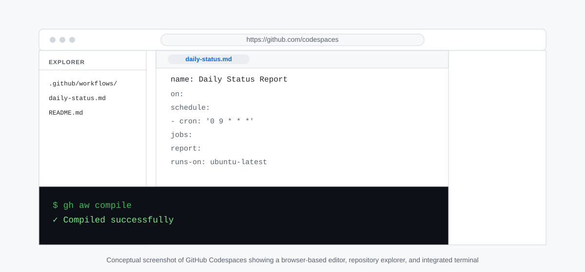
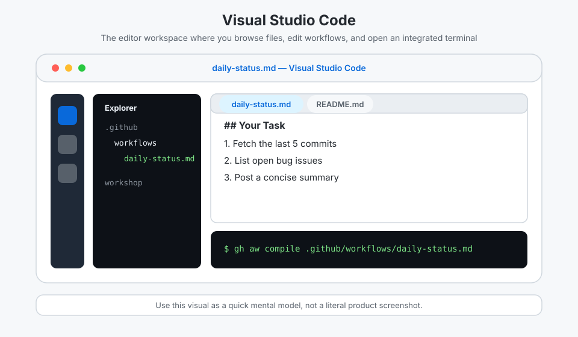
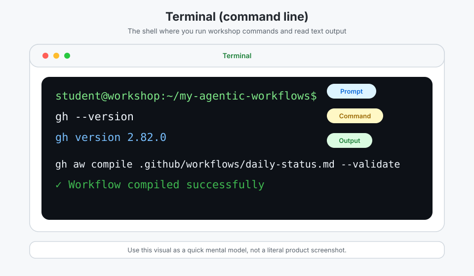
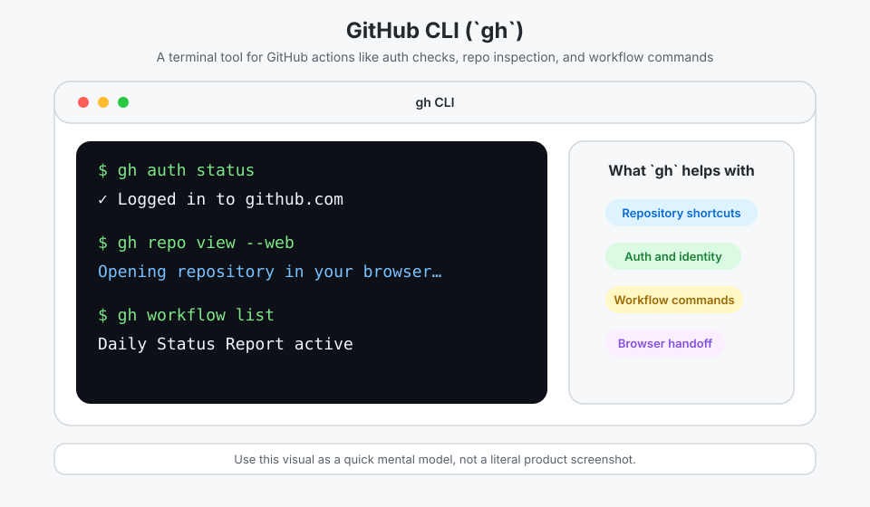
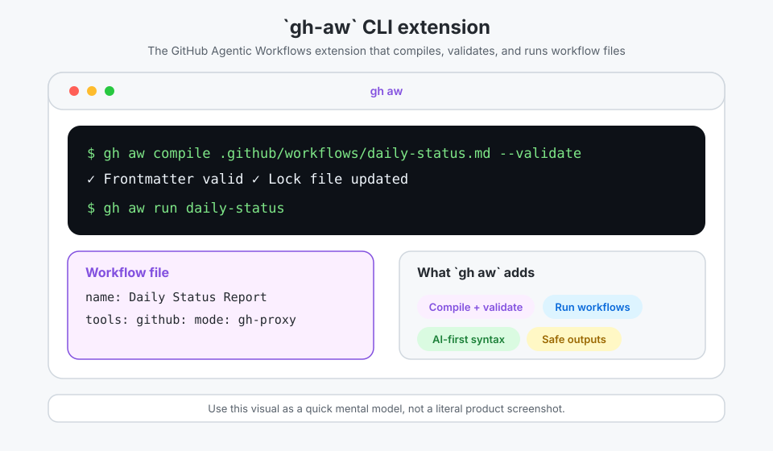
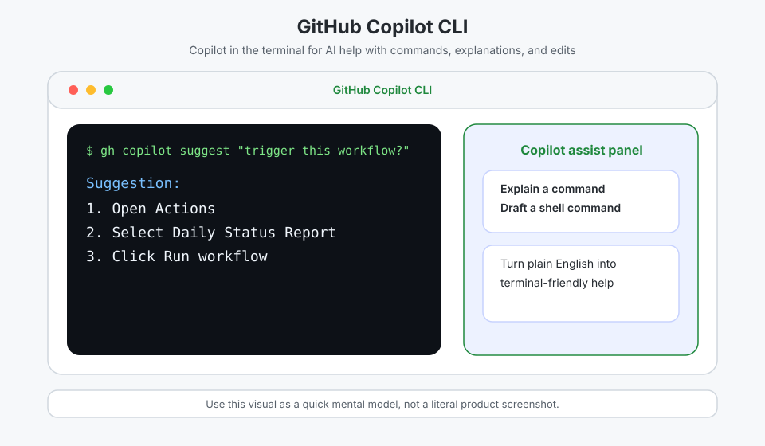
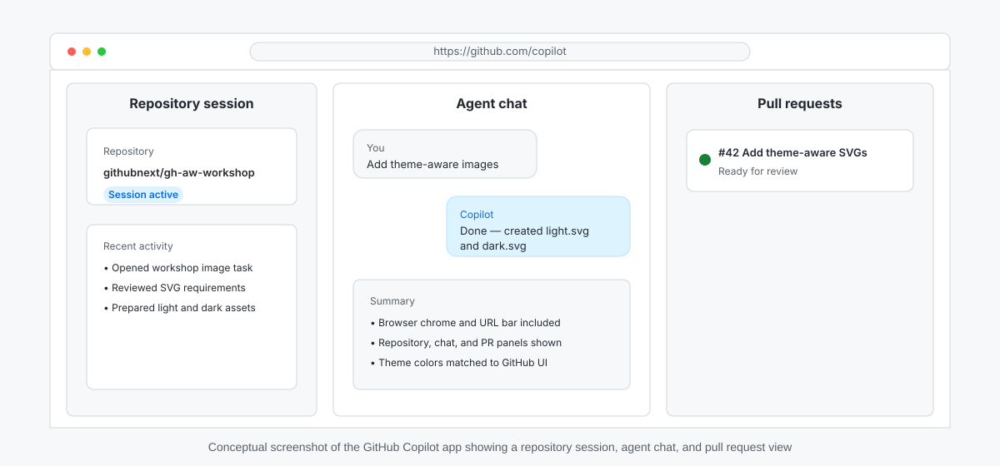
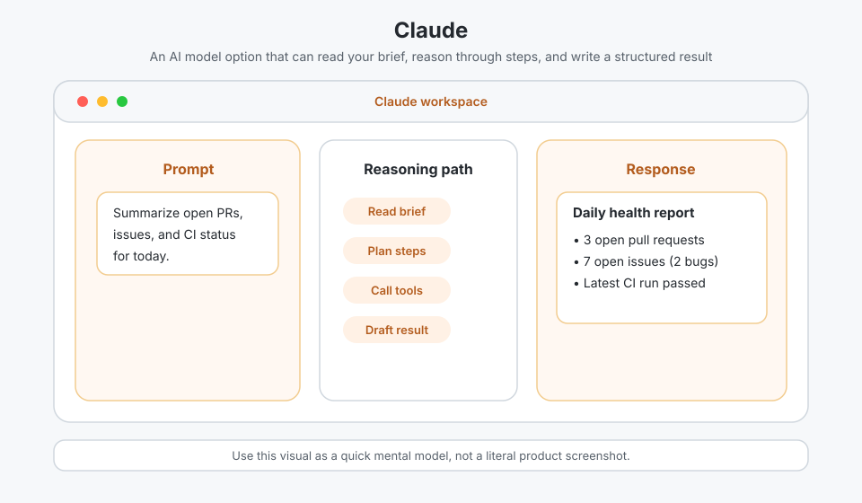
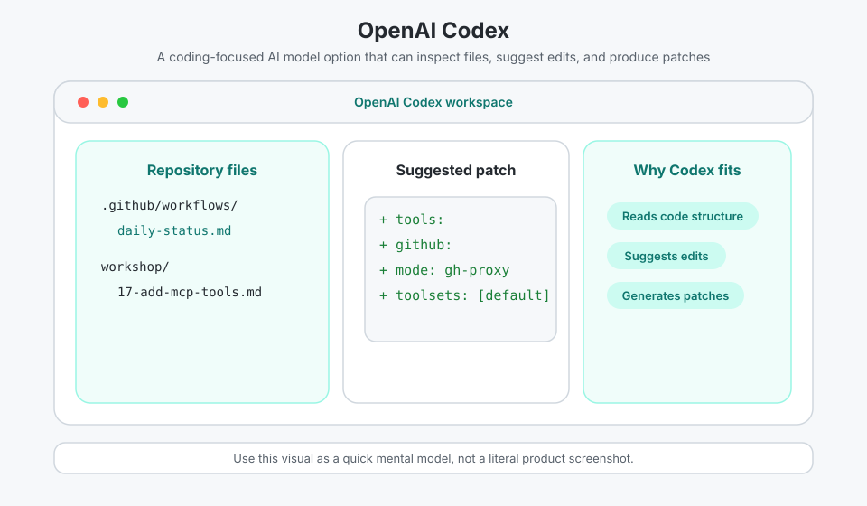

<!-- page-journey: all -->
<!-- page-adventure: side-quest -->
# Side Quest: Environment Reference

> _Optional: use this quick glossary and visual reference to understand the environments and AI tools used throughout the workshop._

**What you'll learn:** By the end of this page you can name each tool and environment used in the workshop, match it to its role, and know when you'll use it.

## :clipboard: Before You Start

This is a reference page — you can read it any time. Come back here whenever the workshop uses a term you want to clarify. No terminal required to read this page.

When you're ready to verify your tools are working, see the [Checkpoint](#white_check_mark-checkpoint) section at the bottom.

## Environment and tool glossary

Knowing which name maps to which role helps you follow workshop instructions without stopping to wonder what "the terminal" or "Codespaces" means in context.

| Term | What it means in this workshop | When you use it | Official documentation |
|------|------|------|------|
| **GitHub Codespaces** | Your cloud development environment when you choose the browser-based setup path. Pre-launched in golden-ticket workshops. | Steps 2–14: writing, compiling, and running workflows | [GitHub Codespaces docs](https://docs.github.com/en/codespaces) |
| **Visual Studio Code (VS Code)** | The editor experience inside Codespaces (and optionally on your local machine). | Editing workflow files and reading output | [Visual Studio Code docs](https://code.visualstudio.com/docs) |
| **Terminal (command line)** | The shell where you run workshop commands (`gh`, `gh aw`, `git`, and more). | Any step that shows a `bash` code block | [GitHub CLI manual](https://cli.github.com/manual/) |
| **GitHub CLI (`gh`)** | GitHub's official CLI, required for this workshop. Pre-installed in the Codespace. | Starting at Step 6 (install the extension) | [GitHub CLI docs](https://cli.github.com/manual/) |
| **`gh-aw` CLI extension** | The GitHub Agentic Workflows extension you install and use in the terminal to compile workflow files. | Step 6 onward | [Install `gh-aw`](https://github.com/github/gh-aw#readme) |
| **GitHub Copilot CLI** | Copilot in the terminal for AI-assisted command and development help. The primary AI surface in this workshop. | Any step that shows a `prompt` code block | [GitHub Copilot CLI docs](https://docs.github.com/en/copilot/concepts/agents/copilot-cli/about-copilot-cli) |
| **GitHub Copilot app** | The GitHub Copilot desktop and web application where you can open repositories, start agent sessions, steer coding tasks, and manage pull requests. | Optional; side quests cover this surface | [GitHub Copilot app](https://github.com/features/ai/github-app) |
| **Claude** | Anthropic's AI model family available in some GitHub Copilot and agentic workflow contexts. | Steps that use a non-default model | [Claude documentation](https://docs.anthropic.com/) |
| **OpenAI Codex** | OpenAI coding model family that can be used in coding and agent workflows. | Steps that use a non-default model | [OpenAI Codex CLI repository](https://github.com/openai/codex#readme) |

> [!NOTE]
> **Enterprise (GHES/GHEC) users**: same tools and commands, just your enterprise hostname instead of `github.com` — see [Step 6](06-install-gh-aw.md) for install notes.

### :bulb: Try it — match each tool to its role

Cover the table above, then try to answer each question before checking.

- [ ] Which tool do you run `gh aw compile` with? <details><summary>Reveal</summary>The `gh-aw` CLI extension.</details>
- [ ] Which surface shows a `prompt` code block in this workshop? <details><summary>Reveal</summary>GitHub Copilot CLI.</details>
- [ ] Which environment is pre-launched for you in golden-ticket workshops? <details><summary>Reveal</summary>GitHub Codespaces.</details>
- [ ] Which command checks that the GitHub CLI itself is installed? <details><summary>Reveal</summary><code>gh --version</code>.</details>
- [ ] Which two model families appear only in steps using a non-default model? <details><summary>Reveal</summary>Claude and OpenAI Codex.</details>

### :white_check_mark: Verify your tools are ready

Open a terminal in your Codespace and run:

```bash
gh --version
git --version
```

Both commands should print a version number. If either fails, see [Set Up a Codespace](02a-setup-codespace.md).

> [!NOTE]
> `gh aw --version` only works after you complete [Install the gh-aw CLI Extension](06-install-gh-aw.md). Skip that check until you reach Step 6.

After you complete Step 6, also run:

```bash
gh aw --version
```

## Conceptual screenshots

These simplified mental models (not literal product screenshots) help you recognize each name when it appears later. Expand any item to see it.

#### GitHub Codespaces

Your ready-to-go browser development environment.

<details>
<summary>Show conceptual screenshot</summary>

<picture>
  <source media="(prefers-color-scheme: dark)" srcset="images/side-quest-01-02-github-codespaces-dark.svg">
  <source media="(prefers-color-scheme: light)" srcset="images/side-quest-01-02-github-codespaces-light.svg">
  
</picture>
</details>

#### Visual Studio Code (VS Code)

The editor you browse files and edit workflows in.

<details>
<summary>Show conceptual screenshot</summary>

<picture>
  <source media="(prefers-color-scheme: dark)" srcset="images/side-quest-01-02-vscode-dark.svg">
  <source media="(prefers-color-scheme: light)" srcset="images/side-quest-01-02-vscode-light.svg">
  
</picture>
</details>

#### Terminal (command line)

Where you run <code>gh</code>, <code>gh aw</code>, and <code>git</code> commands.

<details>
<summary>Show conceptual screenshot</summary>

<picture>
  <source media="(prefers-color-scheme: dark)" srcset="images/side-quest-01-02-terminal-dark.svg">
  <source media="(prefers-color-scheme: light)" srcset="images/side-quest-01-02-terminal-light.svg">
  
</picture>
</details>

#### GitHub CLI (`gh`)

For authentication, repository, and workflow commands.

<details>
<summary>Show conceptual screenshot</summary>

<picture>
  <source media="(prefers-color-scheme: dark)" srcset="images/side-quest-01-02-gh-cli-dark.svg">
  <source media="(prefers-color-scheme: light)" srcset="images/side-quest-01-02-gh-cli-light.svg">
  
</picture>
</details>

#### `gh-aw` CLI extension

Compiles your agentic workflow files.

<details>
<summary>Show conceptual screenshot</summary>

<picture>
   <source media="(prefers-color-scheme: dark)" srcset="images/side-quest-01-02-gh-aw-dark.svg">
   <source media="(prefers-color-scheme: light)" srcset="images/side-quest-01-02-gh-aw-light.svg">
   
</picture>
</details>

#### GitHub Copilot CLI

AI help inside the terminal.

<details>
<summary>Show conceptual screenshot</summary>

<picture>
  <source media="(prefers-color-scheme: dark)" srcset="images/side-quest-01-02-copilot-cli-dark.svg">
  <source media="(prefers-color-scheme: light)" srcset="images/side-quest-01-02-copilot-cli-light.svg">
  
</picture>
</details>

#### GitHub Copilot app

Steer repository sessions and review pull requests.

<details>
<summary>Show conceptual screenshot</summary>

<picture>
  <source media="(prefers-color-scheme: dark)" srcset="images/side-quest-01-02-copilot-app-dark.svg">
  <source media="(prefers-color-scheme: light)" srcset="images/side-quest-01-02-copilot-app-light.svg">
  
</picture>
</details>

#### Claude

An AI model option used in non-default-model steps.

<details>
<summary>Show conceptual screenshot</summary>

<picture>
  <source media="(prefers-color-scheme: dark)" srcset="images/side-quest-01-02-claude-dark.svg">
  <source media="(prefers-color-scheme: light)" srcset="images/side-quest-01-02-claude-light.svg">
  
</picture>
</details>

#### OpenAI Codex

A coding-focused model option used in non-default-model steps.

<details>
<summary>Show conceptual screenshot</summary>

<picture>
  <source media="(prefers-color-scheme: dark)" srcset="images/side-quest-01-02-openai-codex-dark.svg">
  <source media="(prefers-color-scheme: light)" srcset="images/side-quest-01-02-openai-codex-light.svg">
  
</picture>
</details>

<!-- journey: all -->
## :white_check_mark: Checkpoint

- [ ] You can name each environment and tool used in this workshop and describe its role
- [ ] You ran `gh --version` in your terminal and it returned a version number
- [ ] You ran `git --version` in your terminal and it returned a version number
- [ ] If you've completed [Install the `gh-aw` CLI Extension](06-install-gh-aw.md): you ran `gh aw --version` and it returned a version number
- [ ] You can match each item to its conceptual screenshot
- [ ] You know where to find official docs for each tool
- [ ] (Enterprise users) You know which URLs in workshop instructions map to your enterprise hostname

When you're done here, return to [What You Need Before We Start](01-prerequisites.md).
<!-- /journey -->
