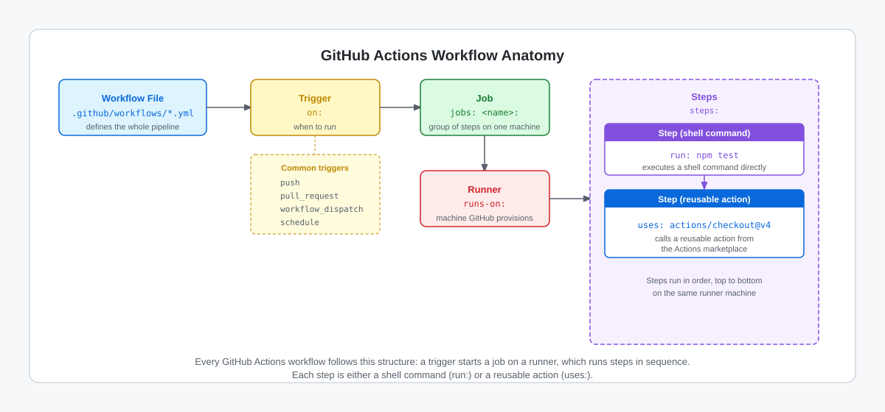

<!-- page-journey: all -->
<!-- page-adventure: side-quest -->
# Side Quest: Label a Sample Workflow

> _Optional: practice spotting the five building blocks of a GitHub Actions workflow before continuing with [GitHub Actions in 5 Minutes](04-github-actions-intro.md)._

## :dart: What You'll Do

You'll label the five key parts of a short Actions workflow — `trigger`, `job`, `runner`, `step`, and `action` — then check your answers. This reinforces the vocabulary from the Quick Refresher so you can read any classic workflow file with confidence.

## :clipboard: Before You Start

- You've read the Quick Refresher in [GitHub Actions in 5 Minutes](04-github-actions-intro.md) and know that `on`, `jobs`, and `steps` are the three top-level keys in a workflow file.

## Steps

The diagram below shows how the five key parts fit together in every workflow file.

<picture>
  <source media="(prefers-color-scheme: dark)" srcset="images/04-actions-anatomy-dark.svg">
  <source media="(prefers-color-scheme: light)" srcset="images/04-actions-anatomy-light.svg">
  
</picture>

Before reading on, label each highlighted part of the workflow below with its type:
`trigger`, `job`, `runner`, `step`, or `action`.

```yaml .github/workflows/hello-workflow.yml
on: [push]
jobs:
  test:
    runs-on: ubuntu-latest
    steps:
      - uses: actions/checkout@v4
      - run: echo "All checks passed"
```

Write a label beside each line:

1. `on: [push]`
2. `test:` (the job name under `jobs:`)
3. `runs-on: ubuntu-latest`
4. `uses: actions/checkout@v4`
5. `run: echo "All checks passed"`

<details>
<summary>Reveal the labels</summary>

- `on: [push]` → **trigger** (when this workflow runs)
- `jobs: test:` → **job** (a group of steps that runs on one machine)
- `runs-on: ubuntu-latest` → **runner** (the machine type GitHub provisions)
- `uses: actions/checkout@v4` → **action** (a reusable step from the Actions marketplace)
- `run: echo "All checks passed"` → **step** (a shell command run directly on the runner)

</details>

## :white_check_mark: Checkpoint

- [ ] You labeled all five parts of the sample workflow above (trigger, job, runner, action, step)
- [ ] You can explain the difference between a `step` and an `action` in a workflow file
- [ ] You know that `runs-on:` identifies the runner, not the job name

**Return to the main adventure:** [GitHub Actions in 5 Minutes](04-github-actions-intro.md)
