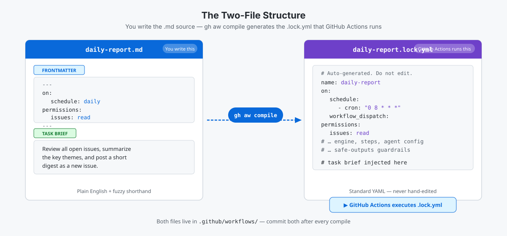

<!-- page-journey: all -->
<!-- page-adventure: side-quest -->
# Side Quest: The Two-File Structure

> _Optional: work through this side quest after [What Are Agentic Workflows?](05-agentic-workflows-intro.md) to understand how `.md` source files and `.lock.yml` [lock files](https://github.github.com/gh-aw/reference/glossary/#workflow-lock-file-lockyml) relate, and to check your vocabulary._

## :clipboard: Before You Start

- You've read [What Are Agentic Workflows?](05-agentic-workflows-intro.md)

## The two files

An [agentic workflow](https://github.github.com/gh-aw/introduction/overview/#what-are-agentic-workflows) has two files that live in `.github/workflows/`:

| File | What it is | Who writes it |
|---|---|---|
| `.md` source | Your task brief plus [frontmatter](https://github.github.com/gh-aw/reference/frontmatter/) | You |
| `.lock.yml` | Compiled YAML that GitHub Actions runs | `gh aw compile` |

**Never edit `.lock.yml` by hand** — regenerate it with `gh aw compile` after every `.md` change.

The diagram below shows how they relate:

<picture>
   <source media="(prefers-color-scheme: dark)" srcset="images/05b-two-file-structure-dark.svg">
   <source media="(prefers-color-scheme: light)" srcset="images/05b-two-file-structure-light.svg">
   
</picture>

## Read a sample `.md` source file

Here is a complete `.md` source file:

```markdown
---
on:
  schedule: daily
permissions:
  issues: read
---

Review all open issues, summarize the key themes, and post a short digest as a new issue.
```

Look at the sample and answer: which part is the **task brief**, and which part tells GitHub Actions **when to run**?

<details>
<summary>Check your answer</summary>

- **Task brief:** the paragraph after the `---` closing fence — the plain-English instruction for the agent.
- **When to run:** the `on:` block in the frontmatter — here `schedule: daily`.

The frontmatter is Actions YAML. The body below it is your agent prompt.

</details>

> [!NOTE]
> `schedule: daily` is fuzzy shorthand. `gh aw compile` converts it into a standard Actions cron expression — you never write raw cron syntax in an agentic workflow `.md` file.

## What `gh aw compile` generates

After you run `gh aw compile`, the tool creates a `.lock.yml`:

```yaml
# Auto-generated by gh aw compile. Do not edit by hand.
name: Review open issues
on:
  schedule:
    - cron: "0 8 * * *"
  workflow_dispatch:
permissions:
  issues: read
```

**Try it:** Run `gh aw compile` in your Codespace terminal and open the generated `.lock.yml`. Find the `cron:` value and compare it to `schedule: daily` in your `.md` source.

## Check your vocabulary

Before you reveal the answers below, write a one-sentence definition for each term:

- Lock file
- Engine
- `workflow_dispatch`

<details>
<summary>Check your answers</summary>

| Term | Plain-language meaning |
|---|---|
| [Lock file](https://github.github.com/gh-aw/reference/glossary/#workflow-lock-file-lockyml) | The compiled YAML that GitHub Actions actually runs — never edit it by hand |
| [Engine](https://github.github.com/gh-aw/reference/engines/) | The AI model provider (for example, GitHub Copilot) used by the workflow |
| `workflow_dispatch` | A manual trigger — you start the run by clicking a button in the Actions tab |

</details>

## How the agent posts output

An agent always operates **read-only**. Any writes — posting a comment, creating an issue — go through [safe outputs](https://github.github.com/gh-aw/reference/safe-outputs/) and guardrails.

**Try it:** Open the `.lock.yml` you compiled earlier. Find the step or job that handles the agent's output. Notice how the write is separated from the agent's read-only work.

> [!TIP]
> If you'd like more practice distinguishing agentic from standard workflows, return to [Side Quest: Classify Agentic vs. Standard Workflows](side-quest-05-02-aw-deep-dive.md).

---

Return to the main adventure: [What Are Agentic Workflows?](05-agentic-workflows-intro.md).

## ✅ Checkpoint

- [ ] You can point to the task brief and the trigger in a sample `.md` file
- [ ] You can describe the difference between the `.md` source and the compiled `.lock.yml`
- [ ] You can define: lock file, engine, and `workflow_dispatch`
- [ ] You know that agents are read-only and writes go through [safe outputs](https://github.github.com/gh-aw/reference/safe-outputs/)
