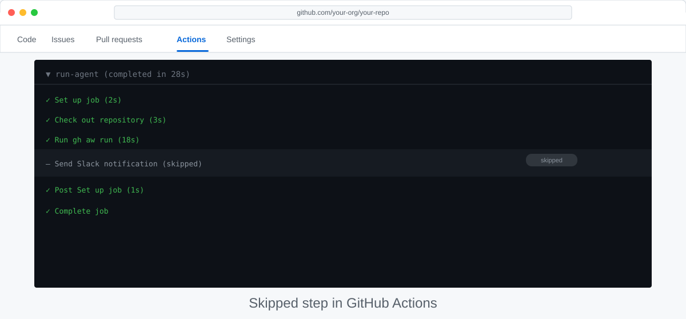

<!-- page-journey: all -->
<!-- page-adventure: side-quest -->
# Side Quest: Chaining Conditions — Weekend Skip

> _A single condition filters one dimension. Chaining conditions lets a workflow skip exactly when it should — and run only when it must._

## 🎯 What You'll Do

Extend your daily-status workflow to also skip execution on weekends. You'll add a day-of-week shell step that captures the current day name as a step output, then update the top-level `if:` to combine it with your existing commit-count condition using `&&`.

## 📋 Before You Start

- You have completed [Make Your Workflow Smarter with Conditional Logic](15-conditional-logic.md).
- Your workflow already has a `count recent commits` step with `id: recent` and a top-level `if: steps.recent.outputs.commit_count != '0'` condition.

## Steps

### Understand the pattern

Some conditions depend on data that GitHub Actions contexts do not provide — for example, the current day of the week. You can capture this in a dedicated shell step that writes the value to `$GITHUB_OUTPUT`, then reference the output in the same `if:` expression alongside your other conditions.

The pattern always follows the same structure:

1. A shell step captures the data and writes it as a named output.
2. The top-level `if:` expression combines the new output with existing conditions using `&&` or `||`.

### Add a day-of-week step

In the GitHub Copilot **Chat** or **Agents** tab, paste:

```text
/agentic-workflows update .github/workflows/daily-status.md to also add a day-of-week step
and extend the if condition to skip the agent job on Saturdays and Sundays.
```

The skill adds the step and updates the `if:` condition, then recompiles the lock file.

<details>
<summary>🖥️ Terminal path</summary>

1. Add a step that writes the current day name as an output:

```yaml
- name: Check day of week
  id: day
  run: echo "day=$(date +%A)" >> $GITHUB_OUTPUT
```

1. Update the top-level `if:` to combine both conditions using `&&`:

```yaml
if: steps.recent.outputs.commit_count != '0' && steps.day.outputs.day != 'Saturday' && steps.day.outputs.day != 'Sunday'
```

1. Run `gh aw compile` to regenerate the lock file with the combined condition.

</details>

### Why `&&` instead of separate conditions

A single top-level `if:` with `&&` is the right tool here because GitHub evaluates the entire expression at once and skips the job cleanly when any part is false. Each sub-expression must independently be true for the job to run. You can keep extending the chain — for example, adding a branch check — without restructuring the workflow.

> [!NOTE]
> Values written to `$GITHUB_OUTPUT` are always strings. Compare them against quoted literals — `steps.day.outputs.day != 'Saturday'` — not unquoted values.

### Verify the combined condition

After confirming the diff, trigger a manual [`workflow_dispatch`](https://github.github.com/gh-aw/reference/triggers/) run from the Actions tab. Check the result:

- On a weekday with commits: the agent job should complete normally.
- On a weekend or a quiet day with no commits: the job should appear as **skipped** with a grey icon.



> [!NOTE]
> The `if:` condition takes effect only after you compile and push both the `.md` source and the updated `.lock.yml` file. The `/agentic-workflows` skill handles compilation automatically.

### Commit and push your changes

```bash
git add .github/workflows/daily-status.md .github/workflows/daily-status.lock.yml
git commit -m "feat: skip summary on weekends"
git push
```

## ✅ Checkpoint

- [ ] Your workflow has a `check day of week` step with `id: day`
- [ ] Your top-level `if:` chains all three checks with `&&`
- [ ] Both `.github/workflows/daily-status.md` and `.github/workflows/daily-status.lock.yml` are compiled, committed, and pushed
- [ ] You triggered the workflow manually and confirmed the skipped behaviour on a weekend or quiet day
- [ ] You can explain why `$GITHUB_OUTPUT` values must be compared against quoted string literals

<!-- journey: all -->
Return to [Make Your Workflow Smarter with Conditional Logic](15-conditional-logic.md).
<!-- /journey -->
