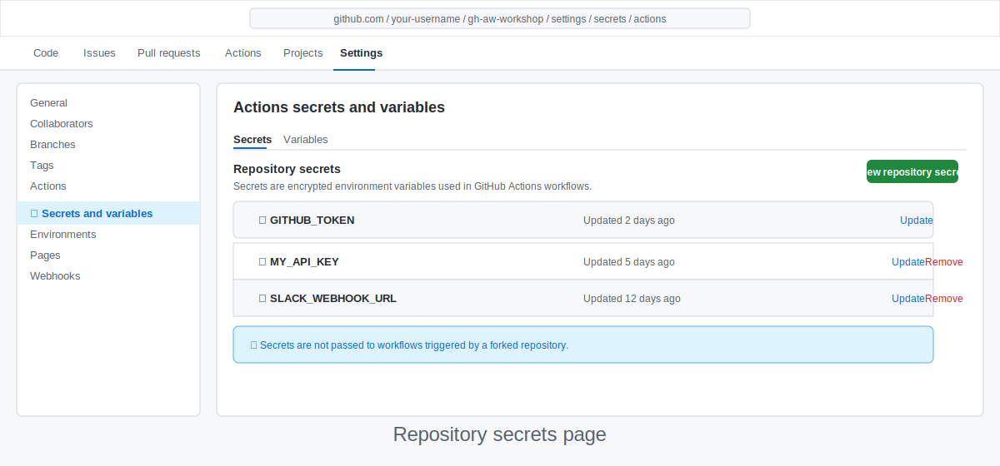

<!-- page-journey: all -->
<!-- page-adventure: side-quest -->
# Side Quest: Storing Credentials with GitHub Secrets

> _Optional: work through this guide when your workflow needs a token or API key that shouldn't appear in plain text, then return to your main path._

## 📋 Before You Start

- Familiarity with [Connect a Live Data Source to Your Workflow](16-connect-data-source.md) is helpful.
- You understand what GitHub Actions workflow YAML looks like.

---

GitHub Actions workflows run in a shared environment where code, logs, and configuration are visible to collaborators. Hard-coding credentials is dangerous — they end up in version history and log output. **GitHub Secrets** gives you a secure vault for sensitive values that workflows can read without exposing.

---

## What is a GitHub Secret?

A secret is a named, encrypted value stored in your repository settings. Your workflow reads it with `${{ secrets.SECRET_NAME }}` at runtime. Secrets:

- Are **never** shown in plain text in the UI after you save them.
- Are **masked** in workflow logs — if a secret's value appears in output, GitHub replaces it with `***`.

> [!NOTE]
> This side quest focuses on repository secrets. If several repositories need the same credential, you can also store it as an organisation secret and grant access to selected repositories.

---

## When do you need a secret?

You need a secret whenever your workflow authenticates to an external service. Common cases:

| Scenario | Secret you'd store |
|---|---|
| Calling a third-party API (Slack, Jira, etc.) | API key or bearer token |
| Posting to an external webhook | Webhook URL (treat URLs with tokens as secrets) |
| Connecting an MCP server that requires auth | Server-specific token |

## Choose the right GitHub token

Use this quick comparison when your workflow needs GitHub access:

| If you need to... | Use | Why |
|---|---|---|
| Read or act on the same repository during a workflow run | `${{ secrets.GITHUB_TOKEN }}` | GitHub creates it automatically for each run, and it expires when the run ends. |
| Reach outside this repository — for example, access another repository or trigger a workflow elsewhere — or use scopes the built-in token does not have | A PAT stored as a repository secret | You create it yourself and can give it the specific extra access you need. |

---

## Add a secret to your repository

### GitHub UI (recommended)

1. Open your repository on GitHub.
2. Click **Settings** → **Secrets and variables** → **Actions**.
3. Click **New repository secret**.
4. Enter a name (e.g. `SLACK_WEBHOOK_URL`) and the secret value.
5. Click **Add secret**.



> [!TIP]
> Secret names must use only uppercase letters, digits, and underscores. By convention, use `SCREAMING_SNAKE_CASE`.

---

## ✏️ Try it: Verify masking

Add a placeholder secret named `WORKSHOP_TOKEN` with any throwaway value, then prove GitHub masks it in logs.

1. Create `WORKSHOP_TOKEN` in **Settings** → **Secrets and variables** → **Actions**.
2. Add this temporary step to a workflow you can run manually:

   ```yaml
   - name: Confirm secret masking
     run: echo "token=${{ secrets.WORKSHOP_TOKEN }}"
   ```

3. Trigger a manual run from the **Actions** tab.
4. Open the run logs and confirm the output shows `token=***`, not the value you entered.
5. Remove the temporary step after you verify masking.

---

## Reference a secret in your workflow

Inside any workflow step, reference a secret with `${{ secrets.SECRET_NAME }}`:

```yaml
- name: Notify Slack
  run: |
    curl -s -X POST "${{ secrets.SLACK_WEBHOOK_URL }}" \
      -H "Content-Type: application/json" \
      -d '{"text": "Daily status report is ready."}'
```

## Going deeper

<details>
<summary>Learn about using the built-in `GITHUB_TOKEN` for GitHub API calls</summary>

Most GitHub API calls in this workshop work with the automatically provided `GITHUB_TOKEN`:

```yaml
- name: List open pull requests
  env:
    GH_TOKEN: ${{ secrets.GITHUB_TOKEN }}
  run: gh pr list --state open
```

The `gh` CLI reads `GH_TOKEN` automatically when it is set as an environment variable.

</details>

<details>
<summary>Learn how permissions frontmatter controls the built-in `GITHUB_TOKEN`</summary>

gh-aw workflows declare required [permissions](https://github.github.com/gh-aw/reference/permissions/) in frontmatter. Only request what you need:

```yaml
---
permissions:
  contents: read
  issues: read
  pull-requests: read
---
```

If a `GITHUB_TOKEN` call fails with a 403, check that the required permission is listed in frontmatter. Keeping permissions minimal reduces the blast radius if a workflow is ever misused.

</details>

---

## ✅ Checkpoint

- [ ] You can add a secret to your repository via the GitHub UI
- [ ] You know how to reference a secret with `${{ secrets.SECRET_NAME }}`
- [ ] You understand when to use `GITHUB_TOKEN` vs. a manually created PAT
- [ ] You can explain why hard-coding credentials in workflow files is risky

<!-- journey: all -->
**Return to:** [Connect a Live Data Source to Your Workflow](16-connect-data-source.md) or [Give Your Agent More Tools with MCP](17-add-mcp-tools.md)
<!-- /journey -->

For more details, see [GitHub Tools Read Permissions](https://github.github.com/gh-aw/reference/permissions/), [Safe Outputs](https://github.github.com/gh-aw/reference/safe-outputs/), and [Network Permissions](https://github.github.com/gh-aw/reference/network/).

