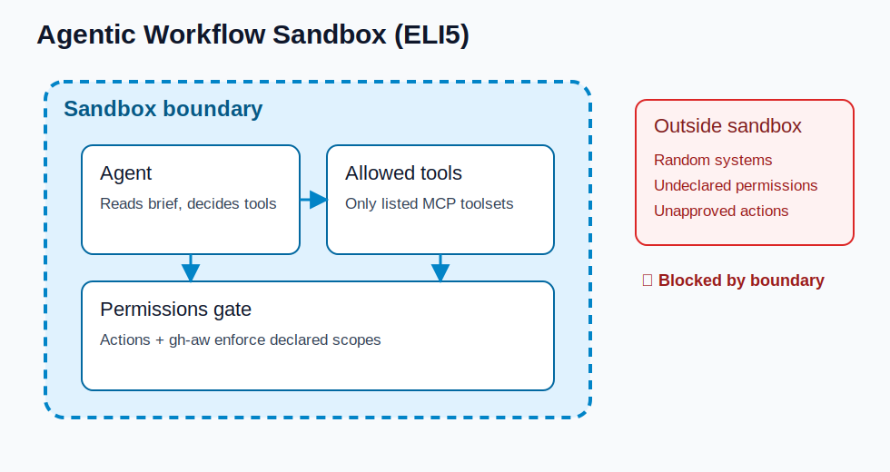
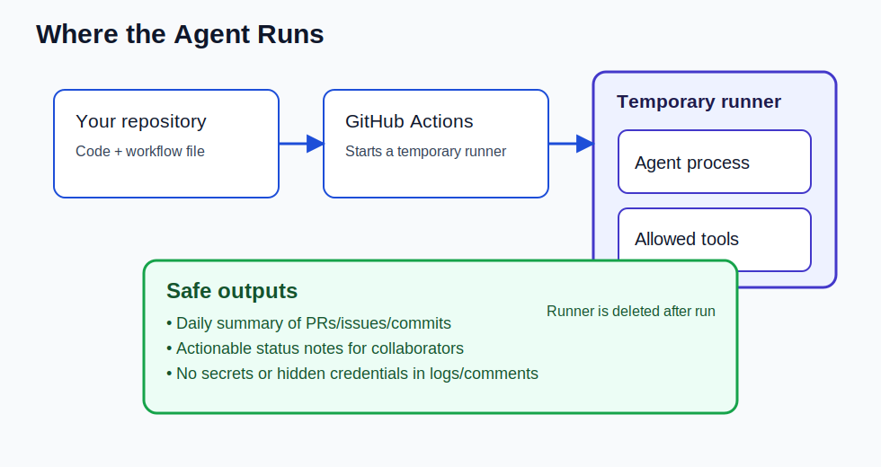

# Side Quest: Agentic Workflow Security Architecture (Explain Like You're 5)

> _Optional: work through this visual primer if you want an intuitive mental model for why gh-aw uses a sandbox, where the agent runs, and what outputs are considered safe._

## 📋 Before You Start

- You understand the basics of agentic workflows from [Step 5: What Are Agentic Workflows?](05-agentic-workflows-intro.md).
- You have a workflow with `permissions` and `tools` frontmatter from [Step 7: Write Your First Agentic Workflow](07-your-first-workflow.md).
- You have started or are about to start [Step 17: Give Your Agent More Tools with MCP](17-add-mcp-tools.md).

Think of your workflow like a smart helper in a playroom.

- The **repository** is your toy box.
- The **agent** is the helper who can look at toys and organize them.
- The **[sandbox](https://github.github.com/gh-aw/reference/sandbox/)** is the play area boundary that keeps the helper from running into the street.

---

## Why you need a sandbox

A powerful helper without boundaries can accidentally do unsafe things.

The sandbox gives your helper clear rules:

- It can only use the tools you allowed.
- It can only do actions covered by your declared permissions.
- It cannot reach random places outside the workflow environment.



Without a sandbox, one mistake could affect too much. With a sandbox, mistakes stay contained.

---

## Where the agent is actually running

The agent does **not** run on your laptop by default. In this workshop flow, it runs inside a GitHub Actions job on a temporary runner.

That means:

- The environment is created for the run.
- The agent reads your workflow brief and repository context there.
- When the run ends, that runtime is discarded.



This design reduces long-lived risk because the environment is short-lived and isolated.

---

## What “safe output” means

Safe output is useful information that avoids harmful leakage or unsafe actions.

Good output usually:

- Summarizes repository activity (issues, PRs, commits, CI status).
- Uses approved tool results and avoids guessing hidden data.
- Avoids secrets, tokens, credentials, and private personal data.
- Stays within the permissions and intent you defined.

> [!IMPORTANT]
> Treat logs and comments as public-to-collaborators surfaces. Never design prompts that ask the agent to print secrets.

---

## Security architecture in one sentence

You declare **[permissions](https://github.github.com/gh-aw/reference/permissions/) + tools + task intent**, the runner enforces boundaries, and the agent produces constrained output from allowed data.

Here is what a well-scoped workflow frontmatter looks like in practice:

```yaml
---
permissions:
  contents: read
  issues: read
tools:
  github:
    mode: gh-proxy
safe-outputs:
  write-summary: # presence flag — declares this output surface is allowed
network:
  allowed-domains:
    - api.github.com
    - copilot-proxy.githubusercontent.com
---
```

> 🤔 **Predict:** What would happen if you removed `network.allowed-domains` from the frontmatter above and an injected prompt told the agent to send data to an external URL?

---

## ✅ Checkpoint

- [ ] You can explain why sandbox boundaries reduce risk in agentic workflows
- [ ] You can describe where the agent runs during a workshop workflow execution
- [ ] You can list what makes an output safe vs. unsafe
- [ ] You can explain how permissions, tools, and task brief work together as a security architecture

---

Return to [Step 17: Give Your Agent More Tools with MCP](17-add-mcp-tools.md).
