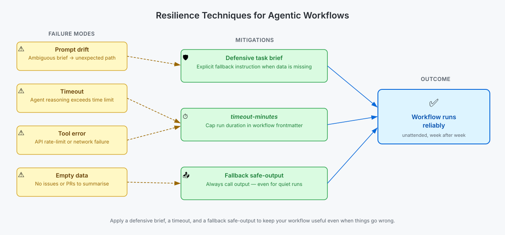

<!-- page-journey: all -->
<!-- page-adventure: advanced -->
# Side Quest: Recognizing Common Agentic Workflow Failure Modes

> _Before you can fix a broken run, you need a name for what went wrong — this primer gives you four._

## :dart: What You'll Do

You'll learn the four most common ways agentic workflows fail in production, see a worked example of each, and practice matching a failure type to its effect. By the end, you'll be able to look at a run log and name the failure mode in one word before you start debugging.

## :clipboard: Before You Start

- You have a working scheduled workflow (see [Refine, Test, and Improve Your Workflow](09-agentic-editing.md)).
- You're starting (or have already started) [Make Your Workflows Resilient to Failure](22-error-handling-and-resilience.md), which uses this vocabulary.

## Steps

### The four failure modes

Agentic workflows can fail for several reasons:

| Failure type | Example | Effect |
|---|---|---|
| **Empty data** | No open issues to summarise | Agent produces a vague or empty report |
| **Tool error** | GitHub API rate-limit hit mid-run | Agent stops mid-task without writing output |
| **Timeout** | Complex reasoning takes too long | Workflow job is cancelled by Actions |
| **Prompt drift** | Instructions are ambiguous | Agent takes an unexpected code path |

Recognising these patterns helps you write instructions that stay on track — most workflow bugs are one of these four things, not something exotic.

The diagram below shows how these failure modes map to three mitigations: a defensive brief, a `timeout-minutes` setting, and a fallback [safe-output](https://github.github.com/gh-aw/reference/safe-outputs/).

<picture>
  <source media="(prefers-color-scheme: dark)" srcset="images/22-resilience-techniques-dark.svg">
  <source media="(prefers-color-scheme: light)" srcset="images/22-resilience-techniques-light.svg">
  
</picture>

### Practice: match the failure to the mitigation

Before checking your answer, decide which mitigation (defensive brief, `timeout-minutes`, or fallback safe-output) best addresses each scenario:

1. A run consistently takes 18 minutes to finish reasoning about a large diff, and Actions cancels it.
2. A run finishes cleanly but never calls a safe-output tool because the repository had no activity that day.
3. A run's summary is technically correct but ignores the instruction to flag blockers, because the brief never defined what a "blocker" is.

Reveal the answers

1. **Timeout.** Set `timeout-minutes` to a value that gives the agent headroom, or reduce the size of the input it reasons over.
2. **Empty data.** Add a defensive brief instruction that tells the agent to write a "no activity" report — and always call the safe output — even when nothing changed.
3. **Prompt drift.** The brief was ambiguous about what counts as a blocker. Tighten the instruction with a concrete definition or example.

### Watch for this pattern in your own runs

Open a recent run of your own workflow in the **Actions** tab and skim the log. Ask yourself: does anything here match one of the four failure types above, even if the run technically succeeded? A run can "succeed" (green checkmark) and still exhibit prompt drift or produce empty-data output.

## :white_check_mark: Checkpoint

- [ ] You can name the four common agentic workflow failure modes without looking at the table
- [ ] You matched each of the three practice scenarios to its correct mitigation
- [ ] You reviewed one of your own workflow runs and identified whether any failure mode applied

**Return to the main adventure:** [Make Your Workflows Resilient to Failure](22-error-handling-and-resilience.md)
