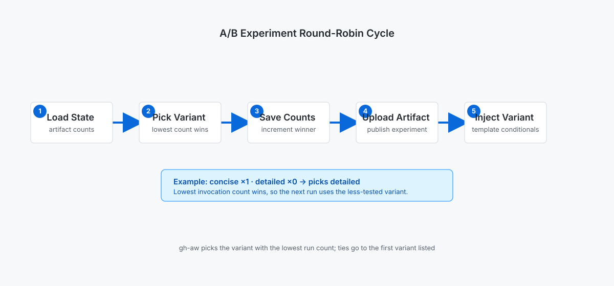

<!-- page-journey: all -->
<!-- page-adventure: side-quest -->
# Side Quest: How A/B Experiment Round-Robin Assignment Works

> _Optional: take this detour if you want a deeper walkthrough of the [round-robin](https://github.github.com/gh-aw/experimental/experiments/#statistical-balancing) mechanism behind `experiments:`, then return to [Step 23](23-ab-experiments.md)._

## :dart: What You'll Do

You'll look under the hood of `experiments:` assignment and learn exactly what gh-aw does on every run, so you can predict which variant comes next and read the `experiment` [artifact](https://github.github.com/gh-aw/reference/artifacts/) with confidence.

## Understand how the [round-robin](https://github.github.com/gh-aw/experimental/experiments/#statistical-balancing) works

<picture>
   <source media="(prefers-color-scheme: dark)" srcset="images/23-ab-roundrobin-dark.svg">
   <source media="(prefers-color-scheme: light)" srcset="images/23-ab-roundrobin-light.svg">
   
</picture>

On each run, gh-aw:

1. Loads state from `experiments/{workflow-id}` (created on first run).
2. Picks the variant with the lowest invocation count (ties are broken by first-in-array order).
3. Saves the updated counts.
4. Uploads the `experiment` [artifact](https://github.github.com/gh-aw/reference/artifacts/).
5. Injects the selected variant into your template conditionals.

## Predict assignment order

Because ties are broken by first-in-array order, you can predict every assignment before you run the workflow:

- With `output_style: [concise, detailed]` and both counts at zero, `concise` runs first (it's first in the array), then `detailed`.
- Once both variants have one run each, the counts tie again, so `concise` is picked first the next time too.
- Adding a third variant, `output_style: [concise, detailed, executive]`, after `concise` and `detailed` each have one run, `executive` is picked first because its count (zero) is lower than the other two.

| Run # | Counts before run (`concise` / `detailed` / `executive`) | Assigned variant |
|-------|------------------------------------------------------------|-------------------|
| 1     | 0 / 0 / —                                                   | `concise`         |
| 2     | 1 / 0 / —                                                   | `detailed`        |
| 3 (after adding `executive`) | 1 / 1 / 0                                    | `executive`       |
| 4     | 1 / 1 / 1                                                   | `concise`         |
| 5     | 2 / 1 / 1                                                   | `detailed`        |

## Inspect artifact counts

1. Open a run, scroll to **[Artifacts](https://github.github.com/gh-aw/reference/artifacts/)**, and download `experiment`.
2. Open the JSON file and confirm the counts match your predicted table.
3. Repeat across several runs to build confidence in the assignment order before you rely on it for a real experiment.

## :white_check_mark: Checkpoint

- [ ] I can describe the five steps gh-aw performs on each run for an `experiments:` block
- [ ] I know ties are broken by first-in-array order
- [ ] I can predict the next assignment from the current `experiment` artifact counts
- [ ] I can verify a prediction by downloading and reading the `experiment` artifact

---

**Return to the main adventure:** [Step 23 — Test Your Prompt Ideas with A/B Experiments](23-ab-experiments.md)

<!-- /journey -->
