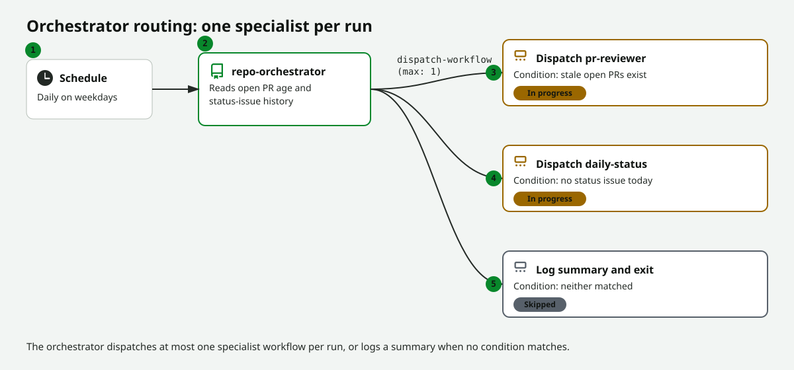

<!-- page-journey: all -->
<!-- page-adventure: side-quest -->
# Side Quest: How `dispatch-workflow` Orchestration Works

> _Optional: work through this primer before or after building your orchestrator in [Step 28](28-orchestrate-workflows.md) to understand what `dispatch-workflow` actually does and why the `workflows` allowlist and `max: 1` fields matter._

## :dart: What You'll Do

You'll learn what problem workflow orchestration solves, how the [`dispatch-workflow`](https://github.github.com/gh-aw/reference/safe-outputs/) safe-output works under the hood, and how to read every field in its frontmatter block before you rely on it in production.

## :clipboard: Before You Start

- You've read [Orchestrate Multiple Agentic Workflows](28-orchestrate-workflows.md) up through **Design your orchestrator**, or you're curious about the mechanism before building anything.
- You have at least two working agentic workflows in the same repository.

## Steps

### Why orchestration matters

When a repository needs different kinds of AI work — status reports, PR reviews, cost audits — you can keep each concern in its own focused workflow instead of piling every responsibility into one monolithic prompt. An orchestrator connects them: it reads signals from the repository and dispatches the right specialist, rather than trying to do everything itself.

<picture>
   <source media="(prefers-color-scheme: dark)" srcset="images/28-orchestrator-routing-dark.svg">
   <source media="(prefers-color-scheme: light)" srcset="images/28-orchestrator-routing-light.svg">
   
</picture>

> :thinking: **Predict:** Look at your existing workflows. Which one handles the broadest task? Which handles the narrowest? The broadest is a natural orchestration candidate; the narrowest is a natural specialist.

### What `dispatch-workflow` actually does

The key primitive is `dispatch-workflow` in [`safe-outputs`](https://github.github.com/gh-aw/reference/safe-outputs/). It lets your orchestrator trigger another workflow in the same repository and optionally pass inputs to it — without giving the orchestrator broad write permissions of its own.

```markdown .github/workflows/repo-orchestrator.md
---
safe-outputs:
  dispatch-workflow:
    workflows:
      - daily-status
      - pr-reviewer
    max: 1
---
```

### Read every field

| Field | What it controls |
|-------|-------------------|
| `workflows:` | An **allowlist**. Your orchestrator can only dispatch workflows named here — it cannot trigger arbitrary workflows in the repository, even if the agent is told to. |
| `max: 1` | Caps how many workflows a single orchestrator run may dispatch. Keeping this at `1` prevents one run from triggering many specialists at once and makes behavior predictable and auditable. |

> [!NOTE]
> `dispatch-workflow` triggers the named workflow with a `workflow_dispatch` event. The specialist runs asynchronously in its own Actions job. Your orchestrator does not wait for it to complete — it fires the trigger and finishes its own run.

### Design a decision table before you write any code

Before writing your orchestrator's task brief, decide three things:

- What signals will the orchestrator read? (open issue count, PR age, recent commit activity, or a combination)
- Which specialist workflows will it activate? (at most one per run keeps behavior predictable)
- What condition routes to each specialist?

A simple decision table helps:

| Signal | Action |
|--------|--------|
| Stale open PRs exist | Dispatch the PR reviewer |
| No status issue created today | Dispatch the daily-status reporter |
| Neither condition | Log a summary and exit |

Writing this table first keeps your orchestrator's task brief short and its routing logic easy to audit later.

## :white_check_mark: Checkpoint

- [ ] You can explain why an orchestrator delegates work instead of doing it directly
- [ ] You can explain what the `workflows:` allowlist prevents
- [ ] You can explain why `max: 1` keeps orchestrator behavior predictable
- [ ] You know that `dispatch-workflow` triggers a `workflow_dispatch` event and does not wait for the specialist to finish
- [ ] You drafted a signal → action decision table for your own orchestrator

**Return to the main adventure:** [Orchestrate Multiple Agentic Workflows](28-orchestrate-workflows.md)
